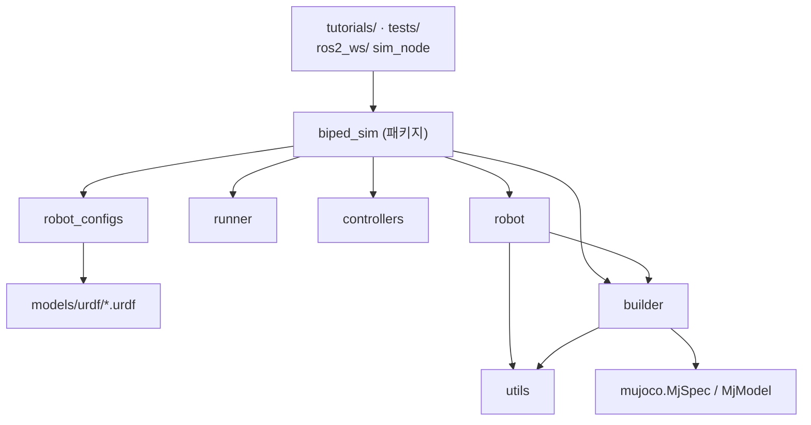

# Giga
거위 2족보행로봇

**biped_sim** — MuJoCo 2족 보행 로봇 시뮬레이터 (교육용 baseline)

제작 중인 2족 보행 로봇을 **MuJoCo**로 시뮬레이션하고, 이후 **ROS2**로 제어하기 위한 기반 저장소입니다.
처음 MuJoCo를 접하는 학생이 **환경 구축 → MuJoCo 기초 → URDF → 2족 로봇 관절 제어**까지 순서대로 따라갈 수 있게 구성했습니다.

- 시뮬레이터: MuJoCo 3.15.0 (Python)
- 환경: Ubuntu 22.04 + ROS2 Humble + 시스템 Python 3.10 (venv)
- 현재 단계: Phase 3 완료, **Phase 5(ROS2 연동) 거의 완료** — 시뮬레이터가 ROS2 노드로 동작하고, 별도 제어기 노드가 토픽만으로 로봇을 세우거나 앉혔다 일으킴. RViz 시각화 포함 ([로드맵](docs/00_roadmap.md))

## 빠른 시작

```bash
# 0) 저장소 받기
git clone https://github.com/joshualikaist/Giga.git
cd Giga

# 1) 처음 한 번: 가상환경 생성 + 설치 + 점검  (conda가 켜져 있으면 먼저 conda deactivate)
bash scripts/setup_env.sh

# 2) 새 터미널마다
source scripts/activate.sh

# 3) 튜토리얼 (순서대로)
python tutorials/t01_hello_mujoco.py            # 뷰어
python tutorials/t06_biped_stand.py --headless  # 뷰어 없이 숫자로

# 4) ROS2 (처음 한 번 빌드: bash scripts/build_ros.sh → source scripts/activate.sh)
ros2 launch giga_description display.launch.py               # URDF만 RViz로 (슬라이더로 관절 움직이기)
ros2 launch giga_sim_ros sim.launch.py controller:=squat     # MuJoCo + RViz + 앉았다 일어서기 제어기

# 5) 전체 테스트 (24개, 약 30초. ROS 연동 테스트는 ros2_ws를 빌드해야 실행됨)
pytest
```

**ROS2 실행 가이드 (어떤 명령을 실행하면 무슨 일이 일어나는지)**: [docs/06_ros2_hands_on.md](docs/06_ros2_hands_on.md)

모델만 빠르게 보고 싶다면: `python -m mujoco.viewer --mjcf=ros2_ws/src/giga_description/urdf/simple_biped.urdf`

## 폴더 구조

```
Giga/                             (clone한 폴더 이름. 로컬에서 다른 이름이어도 무관)
├── README.md                     ← 지금 이 파일 (시작점)
├── requirements.txt              ← pip 의존성 (mujoco==3.15.0, numpy<2, -e .)
├── pyproject.toml                ← biped_sim 패키지 정의 (pip install -e . 로 어디서든 import 가능)
├── .gitignore
│
├── scripts/                      ── 환경/도구
│   ├── setup_env.sh              ← [1회] .venv 생성 + 설치 + 점검
│   ├── activate.sh               ← [매 터미널] source: ROS2 Humble + .venv + PYTHONNOUSERSITE=1
│   ├── check_env.py              ← 환경 진단 (Python/numpy/mujoco/ROS2/GL)
│   ├── build_ros.sh              ← ros2_ws 빌드 (venv의 python -m colcon build — 그냥 colcon build 금지)
│   └── inertia_calc.py           ← box/cylinder/sphere 관성 → URDF <inertia> 한 줄
│
├── docs/                         ── 학습 문서 (번호 순서대로)
│   ├── 00_roadmap.md             ← 전체 계획 Phase 0~8, 현재 위치
│   ├── 01_environment.md         ← 왜 venv인가, 왜 numpy<2인가, 문제 해결
│   ├── 02_mujoco_concepts.md     ← MjModel/MjData, nq≠nv, 좌표·쿼터니언 규약, 접촉, 적분기
│   ├── 03_urdf_and_mujoco.md     ← URDF 문법 + MuJoCo 변환 규칙(실측) + 실제 로봇 체크리스트
│   ├── 04_simple_biped_spec.md   ← 2족 모델 사양서 (치수·질량·관절·부호·게인 근거)
│   ├── 05_ros2_bridge_plan.md    ← ROS2 연동 단계별 실행 계획 (사전 검증 결과, 인터페이스 명세, 결정 사항, 진행 상태)
│   └── 06_ros2_hands_on.md       ← ROS2 첫 실습: sim_node를 터미널 ros2 명령으로 조종하기
│
├── models/                       ── 로봇/장면 모델 (원본)
│   ├── mjcf/
│   │   └── falling_box.xml       ← MJCF Hello World (t01, t02)
│   └── urdf/
│       └── pendulum/
│           └── pendulum.urdf     ← 최소 URDF: 링크 2 + 관절 1 (t03)
│                                   (2족 로봇 URDF는 ros2_ws/src/giga_description/urdf/ 로 이동)
│
├── biped_sim/                    ── 시뮬레이터 코어 (Python 패키지)
│   ├── __init__.py               ← 공개 API 모음
│   ├── paths.py                  ← 파일 경로 상수 (실행 위치와 무관하게 동작)
│   ├── builder.py                ← URDF → MuJoCo 모델 (freejoint·모터·IMU·바닥·충돌제외·키프레임)
│   ├── robot.py                  ← RobotInterface: 관절 '이름' 기반 상태 읽기/토크 쓰기 (ROS2 JointState 대응)
│   ├── controllers.py            ← JointPDController (τ = Kp·e + Kd·ė + τ_ff, 토크 포화)
│   ├── robot_configs.py          ← 로봇별 설정 (URDF 경로, home 자세, 게인, 발 링크)
│   ├── runner.py                 ← simulate() 루프 (뷰어/헤드리스), passive_viewer(안전한 뷰어 종료), 스냅샷, 카메라
│   └── utils.py                  ← 쿼터니언 변환(MuJoCo↔ROS), 지면 높이 계산
│
├── tutorials/                    ── 학생용 실습 (순서대로)
│   ├── README.md                 ← 각 튜토리얼의 관찰 포인트 + 과제
│   ├── t01_hello_mujoco.py       ← 시뮬레이션 루프, 뷰어
│   ├── t02_model_and_data.py     ← nq≠nv, mj_forward vs mj_step, 쿼터니언, 접촉력
│   ├── t03_urdf_pendulum.py      ← URDF 로드 → 검증 실패 → 진단 → 수정 → 재검증
│   ├── t04_biped_inspect.py      ← 2족 URDF 해부, 인덱스 표, MJCF 내보내기
│   ├── t05_biped_hanging_pd.py   ← 매단 로봇 관절 PD 궤적 추종 (게인/피드포워드 비교)
│   └── t06_biped_stand.py        ← 바닥에 세우기, 접촉력=무게 검증, 밀기 실험
│
├── tests/                        ── 회귀 테스트 (pytest)
│   ├── test_simulator.py         ← URDF 변환 동작, 빌더, 진자 주기, 서 있기, 접촉력=무게
│   ├── test_tutorials_and_ros.py ← 튜토리얼 실행 + ROS2 robot_state_publisher URDF 파싱
│   ├── test_ros_sim_node.py      ← sim_node 통합: 주기, 명령, 초기화, IMU·TF, 정상 종료
│   └── test_ros_launch.py        ← launch 통합: 앉았다 일어서기, 제어기 사망 시 감쇠 모드
│
├── ros2_ws/                      ── ROS2 colcon 워크스페이스 (build/ install/ log/는 git 제외)
│   └── src/
│       ├── giga_description/     ← ament_cmake: 로봇 "설명" 패키지
│       │   ├── urdf/simple_biped.urdf    ← 6-DoF 2족 로봇. ROS2·RViz·MuJoCo가 공유하는 단일 원본
│       │   ├── launch/display.launch.py  ← URDF를 RViz로 보기 (슬라이더, 물리 없음)
│       │   └── rviz/display.rviz, sim.rviz
│       └── giga_sim_ros/         ← ament_python: 시뮬레이터 ROS 어댑터
│           ├── giga_sim_ros/sim_node.py         ← MuJoCo를 감싼 ROS2 노드 = "가짜 로봇 하드웨어"
│           ├── giga_sim_ros/demo_controller.py  ← 토픽만으로 로봇 조종 (stand / squat)
│           ├── giga_sim_ros/shutdown.py         ← Ctrl+C·SIGTERM 안전 종료 처리
│           ├── launch/sim.launch.py             ← sim_node + robot_state_publisher + RViz + 제어기
│           └── package.xml, setup.py, setup.cfg, resource/
│
├── output/                       ── 생성물 (git 제외): 내보낸 MJCF, 그래프, 스냅샷
├── biped_sim.egg-info/           ── pip install -e . 가 자동 생성하는 메타데이터 (git 제외, 건드리지 않음)
└── .venv/                        ── 가상환경 (git 제외, setup_env.sh가 생성)
```

### 의존 관계



## 설계 원칙

1. **URDF가 단일 원본**: 로봇 기구학/관성은 URDF 한 곳에서만 정의하고 ROS2와 공유합니다.
   시뮬레이션 전용 요소(바닥, 모터, IMU, freejoint 등)는 `biped_sim/builder.py`가 덧붙입니다.
2. **이름 기반 접근**: 배열 인덱스 대신 관절 이름으로 다룹니다 (`RobotInterface`). ROS2 `JointState`와 1:1.
3. **토크 모터 + 외부 PD**: MuJoCo의 position 액추에이터 대신, 실제 모터 드라이버처럼 PD를 직접 계산해 토크로 넣습니다.
4. **숫자로 검증**: 진자 주기 vs 이론, 접촉력 합 vs 무게 등 해석해와 비교하고, 그 결과를 테스트로 고정합니다.

## 지금까지 실험으로 확인한 중요한 사실

| 사실 | 확인한 곳 |
|---|---|
| URDF를 그대로 MuJoCo에 넣으면 루트 링크가 world에 병합되고 visual·액추에이터가 사라진다 | t03, t04, `test_raw_urdf_import_behavior` |
| 병합된/고정된 몸통은 부모-자식 충돌 필터가 안 먹혀 **에러 없이 결과가 틀린다** (진자 주기 59% 오차) | t03, `test_fixed_base_has_no_spurious_self_contacts` |
| 빌더 사용 시 진자 주기 오차 0.015 % | t03, `test_pendulum_period_matches_theory` |
| 서 있을 때 두 발 수직력 합 = 80.44 N = 8.2 kg × 9.81 | t06, `test_biped_stands_and_contact_force_equals_weight` |
| `<mujoco>` 태그가 들어간 URDF도 ROS2 `robot_state_publisher`가 정상 파싱 | `test_urdf_loads_in_ros2_robot_state_publisher` |
| `package://` 메쉬 경로는 MuJoCo가 못 읽음 → `meshdir` + `strippath="true"`로 해결 | [docs/03](docs/03_urdf_and_mujoco.md) |
| MJCF `euler`(기본 intrinsic xyz) ≠ URDF `rpy`(고정축 XYZ) | t02 |
| `mujoco.viewer.launch_passive`를 그대로 쓰면 종료 시 세그폴트/X 에러/멈춤 (그리기 스레드를 안 기다림) → `biped_sim.passive_viewer`로 해결 | [docs/05 §2](docs/05_ros2_bridge_plan.md) |
| ROS2 노드는 venv의 `python -m colcon build`로 빌드해야 MuJoCo를 쓸 수 있음 (그냥 `colcon build`는 `No module named 'mujoco'`) | `scripts/build_ros.sh` |
| Python ROS2 노드로 500 Hz 시뮬레이션 + 발행 가능 (`/joint_states` 499.99 Hz, 제어 왕복 지연 중앙값 0.77 ms) | [docs/05 §2](docs/05_ros2_bridge_plan.md), `test_ros_sim_node.py` |
| ROS 토픽만으로 제어하는 노드가 로봇을 세우고 앉혔다 일으킴 (몸통 0.505↔0.590 m, 기울기 ≤ 1.4°) | `test_ros_launch.py` |
| MuJoCo는 world에 고정된 바디의 가속도계를 0으로 냄 → `RobotInterface.imu()`에서 +g 보정 | `test_imu_accelerometer_reads_gravity_reaction_on_fixed_base` |

## 다음 단계

IMU를 쓰는 균형 제어기(40 N 밀기 견디기), [docs/00_roadmap.md](docs/00_roadmap.md)의 Phase 4(12-DoF 모델, 센서/모터 현실화).
ROS2 연동의 남은 항목은 [docs/05](docs/05_ros2_bridge_plan.md) 단계표 참고.
실제 로봇의 URDF가 준비되면 [docs/03 §5 체크리스트](docs/03_urdf_and_mujoco.md)를 따라 `robot_configs.py`에 추가하세요.
