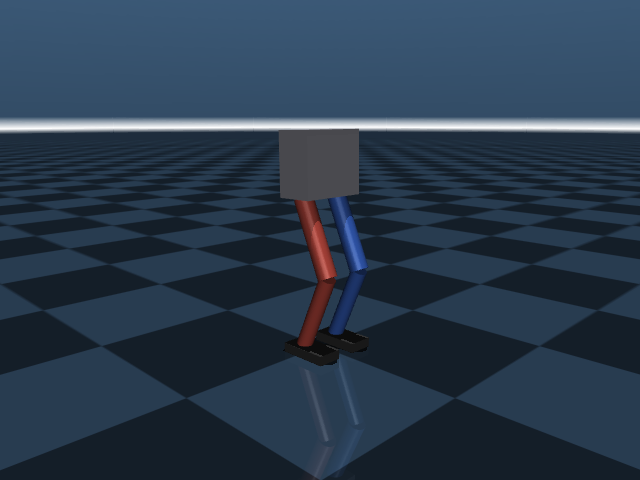
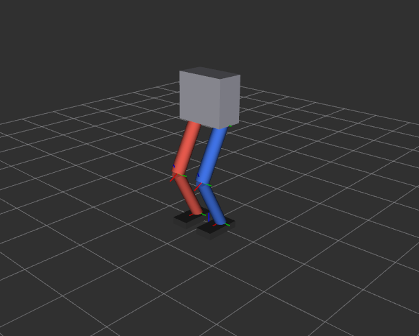
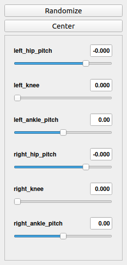
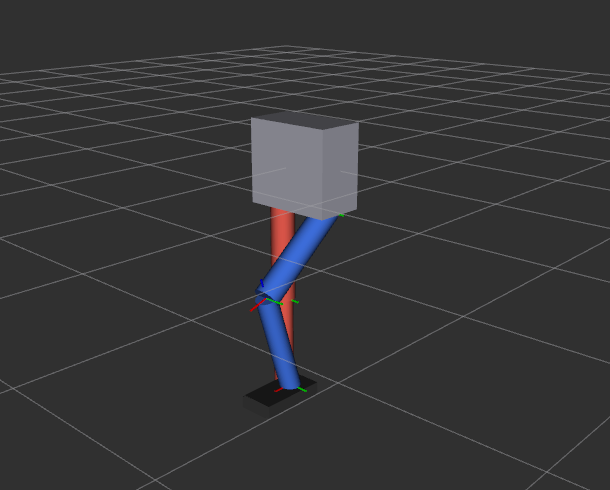
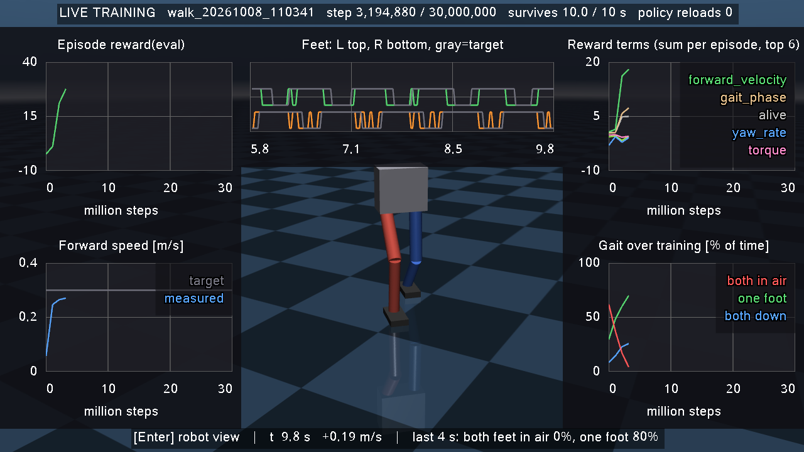
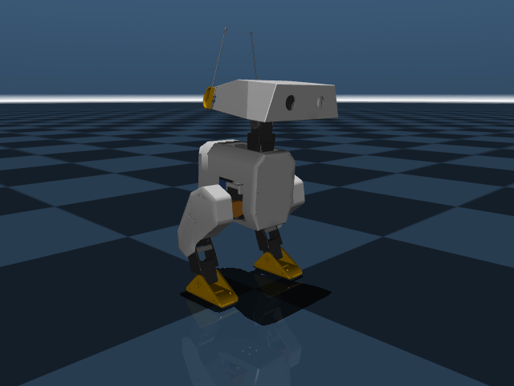
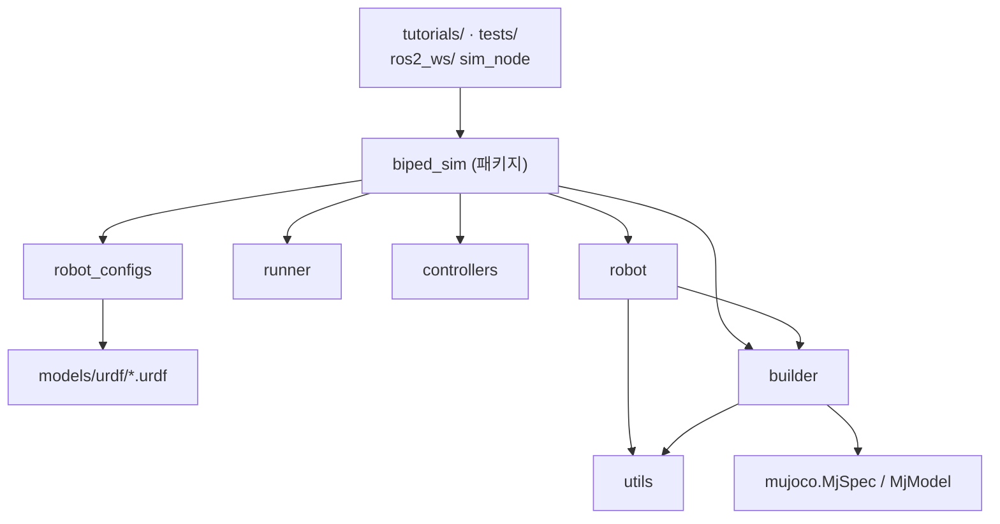

# Giga
거위 2족보행로봇

**MuJoCo 2족 보행 로봇 시뮬레이터 + ROS2 제어** (교육용 baseline, 패키지 이름 `biped_sim`)

<table>
<tr>
<td align="center"><br>MuJoCo (물리 시뮬레이션)</td>
<td align="center"><br>RViz (ROS2가 보는 로봇) — 제어기가 앉히는 중</td>
</tr>
</table>

이 저장소로 할 수 있는 것
- 2족 로봇을 **MuJoCo**에서 시뮬레이션하고 (서 있기, 밀면 넘어지기, 관절 제어 실험)
- **강화학습**으로 로봇이 스스로 균형 잡는 법을 배우게 하고 (밀려도 발을 딛어 버티기)
- 시뮬레이터를 **ROS2**로 조종하고 (토픽으로 관절 명령, RViz로 시각화)
- 튜토리얼 6개로 MuJoCo를 처음부터 배우기 (`tutorials/`)

환경: Ubuntu 22.04 + ROS2 Humble + Python 3.10 · 시뮬레이터: MuJoCo 3.15.0 · 진행 상황: [로드맵](docs/00_roadmap.md)

---

## 처음 시작하기 — 아무것도 몰라도 그대로 따라 하면 됩니다

아래 1~8단계의 명령을 **순서대로 하나씩** 복사해서 터미널에 붙여 넣으세요.
각 단계 끝의 **"✅ 확인"** 과 같은 결과가 나오면 다음 단계로 넘어가면 됩니다.
처음 한 번은 ROS2 설치 때문에 인터넷 속도에 따라 수십 분이 걸릴 수 있습니다. 두 번째부터는 4단계와 7단계만 하면 됩니다.

### 0단계. 준비물과 기본 용어

- **Ubuntu 22.04** 가 설치된 PC (다른 버전은 안 됩니다 — ROS2 Humble이 22.04 전용)
- 인터넷 연결, 관리자(sudo) 비밀번호, 디스크 여유 공간 약 5 GB

| 용어 | 뜻 |
|---|---|
| 터미널 | 명령을 입력하는 창. 키보드 `Ctrl` + `Alt` + `T` 로 열립니다 |
| 붙여넣기 | 터미널에서는 `Ctrl` + `Shift` + `V` (그냥 `Ctrl` + `V`는 안 됨) |
| `#` 뒤의 글 | 설명(주석)입니다. 같이 붙여 넣어도 무시되니 괜찮습니다 |
| `Ctrl` + `C` | 터미널에서 **실행 중인 프로그램을 멈춤** (복사가 아님) |

### 1단계. 저장소 받기 (처음 한 번)

```bash
sudo apt update && sudo apt install -y git     # git 설치 (이미 있으면 그냥 넘어감)
cd ~                                           # 홈 폴더로 이동
git clone https://github.com/joshualikaist/Giga.git
cd Giga
```

✅ 확인: `ls` 를 입력하면 `README.md  docs  scripts  tutorials ...` 가 보입니다.

### 2단계. ROS2 등 시스템 프로그램 설치 (처음 한 번, 관리자 비밀번호 필요)

```bash
bash scripts/install_system_deps.sh --dry-run   # 무엇을 설치할지 미리 보기만 함 (아무것도 안 바뀜)
bash scripts/install_system_deps.sh             # 실제 설치: 'y' 입력 → 비밀번호 입력
```

- ROS2가 없는 PC면 [공식 설치 절차](https://docs.ros.org/en/humble/Installation/Ubuntu-Install-Debs.html)대로 ROS2 Humble부터 설치합니다 (시스템 업데이트 포함이라 오래 걸림).
- ROS2가 이미 있으면 이 프로젝트에 필요한데 빠진 것만 설치합니다.

✅ 확인: 마지막 줄에 `완료! 다음 단계:  bash scripts/setup_env.sh` 또는 `필요한 패키지가 모두 설치되어 있습니다. 할 일이 없습니다. ✅`

### 3단계. 파이썬 환경 설치 (처음 한 번)

> 터미널 줄 맨 앞에 `(base)` 같은 글자가 보이면 conda가 켜져 있는 것입니다. 먼저 `conda deactivate` 를 입력해 끄세요 (글자가 사라질 때까지).

```bash
bash scripts/setup_env.sh
```

MuJoCo 등을 프로젝트 전용 폴더(`.venv`)에 설치하고, 마지막에 환경 점검 결과를 보여 줍니다.

✅ 확인: 끝부분에 `결과: FAIL 0개` (WARN은 있어도 괜찮습니다)

### 4단계. 환경 켜기 — ⚠ 새 터미널을 열 때마다 매번

```bash
cd ~/Giga
source scripts/activate.sh
```

✅ 확인:
```
[biped_sim] 환경 활성화 완료
  python : /home/(사용자이름)/Giga/.venv/bin/python
  ROS    : humble (ROS_DOMAIN_ID=27)
  ros2_ws: ros2_ws 아직 빌드 안 됨 (bash scripts/build_ros.sh)    ← 6단계 후에는 'ros2_ws 로드됨'
```

> 이걸 안 하면 `No module named 'mujoco'`, `ros2: command not found` 같은 오류가 납니다.
> `bash scripts/activate.sh` 가 아니라 반드시 **`source`** 입니다.

### 5단계. 첫 시뮬레이션 — MuJoCo만 (ROS 없이)

```bash
python tutorials/t01_hello_mujoco.py      # 상자와 공이 바닥에 떨어지는 창이 뜸
```

창을 닫거나 터미널에서 `Ctrl` + `C` 로 끝냅니다. 다음은 2족 로봇:

```bash
python tutorials/t06_biped_stand.py       # 로봇이 바닥에 서 있음
```

- 마우스: 왼쪽 드래그 = 회전, 오른쪽 드래그 = 이동, 휠 = 확대
- **로봇 밀어 보기**: 몸통을 더블클릭 → `Ctrl` 을 누른 채 마우스 오른쪽 버튼으로 드래그
- 튜토리얼은 t01~t06 순서로 하나씩 해 보세요 → [tutorials/README.md](tutorials/README.md)

✅ 확인: 위 왼쪽 그림처럼 로봇이 무릎을 살짝 굽히고 서 있으면 성공

### 6단계. ROS2 패키지 빌드 (처음 한 번 + `git pull`로 새 코드를 받았을 때)

```bash
bash scripts/build_ros.sh
source scripts/activate.sh                # 빌드 결과를 지금 터미널에 반영
```

✅ 확인: `Summary: 2 packages finished`, 그리고 activate 출력에 `ros2_ws: ros2_ws 로드됨`

> `colcon build` 를 직접 쓰지 마세요. 꼭 `bash scripts/build_ros.sh` 로 빌드해야 합니다 (이유: [docs/05 §2](docs/05_ros2_bridge_plan.md)).

### 7단계. ROS2로 실행하기

**① 로봇 모델 보기** — 물리 없이 생김새만

```bash
ros2 launch giga_description display.launch.py
```

 

슬라이더 창(왼쪽)을 움직이면 RViz(오른쪽)의 다리가 따라 움직입니다. `Ctrl` + `C` 로 종료.

**② 시뮬레이터 + 제어기** — 로봇이 앉았다 일어서기를 반복

```bash
ros2 launch giga_sim_ros sim.launch.py controller:=squat
```

MuJoCo 창과 RViz 창이 함께 뜨고, 두 창의 로봇이 똑같이 움직이면 성공입니다 (맨 위 그림).
`controller:=stand` 로 바꾸면 가만히 서 있고, `controller:=` 부분을 빼면 제어기 없이 시뮬레이터만 켭니다.
종료: 터미널에서 `Ctrl` + `C` 또는 MuJoCo 창 닫기 (모든 프로그램이 함께 꺼짐).

**③ 터미널에서 직접 조종** — 터미널 2개 사용

```bash
# 터미널 1 (cd ~/Giga && source scripts/activate.sh 먼저)
ros2 run giga_sim_ros sim_node --ros-args -p fixed_base:=true      # 공중에 매달린 로봇
```

```bash
# 터미널 2 (여기서도 cd ~/Giga && source scripts/activate.sh 먼저)
ros2 topic pub --once /joint_commands sensor_msgs/msg/JointState "{name: [left_knee], position: [1.5]}"
```

✅ 확인: 명령을 보낼 때마다 MuJoCo 창에서 **왼쪽 무릎만** 굽혀지면 성공

각 명령에서 내부적으로 무슨 일이 일어나는지, 더 많은 실습은 → **[docs/06 ROS2 실행 가이드](docs/06_ros2_hands_on.md)**

### 8단계. (선택) 전부 잘 되는지 자동 점검

```bash
pytest
```

창 없이 약 30초 동안 시뮬레이션·튜토리얼·ROS2 연동을 모두 시험합니다.

✅ 확인: 마지막 줄에 `failed`가 없으면 성공입니다 (처음엔 `32 passed, 17 skipped`).
`skipped`는 아직 설치하지 않은 선택 항목의 테스트입니다: 9단계 학습 패키지(5개), 10단계 GPU 학습 환경(7개, 그 환경에서
`pytest tests/test_walk_mjx.py`로 따로 실행), 11단계 오리 로봇 파일(5개). 설치하면 그만큼 `passed`로 바뀝니다.

### 9단계. (선택) 강화학습 첫 예제 — 로봇이 스스로 균형 잡는 법을 배우기

PD 제어만으로는 몸통을 30 N으로 밀면 넘어집니다. 강화학습으로 정책을 4분쯤 학습시키면 40 N까지 버티고,
아무도 가르쳐 주지 않은 **발 딛기**를 스스로 찾아냅니다.

```bash
bash scripts/setup_learning.sh                                       # 학습 패키지 설치 (처음 한 번, 수 분)
python learning/evaluate_balance.py --pretrained --view --push 40    # 학습 없이 바로: 미리 학습된 정책이 40 N을 버팀
python learning/evaluate_balance.py --view --push 40 --baseline      # 같은 상황에서 PD만 쓰면 넘어짐
python learning/train_balance.py                                     # 직접 학습 (CPU 약 4분)
```

✅ 확인: `train_balance.py`가 끝나면 학습 전/후 비교표가 나옵니다 (이 PC 실측)

```
밀기 세기   PD만(학습 전)   학습한 정책
   20 N     6/6 버팀        6/6 버팀
   30 N     0/6 버팀        6/6 버팀
   40 N     0/6 버팀        5/6 버팀
   50 N     0/6 버팀        4/6 버팀
   60 N     0/6 버팀        0/6 버팀
```

강화학습 개념, 과제 설계, 결과 해석, CPU vs GPU 실측, 직접 해 볼 과제 → **[docs/07 강화학습 첫 예제](docs/07_learning.md)**

#### 학습 그래프 보기 (TensorBoard)

TensorBoard는 학습 기록(`output/learning/` 안의 파일)을 그래프로 보여 주는 프로그램입니다.
인터넷 사이트가 아니라 **내 컴퓨터에서 직접 켜는 웹페이지**입니다. 켜 두면 학습 중에도 그래프가 계속 갱신됩니다.

```bash
# 새 터미널을 열고
cd ~/Giga
source scripts/activate.sh
tensorboard --logdir output/learning
# → "TensorBoard 2.21.0 at http://localhost:6006/" 가 나오면 성공. 이 터미널은 닫지 말고 그대로 둡니다.
```

1. 같은 컴퓨터의 웹 브라우저(Chrome, Firefox 등) 주소창에 **http://localhost:6006** 을 입력합니다.
2. 위쪽 **SCALARS** 탭에 그래프가 나옵니다. 왼쪽 **Runs**에서 보고 싶은 학습에 체크합니다. 이름은 `날짜_시각_내용` (예: `261008_140644_walk_scratch`)이라 시간순으로 정렬됩니다.
3. 위쪽 검색칸에 `reward` 를 입력하면 보상 그래프만 모아서 볼 수 있습니다.
4. 그래프는 30초마다 자동으로 새로 고쳐집니다 (오른쪽 위 ⟳ 버튼으로 바로 새로 고칠 수도 있음).
5. 끄려면 TensorBoard 터미널에서 `Ctrl+C`를 누릅니다.

이 예제(밀기 버티기)에서는 보상 항목별 값(`reward_terms/`), 버틴 시간(`episode/`), 세기별 시험 결과(`eval/`)가 그래프로 나옵니다.
학습 시작 전에 켜 두어도 되고, 학습 중이나 끝난 뒤에 켜도 같은 그래프가 나옵니다.

### 10단계. (선택, NVIDIA GPU 필요) GPU로 보행 학습

시뮬레이션 자체를 GPU에서 1024개 동시에 돌려(MuJoCo MJX + Brax PPO) **걷기**를 학습합니다. CPU 학습보다 약 13배 빠릅니다.
ROS2 환경과 섞이지 않도록 **별도 가상환경(`.venv-mjx`)** 을 씁니다.

```bash
bash scripts/setup_gpu_learning.sh            # GPU 학습 환경 설치 (처음 한 번, 약 3 GB)
source scripts/activate_gpu.sh                # ROS를 켜지 않은 새 터미널에서
python learning/train_walk_gpu.py --watch     # 3,000만 스텝, 약 20~35분 (처음 3~4분은 컴파일) + 학습 화면
python learning/play_walk.py --view           # 학습이 끝난 뒤 걸음 보기
```

`--watch`를 붙이면 **학습 화면**(MuJoCo 창)이 함께 열립니다. 창을 한 번 클릭한 뒤 **Enter 키**로 두 화면을 오갑니다.

| 화면 | 보이는 것 |
|---|---|
| 학습 현황 (처음 화면) | 양옆에 학습 그래프 4개(보상, 속도, 보상 항목, 걸음 방식 변화), 가운데 위에 발 접촉 그래프, 그 아래에 지금까지 배운 정책으로 걷는 로봇 |
| 로봇 보기 | 로봇을 크게, 아래에 발 접촉 그래프 |



- 로봇은 약 40초마다 새로 배운 정책으로 바뀝니다. 첫 정책이 나오기 전(3~4분)에는 제자리에 서 있습니다.
- **발 접촉 그래프**에서 위쪽 선은 왼발, 아래쪽 선은 오른발이고, 높으면 그 발이 땅을 딛고 있습니다.
  좌우가 번갈아 높으면 걷기이고, 둘이 함께 낮으면 두 발이 다 떠 있는 뛰기입니다.

✅ 확인: 학습 출력에서 `버틴 시간 10.00 s / 10 s`, `앞으로 속도 +0.30 m/s`, `두 발 공중 0%` 근처가 되면 넘어지지 않고 목표 속도로 걷는 것입니다.
더 자세한 그래프는 9단계의 TensorBoard(http://localhost:6006)에서 Runs에서 `…_walk…`를 고르면 됩니다.
`walk/forward_speed_mps`(속도), `walk/gait_flight_pct`(두 발 공중 비율), `eval/episode_reward/<항목>`(보상 항목별)을 보세요.

> 학습 화면은 학습과 별도 프로세스이고 GPU를 거의 쓰지 않게 설정되어 있습니다. 창을 닫아도 학습은 계속됩니다.
> 이 저장소의 MuJoCo 화면은 모두 같은 설정을 쓰지만, 다른 프로그램의 3D 창은 GPU를 최대 96%까지 쓸 수 있으니 학습 중에는 닫아 두세요.

#### 걸음 분석하고 다듬기

학습이 끝나면 걸음을 영상·사진·그래프로 확인하고, 문제가 있으면 보상을 바꿔 **그 정책에서 이어서** 학습합니다.

```bash
python learning/analyze_gait.py --run output/learning/<YYMMDD_HHMMSS>_walk   # 저장된 정책을 모두 비교 → 가장 좋은 걸음을 영상까지 분석
# → output/gait/<실행>_<스텝>/ 에 walk.mp4(영상), walk_slow.mp4(4배 느리게), filmstrip.png(한 걸음 연속 사진),
#   gait.png(관절 각도 좌우 비교 그래프), 터미널에 좌우 대칭 수치와 '절뚝임 점수'
python learning/train_walk_gpu.py --init-from <위에서 고른 정책.pkl> \
    --reward heading=-5 --steps 10000000 --name walk_heading --watch   # 예: 방향 유지를 더 강하게 이어서 다듬기 (약 12분)
```

절뚝이는 걸음을 이렇게 진단하고 고친 실제 과정 → **[docs/08 §6](docs/08_gpu_walking.md#6-걸음-다듬기--보고-진단하고-보상을-바꿔-이어서-학습)**

과제 설계, 보상 항목, 결과 분석, 보상 바꿔 보기 → **[docs/08 GPU 보행 학습](docs/08_gpu_walking.md)**

### 11단계. (선택) 남이 만든 오픈소스 로봇 불러오기 — 오리 로봇 Open Duck Mini

인터넷에서 받은 URDF를 시뮬레이터에 넣을 때 생기는 문제를 실제 로봇으로 확인하고 고칩니다 (4단계 후, 인터넷 필요).

```bash
bash scripts/get_open_duck.sh                   # URDF + 메시 + 라이선스 받기 (처음 한 번, 약 19 MB)
python tutorials/t07_open_duck.py --headless    # 문제 확인 → 보완 → 좌우 관절 부호 → 서 있기 검증
python tutorials/t07_open_duck.py               # 뷰어: PD로 서 있는 오리 (Ctrl+오른쪽 드래그로 밀어 보기)
```

✅ 확인: 마지막에 `발 하중 ... = 무게(20.22 N)의 1.000배`, `서 있음 ✅`



받은 파일은 고치지 않고, 불러올 때 보완합니다 (메시 경로, 토크 한계, 충돌 형상 단순화 등).

오리 걷기 학습 (10단계의 GPU 환경에서, 약 40분):

```bash
source scripts/activate_gpu.sh
python learning/train_walk_gpu.py --robot open_duck_mini                                      # 보상만으로
python learning/train_walk_gpu.py --robot open_duck_mini --reward reference=3 --name duck_ref  # 참고 동작 모방
```

> 오리는 `--watch` 없이 학습하세요. 학습 화면이 오리의 CAD 메시를 계속 그리면 학습이 4.6배 느려집니다 (실측).

울퉁불퉁한 지형(언덕·불규칙한 경사로·장애물) 실험과 지형 학습:

```bash
python learning/terrain_trial.py --params <정책.pkl>          # MuJoCo 화면: 지형마다 새 지형으로 걸려 보기
python learning/train_walk_gpu.py --robot open_duck_mini --terrain rough --init-from <평지 정책.pkl> --steps 20000000
```

평지에서만 배운 오리는 험한 지형에서 10번 중 2~4번만 버텼고, 지형에서 더 배운 오리는 10번 모두 버텼습니다 (docs/09 §7).

오픈소스 URDF 점검표, 확인 과정, 두 학습 방식 비교, 지형 실험 → **[docs/09 오픈소스 로봇 불러오기](docs/09_open_source_robot.md)**

### 막혔을 때

| 증상 | 해결 |
|---|---|
| 줄 앞에 `(base)` 가 보이고 3·4단계에서 conda 경고 | `conda deactivate` 후 다시 |
| `No module named 'mujoco'` | 4단계(`source scripts/activate.sh`)를 안 한 터미널입니다 |
| `ros2: command not found` | 2단계를 안 했거나, 4단계를 안 한 터미널입니다 |
| `Package 'giga_sim_ros' not found` | 6단계를 하고 `source scripts/activate.sh` 를 다시 |
| 노드 실행 시 `No module named 'mujoco'` | `colcon build` 를 직접 썼음 → `bash scripts/build_ros.sh` |
| 다른 터미널에서 `ros2 topic list` 에 토픽이 안 보임 | 그 터미널에서도 4단계를 해야 합니다 (같은 `ROS_DOMAIN_ID=27` 이 되도록) |
| 창이 안 뜸 (원격 접속 등 화면 없는 환경) | 튜토리얼은 `--headless`, ROS2는 `viewer:=false rviz:=false` 를 붙여 실행 |
| 그 밖의 문제 | `python scripts/check_env.py` 출력을 확인 → [docs/01 문제 해결](docs/01_environment.md) |

### 다음에 읽을 것

| 문서 | 내용 |
|---|---|
| [tutorials/README.md](tutorials/README.md) | MuJoCo 튜토리얼 t01~t07 (순서대로, 과제 포함) |
| [docs/06_ros2_hands_on.md](docs/06_ros2_hands_on.md) | ROS2 실행 가이드: 명령별로 무슨 일이 일어나는지 |
| [docs/07_learning.md](docs/07_learning.md) | 강화학습 첫 예제: 개념, 실행, 결과 해석, CPU vs GPU |
| [docs/08_gpu_walking.md](docs/08_gpu_walking.md) | GPU 보행 학습: MJX + Brax PPO, 보상 설계, 걸음 분석·다듬기 |
| [docs/09_open_source_robot.md](docs/09_open_source_robot.md) | 오픈소스 로봇(오리) 불러오기: URDF 점검표, 좌우 부호, 서 있기 |
| [docs/00_roadmap.md](docs/00_roadmap.md) | 전체 계획과 현재 위치 |
| [docs/02](docs/02_mujoco_concepts.md) · [03](docs/03_urdf_and_mujoco.md) · [04](docs/04_simple_biped_spec.md) | MuJoCo 개념, URDF 변환 규칙, 로봇 사양 |

---

## 폴더 구조

```
Giga/                             (clone한 폴더 이름. 로컬에서 다른 이름이어도 무관)
├── README.md                     ← 지금 이 파일 (시작점)
├── requirements.txt              ← pip 의존성 (mujoco==3.15.0, numpy<2, -e .)
├── requirements-learning.txt     ← (선택) 강화학습 패키지: stable-baselines3, gymnasium, tensorboard (torch는 setup_learning.sh가)
├── requirements-gpu.txt          ← (선택) GPU 학습 환경(.venv-mjx): jax[cuda12], mujoco-mjx, brax
├── pyproject.toml                ← biped_sim 패키지 정의 (pip install -e . 로 어디서든 import 가능)
├── .gitignore
│
├── scripts/                      ── 환경/도구
│   ├── install_system_deps.sh    ← [1회, sudo] ROS2 Humble 등 apt 패키지 설치 (--dry-run으로 미리 보기)
│   ├── setup_learning.sh         ← [선택, 1회] PyTorch(CPU판, --gpu로 GPU판) + 강화학습 패키지 설치
│   ├── setup_gpu_learning.sh     ← [선택, 1회] GPU 학습 환경 .venv-mjx 설치 (JAX, MJX, Brax)
│   ├── activate_gpu.sh           ← [GPU 학습 터미널마다] source: .venv-mjx 켜기
│   ├── setup_env.sh              ← [1회] .venv 생성 + 설치 + 점검
│   ├── activate.sh               ← [매 터미널] source: ROS2 Humble + .venv + ros2_ws + ROS_DOMAIN_ID=27
│   ├── check_env.py              ← 환경 진단 (Python/numpy/mujoco/ROS2/GL)
│   ├── build_ros.sh              ← ros2_ws 빌드 (venv의 python -m colcon build — 그냥 colcon build 금지)
│   ├── get_open_duck.sh          ← [선택, 1회] 오픈소스 오리 로봇 Open Duck Mini 내려받기 (고정 커밋, docs/09)
│   └── inertia_calc.py           ← box/cylinder/sphere 관성 → URDF <inertia> 한 줄
│
├── docs/                         ── 학습 문서 (번호 순서대로)
│   ├── 00_roadmap.md             ← 전체 계획 Phase 0~8, 현재 위치
│   ├── 01_environment.md         ← 왜 venv인가, 왜 numpy<2인가, 문제 해결
│   ├── 02_mujoco_concepts.md     ← MjModel/MjData, nq≠nv, 좌표·쿼터니언 규약, 접촉, 적분기
│   ├── 03_urdf_and_mujoco.md     ← URDF 문법 + MuJoCo 변환 규칙(실측) + 실제 로봇 체크리스트
│   ├── 04_simple_biped_spec.md   ← 2족 모델 사양서 (치수·질량·관절·부호·게인 근거)
│   ├── 05_ros2_bridge_plan.md    ← ROS2 연동 단계별 실행 계획 (사전 검증 결과, 인터페이스 명세, 결정 사항, 진행 상태)
│   ├── 06_ros2_hands_on.md       ← ROS2 실행 가이드: 명령별로 일어나는 일 + 터미널 실습
│   ├── 07_learning.md            ← 강화학습 첫 예제: 밀려도 넘어지지 않기 (PPO), TensorBoard
│   ├── 08_gpu_walking.md         ← GPU 보행 학습: MuJoCo MJX + Brax PPO, 보상 설계, 걸음 분석·다듬기
│   ├── 09_open_source_robot.md   ← 오픈소스 로봇 불러오기: URDF 점검표, Open Duck Mini 실습
│   └── images/                   ← README의 "이렇게 보이면 성공" 그림
│
├── models/                       ── 로봇/장면 모델 (원본)
│   ├── mjcf/
│   │   └── falling_box.xml       ← MJCF Hello World (t01, t02)
│   ├── urdf/
│   │   └── pendulum/
│   │       └── pendulum.urdf     ← 최소 URDF: 링크 2 + 관절 1 (t03)
│   │                               (2족 로봇 URDF는 ros2_ws/src/giga_description/urdf/ 로 이동)
│   └── third_party/              ← 외부 오픈소스 로봇 (내려받아 채움, git 제외. README.md에 출처·라이선스)
│
├── biped_sim/                    ── 시뮬레이터 코어 (Python 패키지)
│   ├── __init__.py               ← 공개 API 모음
│   ├── paths.py                  ← 파일 경로 상수 (실행 위치와 무관하게 동작)
│   ├── builder.py                ← URDF → MuJoCo 모델 (freejoint·모터·IMU·바닥·충돌제외·키프레임)
│   ├── robot.py                  ← RobotInterface: 관절 '이름' 기반 상태 읽기/토크 쓰기 (ROS2 JointState 대응)
│   ├── controllers.py            ← JointPDController (τ = Kp·e + Kd·ė + τ_ff, 토크 포화)
│   ├── robot_configs.py          ← 로봇별 설정 (URDF 경로, home 자세, 게인, 발 링크): SIMPLE_BIPED, OPEN_DUCK_MINI
│   ├── runner.py                 ← simulate() 루프 (뷰어/헤드리스), passive_viewer(안전한 뷰어 종료), 스냅샷, 카메라
│   ├── utils.py                  ← 쿼터니언 변환(MuJoCo↔ROS), 지면 높이 계산
│   ├── terrain.py                ← 울퉁불퉁한 지형(높이맵): 언덕·불규칙한 경사로·장애물·학습용 넓은 지형
│   └── envs/                     ← 강화학습 환경
│       ├── balance.py            ←   밀기 버티기 (Gymnasium, CPU) + 평가 함수
│       └── walk_mjx.py           ←   보행 (Brax, GPU MJX) — .venv-mjx에서만
│
├── tutorials/                    ── 학생용 실습 (순서대로)
│   ├── README.md                 ← 각 튜토리얼의 관찰 포인트 + 과제
│   ├── t01_hello_mujoco.py       ← 시뮬레이션 루프, 뷰어
│   ├── t02_model_and_data.py     ← nq≠nv, mj_forward vs mj_step, 쿼터니언, 접촉력
│   ├── t03_urdf_pendulum.py      ← URDF 로드 → 검증 실패 → 진단 → 수정 → 재검증
│   ├── t04_biped_inspect.py      ← 2족 URDF 해부, 인덱스 표, MJCF 내보내기
│   ├── t05_biped_hanging_pd.py   ← 매단 로봇 관절 PD 궤적 추종 (게인/피드포워드 비교)
│   ├── t06_biped_stand.py        ← 바닥에 세우기, 접촉력=무게 검증, 밀기 실험
│   └── t07_open_duck.py          ← 남이 만든 오픈소스 로봇(오리) 불러오기: 문제 확인 → 보완 → 서 있기
│
├── tests/                        ── 회귀 테스트 (pytest)
│   ├── test_simulator.py         ← URDF 변환 동작, 빌더, 진자 주기, 서 있기, 접촉력=무게
│   ├── test_tutorials_and_ros.py ← 튜토리얼 실행 + ROS2 robot_state_publisher URDF 파싱
│   ├── test_ros_sim_node.py      ← sim_node 통합: 주기, 명령, 초기화, IMU·TF, 정상 종료
│   ├── test_ros_launch.py        ← launch 통합: 앉았다 일어서기, 제어기 사망 시 감쇠 모드
│   ├── test_learning.py          ← 학습 환경 규격, 기준선, 미리 학습된 모델 성능, 학습 스크립트
│   ├── test_open_duck.py         ← 오리 로봇: 빌더 보완, 바닥 1 mm 위 시작, 좌우 부호, 서 있기 (파일 있을 때만)
│   ├── test_terrain.py           ← 지형 높이 = MuJoCo 실제 표면(광선으로 확인), 바꿔 끼우기, 출발 자리
│   └── test_walk_mjx.py          ← GPU 보행 환경·관측 일치·학습 화면·걸음 분석·미리 학습된 걸음 (.venv-mjx에서만)
│
├── learning/                     ── 강화학습 예제 (CPU: docs/07, GPU 보행: docs/08)
│   ├── train_balance.py          ← PPO 학습 → output/learning/ (모델, 기록, 학습 곡선, 비교표)
│   ├── evaluate_balance.py       ← 비교표, MuJoCo 화면 재생 (--view, --baseline, --pretrained)
│   ├── train_walk_gpu.py         ← GPU 보행 학습 (Brax PPO), TensorBoard, 보상 바꾸기(--reward), 학습 화면(--watch)
│   ├── play_walk.py              ← 보행 정책 학습 화면(--live)·재생(--view)
│   ├── walk_tools.py             ← 보행 공용 도구: 정책 불러오기, 재생기, 에피소드 기록, 걸음 수치
│   ├── live_dashboard.py         ← MuJoCo 창 안의 학습 그래프·발 접촉 그래프 (Enter로 화면 전환)
│   ├── analyze_gait.py           ← 걸음 분석: 영상·연속 사진·그래프·절뚝임 점수, 체크포인트 비교(--run)
│   ├── terrain_trial.py          ← 울퉁불퉁한 지형 실험: MuJoCo 화면에서 에피소드마다 새 지형 (--headless는 통계)
│   └── pretrained/               ← 미리 학습된 모델: balance_ppo.zip (밀기 버티기),
│                                    walk_policy.pkl/.json (다듬은 걸음, docs/08 §6)
│
├── ros2_ws/                      ── ROS2 colcon 워크스페이스 (build/ install/ log/는 git 제외)
│   └── src/
│       ├── giga_description/     ← ament_cmake: 로봇 "설명" 패키지
│       │   ├── urdf/simple_biped.urdf    ← 6-DoF 2족 로봇. ROS2·RViz·MuJoCo가 공유하는 단일 원본
│       │   ├── launch/display.launch.py  ← URDF를 RViz로 보기 (슬라이더, 물리 없음)
│       │   └── rviz/display.rviz, sim.rviz
│       └── giga_sim_ros/         ← ament_python: 시뮬레이터 ROS 어댑터
│           ├── giga_sim_ros/sim_node.py         ← MuJoCo를 감싼 ROS2 노드 = "가짜 로봇 하드웨어"
│           ├── giga_sim_ros/demo_controller.py  ← 토픽만으로 로봇 조종 (stand / squat)
│           ├── giga_sim_ros/shutdown.py         ← Ctrl+C·SIGTERM 안전 종료 처리
│           ├── launch/sim.launch.py             ← sim_node + robot_state_publisher + RViz + 제어기
│           └── package.xml, setup.py, setup.cfg, resource/
│
├── output/                       ── 생성물 (git 제외): 내보낸 MJCF, 그래프, 스냅샷
├── biped_sim.egg-info/           ── pip install -e . 가 자동 생성하는 메타데이터 (git 제외, 건드리지 않음)
├── .venv/                        ── 가상환경 (git 제외, setup_env.sh가 생성)
└── .venv-mjx/                    ── (선택) GPU 학습 가상환경 (git 제외, setup_gpu_learning.sh가 생성)
```

### 의존 관계



## 설계 원칙

1. **URDF가 단일 원본**: 로봇 기구학/관성은 URDF 한 곳에서만 정의하고 ROS2와 공유합니다.
   시뮬레이션 전용 요소(바닥, 모터, IMU, freejoint 등)는 `biped_sim/builder.py`가 덧붙입니다.
2. **이름 기반 접근**: 배열 인덱스 대신 관절 이름으로 다룹니다 (`RobotInterface`). ROS2 `JointState`와 1:1.
3. **토크 모터 + 외부 PD**: MuJoCo의 position 액추에이터 대신, 실제 모터 드라이버처럼 PD를 직접 계산해 토크로 넣습니다.
4. **숫자로 검증**: 진자 주기 vs 이론, 접촉력 합 vs 무게 등 해석해와 비교하고, 그 결과를 테스트로 고정합니다.

## 지금까지 실험으로 확인한 중요한 사실

| 사실 | 확인한 곳 |
|---|---|
| URDF를 그대로 MuJoCo에 넣으면 루트 링크가 world에 병합되고 visual·액추에이터가 사라진다 | t03, t04, `test_raw_urdf_import_behavior` |
| 병합된/고정된 몸통은 부모-자식 충돌 필터가 안 먹혀 **에러 없이 결과가 틀린다** (진자 주기 59% 오차) | t03, `test_fixed_base_has_no_spurious_self_contacts` |
| 빌더 사용 시 진자 주기 오차 0.015 % | t03, `test_pendulum_period_matches_theory` |
| 서 있을 때 두 발 수직력 합 = 80.44 N = 8.2 kg × 9.81 | t06, `test_biped_stands_and_contact_force_equals_weight` |
| `<mujoco>` 태그가 들어간 URDF도 ROS2 `robot_state_publisher`가 정상 파싱 | `test_urdf_loads_in_ros2_robot_state_publisher` |
| `package://` 메쉬 경로는 MuJoCo가 못 읽음 → `meshdir` + `strippath="true"`로 해결 | [docs/03](docs/03_urdf_and_mujoco.md) |
| MJCF `euler`(기본 intrinsic xyz) ≠ URDF `rpy`(고정축 XYZ) | t02 |
| `mujoco.viewer.launch_passive`를 그대로 쓰면 종료 시 세그폴트/X 에러/멈춤 (그리기 스레드를 안 기다림) → `biped_sim.passive_viewer`로 해결 | [docs/05 §2](docs/05_ros2_bridge_plan.md) |
| ROS2 노드는 venv의 `python -m colcon build`로 빌드해야 MuJoCo를 쓸 수 있음 (그냥 `colcon build`는 `No module named 'mujoco'`) | `scripts/build_ros.sh` |
| Python ROS2 노드로 500 Hz 시뮬레이션 + 발행 가능 (`/joint_states` 499.99 Hz, 제어 왕복 지연 중앙값 0.77 ms) | [docs/05 §2](docs/05_ros2_bridge_plan.md), `test_ros_sim_node.py` |
| ROS 토픽만으로 제어하는 노드가 로봇을 세우고 앉혔다 일으킴 (몸통 0.505↔0.590 m, 기울기 ≤ 1.4°) | `test_ros_launch.py` |
| MuJoCo는 world에 고정된 바디의 가속도계를 0으로 냄 → `RobotInterface.imu()`에서 +g 보정 | `test_imu_accelerometer_reads_gravity_reaction_on_fixed_base` |

## 다음 단계

IMU를 쓰는 균형 제어기(40 N 밀기 견디기), [docs/00_roadmap.md](docs/00_roadmap.md)의 Phase 4(12-DoF 모델, 센서/모터 현실화).
ROS2 연동의 남은 항목은 [docs/05](docs/05_ros2_bridge_plan.md) 단계표 참고.
실제 로봇의 URDF가 준비되면 [docs/03 §5 체크리스트](docs/03_urdf_and_mujoco.md)를 따라 `robot_configs.py`에 추가하세요.
