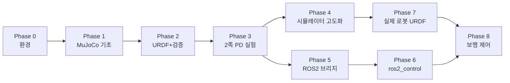

# 00. 전체 로드맵 — MuJoCo 2족 보행 시뮬레이터

> 목표: **실제 제작 중인 2족 로봇을 MuJoCo에서 시뮬레이션하고, ROS2로 제어**할 수 있는 기반을 만든다.
> 원칙: 한 번에 하나씩. 각 단계마다 **"맞게 동작하는지 숫자로 검증"** 한 뒤 다음 단계로 간다.

## 한눈에 보기

| Phase | 내용 | 산출물 | 상태 |
|---|---|---|---|
| 0 | 개발 환경 구축 (venv + MuJoCo + ROS2 Humble 공존) | `scripts/`, `requirements.txt` | ✅ 완료 |
| 1 | MuJoCo 기초: MJCF, MjModel/MjData, 시뮬레이션 루프, 뷰어 | `t01`, `t02` | ✅ 완료 |
| 2 | URDF 기초 + 시뮬레이션 검증 습관 (진자 주기 vs 이론) | `t03`, `pendulum.urdf` | ✅ 완료 |
| 3 | **최소 2족 URDF + 시뮬레이터 코어 + 관절 PD 실험** | `t04`~`t06`, `biped_sim/` | ✅ 완료 |
| 4 | 시뮬레이터 고도화 (3D 보행용 모델, 센서·모터 현실화) | 12-DoF 모델 등 | ⬜ 다음 |
| 5 | ROS2 브리지 (토픽으로 상태 발행/명령 수신, RViz) | `ros2_ws/`, `sim_node` | 🟡 진행 중 ← 지금 여기 |
| 6 | (선택) ros2_control 연동 | hardware interface | ⬜ |
| 7 | 실제 로봇 URDF로 교체 (CAD → URDF → 검증) | 실제 로봇 모델 | ⬜ |
| 8 | 보행 제어 (정적 → ZMP/LIPM 동적 보행 → 선택: 강화학습) | 보행 제어기 | ⬜ |

---

## Phase 0 — 개발 환경 ✅

- **결정**: conda가 아니라 *시스템 Python 3.10 기반 venv(`--system-site-packages`)*, numpy는 1.x로 고정.
  ROS2 Humble이 시스템 Python 3.10 + numpy 1.x로 빌드되어 있기 때문. → [01_environment.md](01_environment.md)
- 완료 기준: `python scripts/check_env.py` 전 항목 OK (venv 안에서 `mujoco`와 `rclpy`가 동시에 import됨).

## Phase 1 — MuJoCo 기초 ✅

- `t01_hello_mujoco.py`: MJCF 파일 → MjModel → MjData → `mj_step` 루프, 뷰어 조작
- `t02_model_and_data.py`: `nq ≠ nv`, 이름으로 접근, `mj_forward` vs `mj_step`, 쿼터니언·오일러각 규약, 접촉력
- 개념 정리: [02_mujoco_concepts.md](02_mujoco_concepts.md)

## Phase 2 — URDF 기초 + 검증 습관 ✅

- `t03_urdf_pendulum.py`: URDF를 그대로 읽으면 **에러 없이 틀린 결과**(진자 주기 오차 59%)가 나오는 것을 직접 확인하고,
  원인(병합된 루트 링크와의 가짜 충돌)을 진단해 수정 → 오차 0.015%로 통과.
- MuJoCo의 URDF 변환 규칙(실측): [03_urdf_and_mujoco.md](03_urdf_and_mujoco.md)

## Phase 3 — 최소 2족 URDF + 시뮬레이터 코어 ✅ ("제일 쉬운 URDF 실험 세팅")

- 모델: `models/urdf/simple_biped/simple_biped.urdf` — 6 DoF(다리당 hip/knee/ankle pitch), 8.2 kg. 사양: [04_simple_biped_spec.md](04_simple_biped_spec.md)
- 시뮬레이터 코어 `biped_sim/`: URDF → (freejoint·모터·IMU·바닥·충돌제외 추가) → MuJoCo 모델
- 실험:
  - `t04`: URDF 그대로 vs 빌더 결과 비교, 모든 인덱스 표, 최종 MJCF 내보내기
  - `t05`: **공중에 매단 로봇의 관절 PD 궤적 추종** (게인/피드포워드/중력보상/채터링 비교)
  - `t06`: 바닥에 세우기 — 접촉력 합 = 무게 검증, 제어 OFF 시 붕괴, 20 N 밀기 버팀 / 40 N 넘어짐
- 회귀 테스트: `pytest` 18개 (물리 검증 + 튜토리얼 + ROS2 URDF 파싱)

## Phase 4 — 시뮬레이터 고도화 ⬜

simple_biped는 hip roll이 없어 **좌우로 체중을 옮길 수 없으므로 3D 보행이 불가능**합니다. 다음을 진행합니다.

1. **12-DoF 모델** (다리당 hip yaw/roll/pitch, knee, ankle pitch/roll) — 실제 로봇 관절 구성과 맞추기
2. **센서 현실화**: 관절 엔코더 양자화/노이즈, IMU 노이즈·바이어스, 발바닥 접촉 센서(touch/force)
3. **모터 현실화**: 토크-속도 한계(URDF `velocity`는 MuJoCo가 무시하므로 직접 구현), 통신 지연
4. **제어 주기 분리**: 물리 1 kHz / 제어 500 Hz 등 (실제 로봇의 제어 주기와 맞추기)
5. **로깅·재생**: 실험 데이터 저장, 그래프 도구
6. 완료 기준: 각 항목마다 t03/t06 같은 정량 검증 + 테스트 추가

## Phase 5 — ROS2 브리지 🟡 진행 중

시뮬레이터를 ROS2 노드로 감싸서, **실제 로봇과 똑같은 토픽 인터페이스**로 제어합니다.
단계별 실행 계획(Step 5-0 ~ 5-8), 인터페이스 명세, 팀 결정 사항: [05_ros2_bridge_plan.md](05_ros2_bridge_plan.md)

- 사전 검증 완료(2026-10-08): venv + `python -m colcon build`로 만든 ROS2 노드에서 MuJoCo 사용 가능,
  Python 노드로 500 Hz 시뮬레이션 + 제어 명령 왕복 지연 0.77 ms(중앙값), MuJoCo 뷰어와 동시 사용 가능
- 완료(2026-10-08): `giga_sim_ros/sim_node` — `/joint_states`(499.99 Hz), `/clock`, `/joint_commands`(검증·범위 제한·타임아웃), `/sim/reset`, 뷰어, 정상 종료, 통합 테스트
- 지금 할 일: [06_ros2_hands_on.md](06_ros2_hands_on.md) 실습(Step 5-0) → RViz 시각화(5-1, 5-3) → IMU·TF(5-4) → 제어기 노드(5-5)
- 사전 설치 필요(관리자 권한): `sudo apt install ros-humble-xacro ros-humble-joint-state-publisher-gui`

## Phase 6 — (선택) ros2_control ⬜

실제 로봇의 하드웨어 인터페이스와 시뮬레이터를 같은 ros2_control 컨트롤러로 구동하는 단계.
직접 hardware interface(C++)를 작성하거나 커뮤니티 구현을 쓸 수 있으나, **ROS2 배포판·MuJoCo 버전 호환을 먼저 확인**해야 합니다.
Phase 5의 토픽 기반 브리지로 충분하다면 생략 가능합니다.

## Phase 7 — 실제 로봇 URDF로 교체 ⬜

1. CAD에서 URDF 추출 (예: SolidWorks용 URDF exporter, Onshape용 onshape-to-robot 등)
2. 메쉬 경로: `package://` 는 MuJoCo가 못 읽음 → `<mujoco><compiler meshdir="..." strippath="true"/></mujoco>` (실측 확인, [03](03_urdf_and_mujoco.md) 참고)
3. **관성 검증**: CAD에서 나온 질량/관성이 그럴듯한지(총 질량, 대칭성, 양의 정부호) 확인 — 가장 흔한 오류 원인
4. 충돌 형상 단순화: 발바닥은 box, 나머지는 capsule/cylinder로 (메쉬 충돌은 느리고 불안정)
5. `robot_configs.py`에 새 `RobotConfig` 추가 → t04~t06과 테스트를 그대로 재사용

## Phase 8 — 보행 제어 ⬜

정적 보행(무게중심을 지지 다각형 안에 유지) → ZMP/LIPM 기반 동적 보행 → (선택) 강화학습(MuJoCo의 MJX 등).
t06에서 본 것처럼 **관절 PD만으로는 40 N 밀기도 못 버티므로**, 균형 제어와 발 딛기가 필요한 이유가 여기서 해결됩니다.
