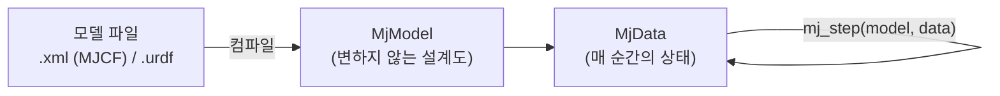

# 02. MuJoCo 핵심 개념 — 로봇 시뮬레이터를 만들기 위해 꼭 알아야 할 것

> 함께 볼 코드: `tutorials/t01_hello_mujoco.py`, `tutorials/t02_model_and_data.py`
> 공식 문서: https://mujoco.readthedocs.io (Overview → Computation → XML Reference → Python 순서 추천)

## 1. 큰 그림: 모델 파일 → MjModel → MjData → mj_step



| | MjModel | MjData |
|---|---|---|
| 담는 것 | 질량, 관성, 형상, 관절 구조/범위, timestep, 중력, 액추에이터 설정 | 위치(qpos), 속도(qvel), 시간, 접촉, 힘, 센서값, 제어입력(ctrl) |
| 바뀌나? | 기본적으로 고정 (단, `model.opt.*` 같은 옵션은 실행 중 변경 가능 — t02 6절) | 매 스텝 바뀜 |
| 개수 | 로봇 하나에 1개 | 같은 모델로 여러 개 가능 (병렬 시뮬레이션) |

시뮬레이션 루프는 결국 이것뿐입니다 (`biped_sim/runner.py`):

```python
while 시간이_남았으면:
    data.ctrl[:] = 제어기(센서값)      # ① 읽고, 계산하고, 쓴다
    mujoco.mj_step(model, data)        # ② 물리 엔진이 timestep만큼 시간을 진행
```

## 2. 상태 벡터: qpos, qvel, ctrl — 그리고 `nq ≠ nv`

| 배열 | 길이 | 의미 |
|---|---|---|
| `data.qpos` | `nq` | 일반화 좌표(위치). hinge=1, slide=1, ball=4(쿼터니언), **free=7** (x,y,z + 쿼터니언 w,x,y,z) |
| `data.qvel` | `nv` | 일반화 속도(= 자유도). hinge=1, slide=1, ball=3, **free=6** (선속도 3 + 각속도 3) |
| `data.ctrl` | `nu` | 액추에이터 입력. 이 프로젝트에선 모터 토크 [N·m] |

회전은 쿼터니언 4개로 표현하지만 자유도는 3이라 `nq ≠ nv` 입니다.
그래서 **"관절 i의 값 = `qpos[i]`" 는 틀린 가정**입니다. 항상 주소를 조회하세요.

```python
adr_q = model.jnt_qposadr[joint_id]   # qpos에서의 시작 위치
adr_v = model.jnt_dofadr[joint_id]    # qvel에서의 시작 위치
data.joint("left_knee").qpos          # 또는 이름으로 (원본 배열의 '뷰')
```

simple_biped (floating base)의 실제 배치 (`t04` 출력):

```
qpos: [ x y z | qw qx qy qz | L_hip L_knee L_ankle R_hip R_knee R_ankle ]   nq = 13
        0 1 2   3  4  5  6     7     8      9      10    11      12
qvel: [ vx vy vz | wx wy wz | L_hip L_knee L_ankle R_hip R_knee R_ankle ]   nv = 12
        0  1  2    3  4  5     6     7      8      9     10      11
```

> freejoint의 `qvel[0:3]`(선속도)은 **world 좌표계**, `qvel[3:6]`(각속도)은 **몸통 좌표계** 기준입니다.

`biped_sim.RobotInterface`는 이 인덱스를 한 번 계산해 두고 관절 이름 순서로 값을 돌려줍니다.

## 3. mj_forward vs mj_step

| 함수 | 시간 진행 | 하는 일 |
|---|---|---|
| `mj_forward(m, d)` | ✗ | qpos/qvel로부터 위치(`xpos`), 자세(`xquat`, `xmat`), 접촉, 힘, 센서값 등 **파생량만 계산** |
| `mj_step(m, d)` | ✓ (timestep) | forward 계산 + 적분하여 다음 상태로 |

`qpos`를 직접 바꾼 뒤에는 `mj_forward`를 불러야 `xpos`나 센서값이 갱신됩니다 (t02 4절에서 확인).

## 4. 좌표계·단위·회전 규약 (ROS2 연동 시 버그의 주범)

| 항목 | MuJoCo | ROS2 / URDF | 주의 |
|---|---|---|---|
| 축 방향 | z-up (중력 −z) | REP-103: x 앞, y 왼쪽, z 위 | 동일 ✅ |
| 단위 | m, kg, s, rad(내부) | m, kg, s, rad | 동일 ✅ |
| **쿼터니언 순서** | **(w, x, y, z)** | **(x, y, z, w)** | ⚠ 변환 필수 (`biped_sim.utils.quat_wxyz_to_xyzw`) |
| MJCF 각도 단위 | 기본 **도(degree)** | 라디안 | `<compiler angle="radian"/>`로 변경 가능 |
| MJCF `euler` | 기본 `eulerseq="xyz"` (회전하는 축 기준) | URDF `rpy` = 고정축 X→Y→Z | ⚠ `euler="20 30 0"` ≠ `rpy="20° 30° 0"`. `eulerseq="XYZ"`로 맞출 수 있음 (t02 3절에서 실측) |
| box 크기 | `size` = **절반 길이** | `size` = 전체 길이 | URDF→MuJoCo 변환 시 자동 처리 |
| cylinder 크기 | `size="반지름 반높이"` | `radius`, `length`(전체) | 자동 처리 |

## 5. 바디 · 관절 · geom · site

| 요소 | 역할 | 비유 |
|---|---|---|
| `body` | 강체 하나. 부모-자식 트리 구조 | URDF의 link |
| `joint` | 바디와 부모 사이의 자유도. **없으면 부모에 용접(고정)** | URDF의 joint (단, 위치가 자식 바디 쪽에 있음) |
| `freejoint` | 6자유도. 공중에 떠서 자유롭게 움직이는 몸통 | URDF엔 사실상 없음 → 빌더가 추가 |
| `geom` | 형상: 충돌 + 그리기 (+ 질량 계산) | URDF의 visual/collision |
| `site` | 질량·충돌 없는 좌표계 표식. 센서 부착 위치 | IMU 장착 위치 |

## 6. 접촉 (Contact)

- 충돌 여부: geom의 `contype`/`conaffinity` 비트가 맞물려야 충돌 검사. **둘 다 0이면 그리기 전용(visual)**.
- MuJoCo는 **부모-자식 바디 간 충돌을 자동 제외**합니다. 단, 부모가 **world이거나 world에 용접된 바디**면 제외하지 않습니다.
  → 관절 부위에서 형상이 겹치는 URDF(대부분의 CAD 모델)는 가짜 접촉이 생깁니다. t03에서 이 때문에 진자 주기가 59% 틀렸습니다.
  → `biped_sim` 빌더는 부모-자식 링크 쌍을 `<exclude>`로 명시적으로 제외합니다.
- MuJoCo 접촉은 **부드러운(soft) 모델**: 정지 상태에서도 0.1 mm 정도 파고드는 게 정상 (t02 7절).
- 접촉력 읽기: `mujoco.mj_contactForce(model, data, i, out6)` → `out6[0]`이 법선(수직) 방향 힘.
- 검증 습관: 정지 상태에서 **Σ 접촉 수직력 = 총 무게(m·g)** 인지 확인 (t02, t06).

## 7. 액추에이터 (Actuator)

| 종류 | 입력 `ctrl`의 의미 | 특징 |
|---|---|---|
| `motor` | 토크 그대로 [N·m] | 실제 모터 드라이버의 토크 모드와 같음. **이 프로젝트의 기본** (PD는 Python에서 계산) |
| `position` | 목표 각도 | MuJoCo 내부에서 kp·(목표−현재) 계산. 간편하지만 실제 로봇과 구조가 다름 |
| `velocity` | 목표 속도 | 내부 kv·(목표속도−현재속도) |

- `ctrlrange` + `ctrllimited`로 입력을 자동 제한 (빌더가 URDF의 `effort`로 설정).
- URDF에는 액추에이터 개념이 없으므로(`<transmission>`은 MuJoCo가 읽지 않음) 빌더가 관절마다 motor를 추가합니다.

## 8. 시간 간격과 적분기 (Integrator)

- `timestep`: 기본 0.002 s (500 Hz). 줄이면 정확·안정해지지만 느려짐.
- 적분기 비교 (t03 4절 실측, 감쇠 없는 진자 10초):

| integrator | 에너지 오차 | 특징 |
|---|---|---|
| `euler` (기본값) | −0.43 % | 사실 semi-implicit Euler. 감쇠는 암시적으로 처리 |
| `implicitfast` | −0.43 % | 속도 의존 힘(감쇠, 액추에이터 kv 등)을 암시적으로 처리 → **로봇에 권장, 이 프로젝트 기본값** |
| `implicit` | −0.43 % | implicitfast보다 정확하지만 느림 |
| `rk4` | ≈ 0 % | 매끄러운 이상계에서 가장 정확. 접촉·마찰이 많으면 이점이 줄어듦 |

  감쇠가 0이면 euler/implicit/implicitfast는 같은 계산이 되어 결과도 같습니다.
- 이산 시간 PD 제어의 안정성: `Kd·dt / I`가 너무 크면 토크가 매 스텝 ±한계를 오가는 **채터링**이 생김 (t05 ⑥).
  관성 `I`가 작은 관절(발목 등)에서 잘 생기며, `armature`(모터 회전자 관성)를 넣으면 완화됩니다.

## 9. 센서

| 센서 | 출력 | 주의 |
|---|---|---|
| `framequat` | 자세 쿼터니언 (w,x,y,z) | world 기준 |
| `gyro` | 각속도 [rad/s] | 센서(site) 좌표계 |
| `accelerometer` | 가속도 [m/s²] | **중력 반작용 포함**: 정지 시 +9.81 z (실제 IMU와 같음, t06에서 확인) |
| `jointpos`, `jointvel` | 관절 각도/속도 | (Phase 4에서 노이즈 추가 예정) |
| `touch`, `force` | 접촉/힘 | 발바닥 센서용 (Phase 4) |

센서값은 `data.sensordata`에 이어 붙어 있고, `data.sensor("이름").data`로 꺼낼 수 있습니다.

## 10. 뷰어

| 방법 | 용도 |
|---|---|
| `python -m mujoco.viewer --mjcf=파일.xml` (또는 `.urdf`) | 코드 없이 모델 보기 |
| `mujoco.viewer.launch(model, data)` | 뷰어가 물리 루프까지 돌림. 오른쪽 "Control" 슬라이더로 액추에이터 입력 가능 (t04) |
| `mujoco.viewer.launch_passive(model, data)` | **루프는 내가 돌리고** 뷰어는 그리기만. 제어기를 붙일 때 사용 (t01, t05, t06) |

조작: 마우스 왼쪽 드래그 회전 / 오른쪽 드래그 이동 / 휠 확대, `Space` 일시정지, `Backspace` 초기화, 더블클릭으로 바디 선택 후
`Ctrl`+오른쪽 드래그로 밀기(힘), `Ctrl`+왼쪽 드래그로 비틀기(토크), `F1` 도움말.
왼쪽 패널 "Rendering"에서 geom 그룹(빌더는 충돌 형상을 그룹 3에 숨김), 관절 축, 관성, 접촉점·접촉력 표시를 켤 수 있습니다.

## 11. MJCF vs URDF — 왜 둘 다 쓰나?

| | URDF | MJCF |
|---|---|---|
| 주 사용처 | ROS 생태계 (RViz, robot_state_publisher, MoveIt, ros2_control) | MuJoCo 시뮬레이션 |
| 기술 범위 | 링크, 관절, 관성, 형상 | + 바닥, 조명, 액추에이터, 센서, 접촉 파라미터, 물리 옵션 |
| 이 프로젝트에서 | **로봇 설명의 단일 원본** (ROS2와 공유) | 빌더가 URDF로부터 생성 (`output/*.xml`로 확인 가능) |

URDF를 원본으로 두는 이유: 실제 로봇 제어(ROS2)와 시뮬레이션이 **같은 기구학 정의**를 쓰게 하기 위해서입니다.
두 파일을 따로 손으로 관리하면 언젠가 반드시 어긋납니다.
