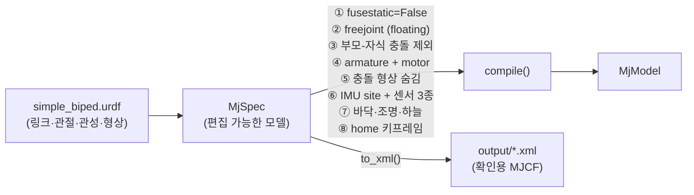

# 03. URDF 기초와 MuJoCo 변환 규칙

> 함께 볼 파일: `models/urdf/pendulum/pendulum.urdf`(최소 예제), `models/urdf/simple_biped/simple_biped.urdf`,
> `biped_sim/builder.py`, `tutorials/t03_urdf_pendulum.py`, `tutorials/t04_biped_inspect.py`
>
> 이 문서의 "MuJoCo 동작" 표는 **MuJoCo 3.15.0에서 직접 실험해 확인한 결과**입니다.
> 버전을 올리면 달라질 수 있으며, `tests/test_simulator.py`가 이를 감시합니다.

## 1. URDF 구조 한눈에

URDF(Unified Robot Description Format)는 **링크(강체)와 관절의 트리**입니다.

```xml
<robot name="이름">
  <link name="부모_링크"> ... </link>
  <link name="자식_링크">
    <inertial>                       <!-- 동역학: 질량과 관성 (시뮬레이션에 필수) -->
      <origin xyz="COM 위치" rpy="..."/>
      <mass value="kg"/>
      <inertia ixx="" ixy="" ixz="" iyy="" iyz="" izz=""/>   <!-- COM 기준! -->
    </inertial>
    <visual>    <origin .../> <geometry>...</geometry> <material .../> </visual>    <!-- 보이는 모양 -->
    <collision> <origin .../> <geometry>...</geometry> </collision>                 <!-- 충돌 모양 -->
  </link>
  <joint name="관절" type="revolute">
    <parent link="부모_링크"/>
    <child link="자식_링크"/>
    <origin xyz="..." rpy="..."/>    <!-- 부모 좌표계 → 자식 좌표계(=관절 위치) 변환 -->
    <axis xyz="0 1 0"/>              <!-- 자식 좌표계에서 본 회전축 -->
    <limit lower="rad" upper="rad" effort="N·m" velocity="rad/s"/>
    <dynamics damping="N·m·s/rad" friction="N·m"/>
  </joint>
</robot>
```

### 핵심 규칙

1. **트리 구조**: 모든 링크는 부모가 정확히 하나(루트 링크 제외). 고리(loop) 불가.
2. **자식 링크의 좌표계 원점 = 관절 위치**. `<joint><origin>`이 부모 좌표계에서 그 위치/자세를 정의.
3. `<inertial><origin>`은 **링크 좌표계에서 본 COM 위치**, `<inertia>`는 **COM 기준** 관성 텐서.
4. 단위: m, kg, rad, N·m, s. 각도(rpy)는 **라디안**, `rpy`는 고정축 X→Y→Z 회전.
5. 관절 타입: `revolute`(범위 있는 회전), `continuous`(무제한 회전), `prismatic`(직선), `fixed`(고정), `floating`, `planar`.

### 기본 도형 관성 (COM 기준, `scripts/inertia_calc.py`로 계산)

| 도형 | Ixx | Iyy | Izz |
|---|---|---|---|
| box (x, y, z 전체 길이) | m(y²+z²)/12 | m(x²+z²)/12 | m(x²+y²)/12 |
| cylinder (반지름 r, 길이 h, 축=z) | m(3r²+h²)/12 | m(3r²+h²)/12 | m r²/2 |
| sphere (반지름 r) | 2mr²/5 | 2mr²/5 | 2mr²/5 |

```bash
python scripts/inertia_calc.py cylinder 1.0 0.03 0.25
# <inertia ixx="0.00543333" ixy="0" ixz="0" iyy="0.00543333" iyz="0" izz="0.00045"/>
```

## 2. MuJoCo가 URDF를 읽을 때 실제로 일어나는 일 (MuJoCo 3.15.0 실측)

`mujoco.MjModel.from_xml_path("robot.urdf")` 한 줄로 URDF를 읽을 수 있지만, 다음과 같이 변환됩니다.

| URDF 요소 | MuJoCo 결과 | 문제가 되나? | 이 프로젝트의 대응 |
|---|---|---|---|
| 루트 링크 (`base_link`) | 관절이 없으므로 **world에 병합되어 사라짐** (`fusestatic`의 URDF 기본값 = true). 질량도 사라짐 | ⚠ 2족 로봇이면 치명적: freejoint를 붙일 바디가 없음 | `<mujoco><compiler fusestatic="false"/>` + 빌더에서 강제 |
| `fixed` 관절로 붙은 링크 (예: `imu_link`) | 마찬가지로 부모에 병합되어 사라짐 | ⚠ 센서 위치 링크가 사라짐 | 위와 동일 |
| `<visual>` | **버려짐** (`discardvisual` 기본값 true) → 충돌 형상만 보임, 색상 사라짐 | 보기에만 영향 | `<mujoco><compiler discardvisual="false"/>` → visual은 group 1, 충돌 없음(contype=0) |
| `<collision>` | geom (group 0, 충돌 O) | | 빌더가 group 3(뷰어 기본 숨김)으로 옮김 |
| `<material><color rgba>` | geom 색상 (`<visual>`을 유지할 때) | | |
| `<limit lower/upper>` | 관절 `range` | | |
| `<limit effort>` | 관절 `actuatorfrcrange` (관절이 받을 수 있는 액추에이터 힘 한계) | | 빌더가 모터 `ctrlrange`로도 사용 |
| `<limit velocity>` | **무시됨** | ⚠ 속도 제한이 없음 | 필요 시 제어기에서 직접 제한 (Phase 4) |
| `<dynamics damping>` | `damping` | | |
| `<dynamics friction>` | `frictionloss` (쿨롱 마찰) | | |
| `<transmission>` | **무시됨** → 액추에이터 0개 | ⚠ 토크를 줄 방법이 없음 | 빌더가 관절마다 `motor` 추가 |
| `continuous` 관절 | 범위 없는 hinge | | |
| `floating` 관절 (`world` 더미 링크 → base) | free joint (nq=7, nv=6) | | 대신 빌더에서 freejoint 추가 (ROS 도구들이 floating 관절을 싫어함) |
| `<mesh filename="package://pkg/meshes/x.STL">` | **파일 열기 실패** (`package:/pkg/...`) | ⚠ CAD URDF는 거의 다 이 형식 | `<mujoco><compiler meshdir="메쉬폴더" strippath="true"/>` → 파일명만 남겨 meshdir에서 찾음 (실측 확인) |
| `rpy` | 정확히 변환됨 (고정축 XYZ) | | |
| 관성 텐서 | 주축으로 대각화되며 **크기순으로 재정렬 + `quat`로 회전**될 수 있음 | ⚠ `model.body_inertia` ≠ URDF의 [ixx, iyy, izz] 순서 | 비교할 땐 `body_iquat`로 회전해 복원 (t03 `pivot_inertia_and_com`) |
| 부모-자식 링크 형상 겹침 | 부모가 world(또는 world에 용접된 바디)면 **충돌로 처리됨** | ⚠ **에러 없이 결과가 틀림** (t03: 진자 주기 59% 오차) | 빌더가 부모-자식 쌍을 `<exclude>` |

### MuJoCo 전용 `<mujoco>` 태그

URDF 안에 다음을 넣으면 MuJoCo 컴파일러 옵션을 줄 수 있습니다. ROS2의 URDF 파서(urdfdom)는 모르는 태그를 무시하므로
**같은 파일을 ROS2에서도 그대로 쓸 수 있습니다** (`robot_state_publisher`로 실측 확인, `tests/test_tutorials_and_ros.py`).

```xml
<robot name="simple_biped">
  <mujoco>
    <compiler discardvisual="false" fusestatic="false"/>
    <!-- 메쉬가 있으면: meshdir="../meshes" strippath="true" -->
  </mujoco>
  ...
```

## 3. URDF에 없는 것 → `biped_sim/builder.py`가 추가



`MjSpec`은 MuJoCo 3.x의 모델 편집 API입니다. XML 문자열을 직접 조작하지 않고 파이썬 객체로 바디/관절/센서를 추가할 수 있습니다.

## 4. ROS 쪽 경고: "KDL does not support a root link with an inertia"

`robot_state_publisher`로 simple_biped를 읽으면 이 경고가 나옵니다.
KDL(ROS의 기구학 라이브러리)이 루트 링크의 관성을 무시한다는 뜻이며, **TF 계산(robot_state_publisher의 역할)에는 영향이 없습니다.**
동역학은 MuJoCo가 계산하므로 이 프로젝트에선 무해합니다.

경고를 없애고 싶다면 질량 없는 더미 루트 링크를 추가하는 관례가 있습니다:

```xml
<link name="base"/>
<joint name="base_fixed" type="fixed"><parent link="base"/><child link="base_link"/></joint>
```

이 경우에도 빌더는 정상 동작합니다 (실측: 질량 0인 `base`에 freejoint가 붙고, 그 아래 `base_link`가 용접되어 총 질량 8.2 kg 유지).

## 5. 새 URDF(실제 로봇)를 가져올 때 체크리스트

- [ ] `check_urdf`(liburdfdom-tools) 또는 `robot_state_publisher`로 파싱 에러가 없는가 (모든 링크가 "got segment"로 나오는가)
- [ ] 총 질량이 실제 로봇 무게와 맞는가 (`model.body_subtreemass[1]`)
- [ ] 좌우 대칭 링크의 질량/관성이 대칭인가
- [ ] 관성값이 터무니없지 않은가 (CAD 단위 mm↔m 실수 시 10⁶배 차이)
- [ ] 관절 축 방향과 부호가 의도대로인가 (t04 뷰어의 Control 슬라이더로 하나씩 확인)
- [ ] `<limit effort>`가 모든 구동 관절에 있는가 (없으면 빌더가 에러)
- [ ] 메쉬 경로: `package://` → `<mujoco><compiler meshdir strippath>` / 메쉬 형식은 STL 또는 OBJ
- [ ] 충돌 형상: 발바닥은 box, 나머지는 단순 도형 권장 (메쉬 충돌은 느리고 접촉이 불안정)
- [ ] fixed base로 매달아 `ncon == 0`인가 (자기 충돌/가짜 접촉 없음, `test_fixed_base_has_no_spurious_self_contacts` 참고)
- [ ] 바닥에 세워 정지 시 Σ접촉력 = m·g 인가 (t06)
