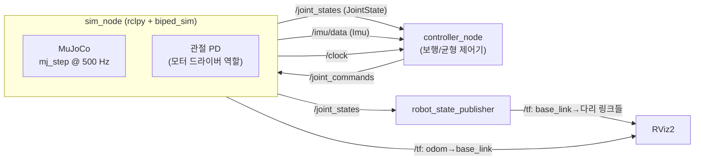

# 05. ROS2 연동 계획 (Phase 5) — ROS2 기초부터

> 상태: **설계 문서** (아직 구현 전). Phase 0~3에서 ROS2 연동을 위한 기반은 확인해 두었습니다:
> venv 안에서 `rclpy` + `sensor_msgs` 동작, URDF를 `robot_state_publisher`가 파싱(테스트 포함),
> `RobotInterface.as_joint_state()`가 `sensor_msgs/JointState` 모양의 데이터를 제공.

## 1. ROS2 최소 개념 (이 프로젝트에 필요한 만큼만)

| 개념 | 한 줄 설명 | 이 프로젝트에서 |
|---|---|---|
| **노드 (node)** | 하나의 역할을 하는 프로세스 | 시뮬레이터 노드, 제어기 노드, robot_state_publisher |
| **토픽 (topic)** | 이름 붙은 데이터 통로. 여러 노드가 발행(publish)/구독(subscribe) | `/joint_states`, `/imu/data`, `/joint_commands` |
| **메시지 (message)** | 토픽에 흐르는 데이터 형식 | `sensor_msgs/msg/JointState`, `sensor_msgs/msg/Imu` |
| **파라미터 (parameter)** | 노드 설정값 | PD 게인, URDF 경로, `use_sim_time` |
| **launch 파일** | 여러 노드를 설정과 함께 한 번에 실행하는 파이썬 스크립트 | `ros2 launch ... sim.launch.py` |
| **패키지 / 워크스페이스** | 코드 묶음 단위 / 패키지들을 모아 `colcon build`하는 폴더 | `ros2_ws/src/biped_sim_ros` |
| **TF2** | 좌표계들 사이의 변환 트리를 시간에 따라 관리 | `odom → base_link → left_thigh → ...` |
| **robot_state_publisher** | URDF + `/joint_states` → 모든 링크의 TF를 계산해 발행 | RViz에 로봇을 그리기 위해 필요 |
| **`/clock`, `use_sim_time`** | 시뮬레이션 시간을 ROS 시간으로 쓰게 하는 장치 | 시뮬이 느려지거나 멈춰도 제어기가 같은 시간축을 봄 |
| **RViz2** | 3D 시각화 도구 (물리 없음) | 로봇 자세, TF, 센서값 확인 |

> MuJoCo 뷰어 = "물리 세계를 보는 창", RViz = "ROS가 알고 있는 로봇 상태를 보는 창". 둘이 같아야 정상입니다.

## 2. 목표 구조



핵심 아이디어: **시뮬레이터 노드는 "실제 로봇 하드웨어"와 똑같은 토픽 인터페이스를 제공**합니다.
그러면 제어기 노드는 상대가 시뮬레이터인지 실제 로봇인지 모른 채 그대로 동작합니다.

## 3. 토픽 인터페이스 (초안)

| 토픽 | 방향 | 메시지 | 내용 | `biped_sim` 대응 |
|---|---|---|---|---|
| `/joint_states` | sim → | `sensor_msgs/msg/JointState` | name[], position[], velocity[], effort[] | `RobotInterface.as_joint_state()` |
| `/imu/data` | sim → | `sensor_msgs/msg/Imu` | orientation(**x,y,z,w**), angular_velocity, linear_acceleration | `RobotInterface.imu()` + `utils.quat_wxyz_to_xyzw` |
| `/clock` | sim → | `rosgraph_msgs/msg/Clock` | 시뮬레이션 시간 | `data.time` |
| `/tf` (odom→base_link) | sim → | `tf2_msgs/msg/TFMessage` | 몸통 위치/자세 (시뮬레이션 정답값) | `base_position()`, `base_quaternion()` |
| `/joint_commands` | → sim | `sensor_msgs/msg/JointState` (v1) | position=q_des, velocity=dq_des, effort=τ_ff | `JointPDController.compute(...)` 입력 |
| (Phase 4+) 발 접촉 | sim → | `geometry_msgs/msg/WrenchStamped` 등 | 발바닥 힘 | `contact_normal_force()` |

v1에서 명령을 `JointState`로 받는 이유: 사용자 정의 메시지(custom msg)를 만들려면 C++ 빌드 패키지(ament_cmake)가 필요해서,
처음엔 표준 메시지로 시작합니다. 실제 로봇 드라이버 형식이 정해지면(예: q_des, dq_des, kp, kd, τ_ff를 담는 메시지) 그때 맞춥니다.

⚠ 쿼터니언 순서: MuJoCo `(w,x,y,z)` → ROS `(x,y,z,w)`. 이 변환을 빼먹으면 RViz에서 로봇이 이상하게 돌아갑니다.

## 4. 시간 처리

1. 시뮬 노드가 매 스텝(또는 N 스텝마다) `/clock`을 발행.
2. 모든 노드를 `use_sim_time:=true`로 실행 → `node.get_clock().now()`가 시뮬레이션 시간을 돌려줌.
3. 처음엔 시뮬레이터가 실시간으로 돌고 제어기는 최신 명령만 반영(비동기).
   재현성이 필요하면 이후에 "제어기 응답을 기다렸다가 스텝"하는 lockstep 방식을 검토.

## 5. 패키지 구성 (예정)

```
ros2_ws/                          ← colcon 워크스페이스 (Phase 5에서 생성)
└── src/
    └── biped_sim_ros/            ← ament_python 패키지
        ├── package.xml
        ├── setup.py
        ├── biped_sim_ros/
        │   ├── sim_node.py       ← biped_sim을 import해서 MuJoCo를 돌리고 토픽 발행/구독
        │   └── demo_controller.py← 예: home 자세 유지 명령 발행
        ├── launch/sim.launch.py  ← sim_node + robot_state_publisher + rviz2
        └── config/params.yaml    ← 게인, 발행 주기, URDF 경로
```

`biped_sim` 패키지는 이미 venv에 편집 가능 모드로 설치되어 있으므로, ROS 노드에서 `import biped_sim`으로 바로 재사용합니다.

venv와 colcon을 함께 쓰는 방법 (Phase 5에서 실제로 검증 후 확정):

```bash
source scripts/activate.sh                 # ROS2 + venv
cd ros2_ws && python -m colcon build --symlink-install   # venv의 python으로 colcon 실행
source install/setup.bash
ros2 launch biped_sim_ros sim.launch.py
```

## 6. Phase 5 작업 순서와 완료 기준

| 단계 | 작업 | 완료 기준 |
|---|---|---|
| 5-1 | URDF를 RViz로 보기: `sudo apt install ros-humble-joint-state-publisher-gui ros-humble-xacro` 후 robot_state_publisher + joint_state_publisher_gui + rviz2 | 슬라이더로 관절을 움직이면 RViz 로봇이 따라 움직임 |
| 5-2 | `sim_node`: MuJoCo를 돌리며 `/joint_states`, `/clock` 발행 | `ros2 topic hz /joint_states`가 설정 주기로 나옴, RViz와 MuJoCo 뷰어 자세가 같음 |
| 5-3 | `/imu/data`, `/tf (odom→base_link)` 발행 | 로봇을 밀어 넘어뜨리면 RViz에서도 똑같이 넘어짐 |
| 5-4 | `/joint_commands` 구독 → PD | `demo_controller`로 t06(서 있기)과 같은 결과 재현 |
| 5-5 | launch 파일 + 파라미터 파일 | 명령 한 줄로 전체 실행 |
| 5-6 | 테스트 | 토픽 왕복 지연, 주기, 서 있기 성공을 자동 테스트 |

## 7. 자주 쓰는 ROS2 명령

```bash
ros2 node list                       # 실행 중인 노드
ros2 topic list                      # 토픽 목록
ros2 topic echo /joint_states        # 메시지 내용 보기
ros2 topic hz /joint_states          # 발행 주기 측정
ros2 topic info /joint_states -v     # 발행자/구독자, QoS
ros2 interface show sensor_msgs/msg/JointState   # 메시지 형식 보기
rqt_graph                            # 노드-토픽 연결 그림
rviz2                                # 3D 시각화
```
