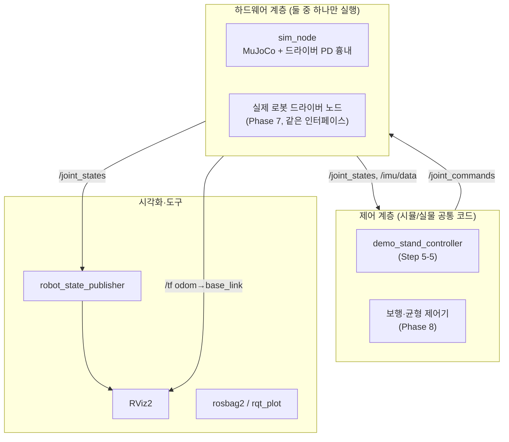

# 05. ROS2 연동 실행 계획 (Phase 5, 6 미리보기)

> 상태: **진행 중** (1인 개발 기준) — Step 5-2 완료, 5-3·5-5 일부 완료 (2026-10-08).
> "사전 검증"(§2) 항목은 이 개발 PC(Ubuntu 22.04, ROS2 Humble, MuJoCo 3.15.0)에서 직접 확인한 결과입니다.
> 지금 바로 해 볼 수 있는 실습: [06_ros2_hands_on.md](06_ros2_hands_on.md)

---

## 0. 한 페이지 요약

**목표**: MuJoCo 시뮬레이터를 ROS2 노드(`sim_node`)로 감싸서, **실제 로봇 하드웨어와 같은 토픽 인터페이스**를 제공한다.
그러면 제어기 노드는 상대가 시뮬레이터인지 실제 로봇인지 모른 채 그대로 동작한다.

**시작점**: [06_ros2_hands_on.md](06_ros2_hands_on.md)의 실습 — 이미 만든 `sim_node`(MuJoCo 로봇)를 터미널의
`ros2` 명령으로 직접 조종하면서 노드·토픽·메시지·서비스·파라미터를 익힌다 (Step 5-0).

**필요한 것**

| 구분 | 내용 | 상태 |
|---|---|---|
| ROS2 기본 도구 | rclpy, tf2_ros, launch, rviz2, rosbag2, rqt | ✅ 설치됨 (`ros-humble-desktop`) |
| 추가 apt 패키지 | `joint_state_publisher_gui`, `xacro` (Step 5-1) | ❌ 설치 필요 (sudo) |
| (Phase 6, 선택) | `ros2_control`, `ros2_controllers` | ❌ 필요할 때 설치 |
| Python 환경 | venv 안에서 `rclpy` + `mujoco` 동시 사용 | ✅ 확인됨 |
| 시뮬레이터 코어 | `biped_sim` (RobotInterface, PD, builder) | ✅ 있음 — ROS 노드는 이걸 감싸기만 함 |
| ROS2 노드 | `giga_sim_ros/sim_node` (`/joint_states`, `/clock`, `/joint_commands`, `/sim/reset`) | ✅ 동작 (테스트 포함) |
| 결정 사항 | 실제 로봇 모터 드라이버·제어 모드·제어 주기 (§8) | ⬜ 결정 필요 |

**단계**

| Step | 내용 | 완료 기준 (한 줄) | 상태 |
|---|---|---|---|
| 5-0 | ROS2 기초 실습 (우리 `sim_node`로), `ROS_DOMAIN_ID` 정하기 | docs/06 실습 1~8을 직접 해 봄 | ⬜ 사용자 실습 |
| 5-1 | `giga_description` 패키지 + RViz 표시 | 슬라이더로 관절을 움직이면 RViz 로봇이 따라 움직임 | ⬜ (sudo 설치 필요) |
| 5-2 | `giga_sim_ros` 패키지 뼈대 + 빌드 규칙 | 노드가 venv의 `mujoco`를 import하며 실행됨 | ✅ |
| 5-3 | `sim_node` v1: `/joint_states`, `/clock` | `ros2 topic hz /joint_states` ≈ 500 Hz, RViz와 MuJoCo 자세 일치 | 🟡 발행·뷰어·종료 완료 (499.99 Hz), RViz 확인 남음 |
| 5-4 | `/imu/data`, TF `odom→base_link` | 뷰어에서 로봇을 밀어 넘어뜨리면 RViz도 똑같이 넘어짐 | ⬜ |
| 5-5 | `/joint_commands` + 드라이버 PD + 안전장치, 데모 제어기 | ROS를 거쳐 t06과 같은 결과(서 있기, 접촉력 = 무게) | 🟡 명령 구독·PD·검증·타임아웃·`/sim/reset` 완료, 제어기 노드 남음 |
| 5-6 | launch·파라미터·RViz 설정 통합 | 명령 한 줄로 전체 실행 | ⬜ |
| 5-7 | 자동 테스트·성능 측정·rosbag | 주기·지연·서 있기를 `pytest`로 확인 | 🟡 `tests/test_ros_sim_node.py` (주기·명령·초기화·종료) |
| 5-8 | (선택) 확장: 사용자 정의 메시지, lockstep, 발 접촉 토픽 | 필요 시 | — |

---

## 1. "ROS2 연결 완료"의 정의

다음이 모두 되면 Phase 5 완료입니다.

1. `ros2 launch giga_sim_ros sim.launch.py` 한 줄로 MuJoCo 시뮬레이터 + robot_state_publisher + RViz가 뜬다.
2. 시뮬레이터가 `/joint_states`, `/imu/data`, `/clock`, `/tf`를 발행하고 `/joint_commands`를 구독한다.
3. **별도 프로세스의 제어기 노드**가 토픽만으로 로봇을 세워 둘 수 있다 (t06과 같은 수치 결과).
4. MuJoCo 뷰어와 RViz에 보이는 로봇 자세가 항상 같다.
5. 위 내용이 자동 테스트로 확인된다.

---

## 2. 사전 검증 결과 (이 PC에서 직접 확인)

| 확인 항목 | 결과 | 계획에 주는 영향 |
|---|---|---|
| venv에서 `rclpy` + `mujoco` + `biped_sim` 동시 import | ✅ | 노드 하나에서 MuJoCo를 직접 돌릴 수 있음 |
| venv를 켜고 **`python -m colcon build`** | ✅ 실행 파일이 `.venv/bin/python`으로 생성 → 노드가 `mujoco` import 성공 | **빌드 규칙 1**: 항상 이 방식으로 빌드 |
| 그냥 `colcon build` | ❌ 실행 파일이 `/usr/bin/python3`로 생성 → `ModuleNotFoundError: No module named 'mujoco'` | 가장 먼저 겪을 오류 → `scripts/build_ros.sh`로 막음 |
| `ros2` 명령(launch 실행기)의 Python | `/usr/bin/python3` → `mujoco`, `biped_sim` import 불가 | **빌드 규칙 2**: launch 파일에서 venv 패키지를 import하지 않음. URDF는 description 패키지에서 찾음 |
| Python 노드 성능 (ROS 타이머 500 Hz로 `mj_step` + JointState·Clock 발행) | 실시간 배율 1.00, 500 스텝/초, 1스텝 비용 중앙값 0.22 ms (상위 1% 0.63 ms) | 지금 모델은 Python으로 충분. 12-DoF·1 kHz에서 재측정 |
| 제어 왕복 지연 (sim → 별도 제어기 노드 → sim, 500 Hz) | 중앙값 **0.77 ms**, 상위 1% 1.23 ms. ROS를 거친 명령으로 로봇이 서 있음 | 명령은 다음 스텝(2 ms 후)에 반영됨 = 1스텝 지연 |
| 별도 스레드에서 루프를 돌리는 방식 | 동작하지만 1스텝 비용 0.59 ms, 지연 1.18 ms로 더 느림 | **ROS 타이머 방식 채택** (더 단순하고 빠름) |
| MuJoCo 뷰어를 켠 상태 (60 Hz 화면 갱신 타이머 추가) | 500 Hz 유지, 화면 갱신 비용 0.05 ms | 뷰어 옵션을 기본 제공 가능 |
| `launch_passive` 뷰어를 닫고 프로그램 종료 | ❌ 세그폴트(exit 139), `GLXBadContext` X 에러, 또는 프로세스 멈춤 — **ROS와 무관하게, Ctrl+C 없이도** 재현. 원인: 뷰어의 그리기 스레드(daemon)가 끝나기 전에 프로그램이 종료됨 (`close()`는 종료 요청만 보냄) | **구현 규칙**: `biped_sim.passive_viewer`로 열기 — 닫은 뒤 그리기 스레드를 `join()`. 적용 후 sim_node·튜토리얼 모두 정상 종료 (반복 확인). 처음엔 "`with` 블록이면 괜찮다"고 판단했으나 타이밍이 운 좋게 맞았던 것이었음 |
| rclpy 기본 신호 처리로 Ctrl+C / SIGTERM | ❌ 가끔 `RCLError: ... context is not valid` 트레이스 (SIGTERM 5회 중 2회) | **구현 규칙**: `rclpy.init(signal_handler_options=NO)` + SIGTERM도 `KeyboardInterrupt`로 바꿔 한 경로로 정리 → 12회 모두 정상 |
| `ros2 topic pub --once`로 명령 | ✅ 유실 없이 전달됨 | 터미널 실습에 그대로 사용 (docs/06) |
| URDF의 `<mujoco>` 태그와 ROS | `robot_state_publisher`가 정상 파싱 (기존 테스트) | 같은 URDF 파일을 그대로 공유 |
| 네트워크 설정 | `ROS_DOMAIN_ID` 미설정(=0), `ROS_LOCALHOST_ONLY=0` | 같은 네트워크의 모든 PC와 토픽이 섞임 → Step 5-0에서 해결 |

---

## 3. ROS2 최소 개념 (이 계획을 읽기 위한 만큼만)

| 개념 | 한 줄 설명 | 이 프로젝트에서 |
|---|---|---|
| **노드 (node)** | 하나의 역할을 하는 프로세스 | `sim_node`, 제어기 노드, `robot_state_publisher` |
| **토픽 (topic)** | 이름 붙은 데이터 통로. 발행(publish)/구독(subscribe) | `/joint_states`, `/joint_commands` |
| **메시지 (message)** | 토픽에 흐르는 데이터 형식 | `sensor_msgs/msg/JointState`, `sensor_msgs/msg/Imu` |
| **서비스 (service)** | 요청-응답 호출 | `/sim/reset` (시뮬레이션 초기화) |
| **파라미터 (parameter)** | 노드 설정값. 실행 중 변경 가능 | PD 게인, 발행 주기, `use_sim_time` |
| **launch 파일** | 여러 노드를 설정과 함께 한 번에 실행하는 Python 스크립트 | `sim.launch.py` |
| **패키지 / 워크스페이스** | 코드 묶음 / 패키지들을 모아 `colcon build`하는 폴더 | `ros2_ws/src/giga_sim_ros` |
| **TF2** | 좌표계 사이의 변환을 시간에 따라 관리하는 트리 | `odom → base_link → left_thigh → …` |
| **robot_state_publisher** | URDF + `/joint_states` → 모든 링크의 TF 계산·발행 | RViz에 로봇을 그리는 데 필요 |
| **`/clock`, `use_sim_time`** | 시뮬레이션 시간을 ROS 시간으로 쓰게 하는 장치 | 시뮬이 느려져도 모든 노드가 같은 시간축 사용 |
| **QoS** | 통신 품질 설정 (신뢰성, 버퍼 크기 등) | v1은 기본값(reliable, depth 10). 문제가 생기면 조정 |
| **DDS / Domain ID** | ROS2의 통신 계층. 같은 Domain ID끼리만 통신 | 연구실의 다른 PC와 겹치지 않는 번호 사용 |

> MuJoCo 뷰어 = "물리 세계를 보는 창", RViz = "ROS가 알고 있는 로봇 상태를 보는 창". 둘이 같아야 정상입니다.

---

## 4. 아키텍처

### 4.1 계층 구조와 핵심 원칙



1. **`sim_node`는 "가짜 하드웨어"다.** 실제 로봇 드라이버가 할 일(관절 상태 발행, IMU 발행, 명령을 받아 모터 PD로 토크 생성)을 똑같이 한다.
2. **`biped_sim`은 ROS를 모른다.** ROS 없이도 테스트할 수 있게 유지하고, `giga_sim_ros`는 그 위의 얇은 어댑터만 담당한다.
3. **인터페이스(토픽 이름·메시지·의미)를 먼저 고정**하고, 실제 로봇 드라이버도 같은 인터페이스를 구현한다.

### 4.2 `sim_node` 내부 구조 (사전 검증한 구조)

```
SingleThreadedExecutor (메인 스레드)
 ├─ 타이머 @ 1/timestep (500 Hz)  : 명령 반영 → PD 토크 → mj_step → /joint_states, /clock, (/imu, /tf) 발행
 ├─ 타이머 @ 60 Hz (뷰어 켰을 때)   : viewer.sync()
 ├─ 구독 /joint_commands          : 최신 명령 저장 (+ 수신 시각 기록 → 타임아웃 판단)
 └─ 서비스 /sim/reset              : home 키프레임으로 초기화
```

`biped_sim.runner.simulate()`는 뷰어 루프를 직접 도는 구조라 ROS 노드에서는 쓰지 않고,
`RobotInterface`, `JointPDController`, `build_robot_model`만 재사용합니다.

---

## 5. 인터페이스 명세 v1

### 5.1 토픽

| 토픽 | 방향 | 메시지 | 주기 | frame_id | 내용 | `biped_sim` 대응 |
|---|---|---|---|---|---|---|
| `/joint_states` | sim → | `sensor_msgs/msg/JointState` | 500 Hz (파라미터) | — | name[], position[], velocity[], effort[] (실제 토크) | `RobotInterface.as_joint_state()` |
| `/imu/data` | sim → | `sensor_msgs/msg/Imu` | 500 Hz | `base_link` | orientation(**x,y,z,w**), angular_velocity, linear_acceleration(중력 포함) | `imu()` + `utils.quat_wxyz_to_xyzw` |
| `/clock` | sim → | `rosgraph_msgs/msg/Clock` | 매 스텝 | — | 시뮬레이션 시간 `data.time` | |
| `/tf` | sim → | `tf2_msgs/msg/TFMessage` | 100 Hz | `odom` → `base_link` | 몸통 위치·자세 (시뮬레이션 정답값) | `base_position()`, `base_quaternion()` |
| `/joint_commands` | → sim | `sensor_msgs/msg/JointState` | 제어기 주기 | — | position = q_des, velocity = dq_des, effort = τ_ff | `JointPDController.compute()` 입력 |
| `/robot_description` | rsp → | `std_msgs/msg/String` | latched | — | URDF 내용 (robot_state_publisher가 발행) | |

규칙:
- **모든 stamp는 시뮬레이션 시간**(`data.time`)으로 찍는다. 다른 노드는 모두 `use_sim_time:=true`로 실행한다.
- `/joint_commands`에서 `velocity`나 `effort`가 비어 있으면 0으로 간주한다. `name` 순서는 자유 (이름으로 매칭).
- `odom → base_link`는 **시뮬레이션만 아는 정답값**입니다. 실제 로봇에서는 상태 추정기가 이 값을 만들어야 하므로,
  제어기가 이 TF에 의존하면 실물로 옮길 때 깨집니다. 제어기는 `/joint_states`와 `/imu/data`만 쓰도록 합니다.

### 5.2 명령의 의미 (모터 드라이버 흉내)

`sim_node`는 받은 명령으로 매 스텝 `τ = Kp·(q_des − q) + Kd·(dq_des − dq) + τ_ff`를 계산합니다 (실제 모터 드라이버의 저수준 PD와 같은 역할).

| 상황 | 동작 |
|---|---|
| 시작 직후, 명령을 아직 못 받음 | home 자세 유지 ✅ |
| 명령 수신 중 | 최신 명령으로 PD. 일부 관절만 보내면 나머지는 이전 목표 유지 ✅ |
| 가동 범위 밖 목표 | 범위 끝으로 잘라내고 경고 ✅ |
| 마지막 명령 후 `command_timeout` 경과 | **감쇠 모드**: Kp = 0, Kd만 작동 (실제 드라이버의 안전 정지와 같은 동작) + 경고 로그 ✅. 기본값 0(끔) — 터미널 실습용. 제어기 노드를 붙일 때 0.05 권장 |
| 모르는 관절 이름 / 배열 개수 불일치 | 명령 전체 거부 + 경고 로그 (조용히 무시하지 않음) ✅ |

### 5.3 `sim_node` 파라미터

| 이름 | 기본값 | 설명 | 상태 |
|---|---|---|---|
| `fixed_base` | false | true면 공중에 매단 모드 (t05 대응) | ✅ |
| `viewer` | true | MuJoCo 뷰어 표시 | ✅ |
| `publish_rate` | 500.0 | `/joint_states` (+ 이후 `/imu/data`) 발행 주기 [Hz] | ✅ |
| `command_timeout` | 0.0 | [s], 0 = 끔 | ✅ |
| `tf_rate` | 100.0 | `odom→base_link` 발행 주기 [Hz] | ⬜ Step 5-4 |
| `kp`, `kd` | `robot_configs` 값 | 관절 순서대로의 배열, 실행 중 변경 가능하게 | ⬜ Step 5-5 |

현재 파라미터는 시작할 때만 읽습니다 (실행 중 `ros2 param set`은 반영 안 됨).

### 5.4 서비스

| 서비스 | 타입 | 동작 |
|---|---|---|
| `/sim/reset` | `std_srvs/srv/Trigger` | home 키프레임으로 초기화 |

---

## 6. 폴더·패키지 구조 (✅ 있음 / ⬜ 예정)

```
Giga/
├── biped_sim/                      ✅ ROS 의존성 없음 (runner.passive_viewer 추가)
├── models/                         ✅ MJCF 예제, pendulum, simple_biped URDF
├── tests/
│   └── test_ros_sim_node.py        ✅ sim_node 통합 테스트 (토픽·명령·초기화·종료)
├── scripts/
│   ├── activate.sh                 ✅ ros2_ws/install/local_setup.bash가 있으면 함께 source
│   └── build_ros.sh                ✅ venv 확인 후 `python -m colcon build --symlink-install`
└── ros2_ws/                        ✅ colcon 워크스페이스 (build/ install/ log/는 .gitignore)
    └── src/
        ├── giga_description/       ⬜ ament_cmake: 로봇 "설명"만 담는 표준 패키지 (Step 5-1)
        │   ├── urdf/simple_biped.urdf      (models/urdf/simple_biped/에서 이동, 단일 원본 유지)
        │   ├── meshes/                     (Phase 7: 실제 로봇 메쉬)
        │   ├── rviz/display.rviz
        │   └── launch/display.launch.py    (rsp + joint_state_publisher_gui + rviz2)
        └── giga_sim_ros/           ✅ ament_python: 시뮬레이터 ROS 어댑터
            ├── package.xml, setup.py, setup.cfg, resource/
            ├── giga_sim_ros/sim_node.py              ✅
            ├── giga_sim_ros/demo_stand_controller.py ⬜ Step 5-5
            ├── launch/sim.launch.py                  ⬜ Step 5-6
            └── config/sim_params.yaml                ⬜ Step 5-6
```

**URDF 위치를 `giga_description`으로 옮기는 이유** (권장, §8 결정 사항)
- launch 파일은 `/usr/bin/python3`에서 돌아 `biped_sim.paths`를 쓸 수 없으므로(§2), ROS 표준 방식인 `get_package_share_directory("giga_description")`으로 URDF를 찾아야 합니다.
- Phase 7에서 실제 로봇 메쉬를 `package://giga_description/meshes/...`로 참조하면 RViz가 그대로 읽습니다 (MuJoCo는 `meshdir` + `strippath`로 처리, [03](03_urdf_and_mujoco.md) 참고).
- 이동 후 `biped_sim/paths.py`의 `SIMPLE_BIPED_URDF`만 새 경로로 바꾸면 튜토리얼과 테스트는 그대로 동작합니다.

---

## 7. 단계별 계획

### Step 5-0. ROS2 기초 실습 — 우리 로봇으로

| | |
|---|---|
| **목표** | 이미 만든 `sim_node`를 터미널에서 직접 조종하며 ROS2 도구에 익숙해진다 |
| **배우는 개념** | 노드, 토픽, 메시지, 서비스, 파라미터, `ros2` CLI, rqt_graph |
| **할 일** | ① `ROS_DOMAIN_ID`를 하나 정해 `~/.bashrc`에 추가 (0~101, 연구실 다른 PC와 겹치지 않게) ② [06_ros2_hands_on.md](06_ros2_hands_on.md) 실습 1~8 ③ (선택) 공식 튜토리얼 Beginner: CLI tools — 같은 구조를 turtlesim으로 한 번 더 |
| **완료 기준** | `ros2 topic pub`으로 원하는 관절을 움직이고, `/sim/reset`으로 되돌리고, `rqt_graph`로 연결 구조를 설명할 수 있다 |
| **주의** | Domain ID가 같으면 같은 네트워크의 다른 PC 토픽이 보입니다. 시뮬레이터가 500 Hz로 발행하므로 섞이면 네트워크 부하도 커집니다 |

### Step 5-1. `giga_description` 패키지 + URDF를 RViz로 보기

| | |
|---|---|
| **목표** | ROS 쪽에서 로봇 모델이 올바르게 보이는지 확인 (물리 없음) |
| **배우는 개념** | 워크스페이스, ament_cmake 패키지, launch 파일, robot_state_publisher, TF, RViz |
| **할 일** | ① `sudo apt install ros-humble-joint-state-publisher-gui ros-humble-xacro` ② `ros2_ws/src/giga_description` 생성, URDF 이동, `biped_sim/paths.py` 경로 수정 ③ `display.launch.py`: robot_state_publisher(URDF 내용을 파라미터로) + joint_state_publisher_gui + rviz2 ④ RViz 설정 저장: Fixed Frame = `base_link`, RobotModel, TF |
| **만들 파일** | `giga_description/{CMakeLists.txt, package.xml, urdf/, launch/display.launch.py, rviz/display.rviz}` |
| **완료 기준** | `ros2 launch giga_description display.launch.py` → 슬라이더로 각 관절을 움직이면 RViz 로봇이 따라 움직이고, 부호 규약이 [04](04_simple_biped_spec.md) §3과 일치. 기존 `pytest` 전부 통과 (경로 이동 확인) |
| **주의** | URDF를 커맨드라인 인자(`-p robot_description:="$(cat ...)"`)로 넘기면 YAML 해석 오류가 납니다 (확인됨). launch 파일에서 파일을 읽어 파라미터로 넘깁니다 |

### Step 5-2. `giga_sim_ros` 패키지 뼈대와 빌드 규칙 — ✅ 완료

| | |
|---|---|
| **목표** | venv의 MuJoCo를 쓰는 ROS2 Python 패키지를 빌드·실행하는 절차를 굳힌다 |
| **배우는 개념** | ament_python 패키지(`package.xml`, `setup.py`, entry point), `colcon build --symlink-install`, `install/setup.bash` |
| **할 일** | ① `ros2 pkg create --build-type ament_python giga_sim_ros` ② 빈 노드: 시작 시 `mujoco`, `biped_sim` 버전 로그 출력 ③ `build_ros.sh`로 빌드 ④ `activate.sh`에 워크스페이스 overlay 추가 |
| **완료 기준** | `ros2 run giga_sim_ros sim_node`가 `.venv/bin/python`으로 실행되어 `mujoco 3.15.0` 로그 출력 (사전 검증과 동일 조건) |
| **주의** | 그냥 `colcon build`를 하면 `ModuleNotFoundError: mujoco` (확인됨). 빌드 스크립트에서 venv가 켜져 있지 않으면 중단하도록 |

### Step 5-3. `sim_node` v1 — `/joint_states`, `/clock` — 🟡 RViz 확인만 남음

| | |
|---|---|
| **목표** | MuJoCo가 ROS 노드 안에서 실시간으로 돌고, 관절 상태가 ROS로 나간다 |
| **배우는 개념** | publisher, timer, 메시지 채우기, 파라미터 선언, sim time |
| **할 일** | ① `build_robot_model` + `RobotInterface`로 모델 생성, home 키프레임 초기화 ② 500 Hz 타이머: `mj_step` → `/joint_states`, `/clock` 발행 ③ `viewer` 파라미터: `biped_sim.passive_viewer` + 60 Hz 동기화 타이머 ④ Ctrl+C·SIGTERM을 파이썬이 받아 뷰어 → 노드 → rclpy 순서로 종료 |
| **완료 기준** | `ros2 topic hz /joint_states` ≈ 500 Hz, `ros2 topic echo /clock`이 시뮬레이션 시간과 일치, robot_state_publisher + RViz(`use_sim_time:=true`)에 MuJoCo와 같은 다리 자세가 보임, Ctrl+C로 깔끔히 종료 |
| **주의** | 뷰어는 반드시 `biped_sim.passive_viewer`로 (§2: 그리기 스레드를 기다리지 않으면 종료 시 세그폴트) |

### Step 5-4. `/imu/data`와 TF `odom → base_link`

| | |
|---|---|
| **목표** | 몸통의 움직임(넘어짐 등)까지 ROS 쪽에서 보이게 한다 |
| **배우는 개념** | `sensor_msgs/Imu`, tf2 `TransformBroadcaster`, 좌표계 이름 규약(REP-105: `odom`, `base_link`) |
| **할 일** | ① IMU 메시지: 쿼터니언을 **x,y,z,w로 변환**, 각속도·가속도 채우기 ② `odom → base_link` TF 발행 (floating base일 때만) ③ RViz Fixed Frame을 `odom`으로 |
| **완료 기준** | MuJoCo 뷰어에서 몸통을 Ctrl+드래그로 밀어 넘어뜨리면 RViz 로봇도 똑같이 넘어짐. 정지 시 `/imu/data`의 가속도 z ≈ +9.81 |
| **주의** | 쿼터니언 순서를 틀리면 RViz에서 로봇이 엉뚱하게 회전합니다 → 변환 함수를 단위 테스트로 고정 |

### Step 5-5. `/joint_commands` + 드라이버 PD + 데모 제어기 — 🟡 제어기 노드 남음

| | |
|---|---|
| **목표** | 별도 프로세스의 제어기가 토픽만으로 로봇을 제어한다 (Phase 5의 핵심) |
| **배우는 개념** | subscriber, 콜백, 메시지 검증, 타임아웃 기반 안전장치, 여러 노드 협업 |
| **할 일** | ① `sim_node`: `/joint_commands` 구독 → 이름으로 매칭 → PD 적용, §5.2의 타임아웃·감쇠 모드, `/sim/reset` 서비스 ② `demo_stand_controller`: `/joint_states`를 받아 home 자세 명령 발행 (t06의 ROS 버전) ③ `ros2 param set /sim_node kp ...`로 게인 실시간 변경 |
| **완료 기준** | 제어기를 켜면 로봇이 서 있고(몸통 높이 ≈ 0.588 m, 기울기 < 3°), `command_timeout:=0.05`로 실행한 상태에서 제어기를 끄면 50 ms 뒤 감쇠 모드로 전환되며 경고 로그 출력 |
| **주의** | 명령은 다음 스텝에 반영되는 1스텝 지연이 있음 (사전 측정 왕복 0.77 ms < 2 ms). 실제 로봇은 지연이 더 크므로 Phase 4에서 지연을 일부러 넣어 보는 실험 권장 |

### Step 5-6. launch·파라미터·RViz 통합

| | |
|---|---|
| **목표** | 명령 한 줄로 전체 실행, 설정은 파일로 관리 |
| **배우는 개념** | launch argument, 파라미터 YAML, 조건부 노드 실행 |
| **할 일** | `sim.launch.py`: 인자 `fixed_base`, `viewer`, `rviz`, `controller` → sim_node + robot_state_publisher + (rviz2) + (demo 제어기), 모든 노드 `use_sim_time:=true`. `config/sim_params.yaml` |
| **완료 기준** | `ros2 launch giga_sim_ros sim.launch.py` / `... fixed_base:=true viewer:=false` 등 조합이 모두 동작 |
| **주의** | launch 파일에서 `biped_sim`이나 `mujoco`를 import하지 않습니다 (§2 빌드 규칙 2) |

### Step 5-7. 자동 테스트·성능 측정·기록

| | |
|---|---|
| **목표** | ROS 연동이 깨지면 바로 알 수 있게 한다 |
| **배우는 개념** | launch_testing(설치됨) 또는 pytest + rclpy, rosbag2, rqt_plot |
| **할 일** | ① 테스트: 노드 기동 → `/joint_states` 주기 450 Hz 이상, 명령 왕복 지연 < 2 ms(p99), 5초 서 있기 성공 ② `ros2 bag record`로 실험 저장·재생 ③ 측정 결과를 이 문서 §2 표에 갱신 |
| **완료 기준** | `pytest`에 ROS 연동 테스트 추가, 전체 통과 |

### Step 5-8. (선택) 확장

| 항목 | 언제 필요한가 |
|---|---|
| 사용자 정의 메시지 패키지 `giga_msgs` (q_des, dq_des, kp, kd, τ_ff를 한 메시지로) | 실제 로봇 드라이버의 명령 형식이 정해졌을 때 (§8) |
| lockstep 모드 (제어기 응답을 받은 뒤에 스텝) | 실험의 정확한 재현이 필요할 때 |
| 발 접촉력 토픽 (`geometry_msgs/msg/WrenchStamped` 등) | 보행 제어(Phase 8)에서 접지 판단이 필요할 때 |
| 정답값 토픽 `/ground_truth/odom` (`nav_msgs/msg/Odometry`) | 상태 추정기 성능 평가 |
| PlotJuggler (`sudo apt install ros-humble-plotjuggler-ros`) | 실시간 그래프가 자주 필요할 때 |

---

## 8. 결정해야 할 사항

| 결정 사항 | 왜 중요한가 | 권장 기본값 (결정 전까지) |
|---|---|---|
| **실제 로봇 모터·드라이버 종류와 통신** (CAN, EtherCAT, Dynamixel 등) | 실제 드라이버 노드 구조와 가능한 제어 주기가 여기서 결정됨 | — (정해지면 Phase 7 계획에 반영) |
| **모터 제어 모드** (토크 / 위치 / 드라이버 내부 PD) | `/joint_commands` 메시지 설계가 바뀜 | 드라이버 내부 PD 가정 (q_des, dq_des, τ_ff + Kp/Kd) — 현재 계획 |
| **목표 제어 주기** | 시뮬레이터 timestep과 성능 요구가 정해짐 | 500 Hz (현재). 1 kHz가 필요하면 Step 5-7에서 재측정 |
| **로봇 탑재 컴퓨터와 ROS2 배포판** | 개발 PC(Humble)와 맞아야 같은 코드를 그대로 씀 | Humble 유지 |
| **URDF를 `giga_description`으로 이동** | launch·RViz·메쉬 경로를 ROS 표준으로 처리 | 이동 (§6) |
| **`ROS_DOMAIN_ID`** | 연구실 네트워크의 다른 PC와 토픽 섞임 방지 | 0~101 중 하나를 정해 `~/.bashrc`에 (Step 5-0) |
| **패키지 이름 접두어** | 이후 모든 패키지·토픽 이름에 영향 | `giga_` |

---

## 9. 위험 요소와 대응

| 위험 | 증상 | 대응 | 근거 |
|---|---|---|---|
| 그냥 `colcon build` | `ModuleNotFoundError: No module named 'mujoco'` | `scripts/build_ros.sh`만 사용 (venv 확인 후 `python -m colcon build`) | 확인됨 |
| launch 파일에서 venv 패키지 import | launch 실행 실패 | launch 파일은 ROS API만 사용, URDF는 description 패키지에서 | 확인됨 |
| 뷰어 종료 방식 | 세그폴트, `GLXBadContext`, 프로세스 멈춤 | `biped_sim.passive_viewer` (그리기 스레드 join) + ROS 종료 전에 뷰어 닫기 | 확인·해결됨 |
| rclpy 신호 처리 경합 | 종료 시 가끔 `RCLError` 트레이스 | `SignalHandlerOptions.NO` + SIGTERM→KeyboardInterrupt | 확인·해결됨 |
| 연구실 네트워크 토픽 섞임 | 남의 로봇이 내 RViz에 보이거나 명령이 섞임 | 나만의 `ROS_DOMAIN_ID`, 필요 시 `ROS_LOCALHOST_ONLY=1` | 현재 미설정 확인 |
| 쿼터니언 순서 (MuJoCo wxyz ↔ ROS xyzw) | RViz에서 로봇이 이상하게 회전 | `biped_sim.utils` 변환 함수 + 단위 테스트 | 기존 테스트 있음 |
| 시간 기준 불일치 | TF 외삽 오류, RViz 경고 | 모든 stamp = `data.time`, 모든 노드 `use_sim_time:=true` | 설계 |
| Python 성능 한계 (12-DoF, 1 kHz, 센서 증가 시) | 실시간 배율 < 1 | 단계마다 측정. 부족하면 발행 주기 낮추기 → 핵심 루프 C++ 노드화 순으로 검토 | 현재 여유 큼 (0.22 ms/스텝) |
| numpy 2 유입 | ROS 메시지 생성 시 크래시 | `numpy<2` 고정 유지 | 기존 설정 |
| 강제 종료 시 예외 트레이스 | 로그가 지저분해 진짜 오류를 놓침 | `KeyboardInterrupt`, `ExternalShutdownException` 처리 | 확인됨 |
| KDL 경고 (root link inertia) | robot_state_publisher 시작 시 WARN | 무해 (TF 계산에 영향 없음, [03](03_urdf_and_mujoco.md) §4) | 확인됨 |

---

## 10. Phase 6 미리보기 — ros2_control을 쓸 것인가?

| | 토픽 브리지 (이 계획) | ros2_control |
|---|---|---|
| 구조 | `sim_node`가 토픽으로 상태 발행·명령 수신 | 하드웨어 인터페이스(C++ 플러그인) + controller_manager + 표준 컨트롤러 |
| 학습 부담 | 낮음 (Python, 토픽만 알면 됨) | 높음 (C++, 플러그인, 컨트롤러 설정) |
| 실시간성 | Python 노드 간 통신 지연(측정 0.77 ms) | 같은 프로세스 안에서 처리, 결정적 |
| 표준 컨트롤러 재사용 | 직접 작성 | joint_trajectory_controller 등 사용 가능 |
| 실제 로봇 전환 | 드라이버 노드가 같은 토픽을 구현 | 하드웨어 인터페이스 플러그인만 교체 |
| 설치 | 추가 없음 | `ros-humble-ros2-control`, `ros-humble-ros2-controllers` |

**권장**: Phase 5는 토픽 브리지로 진행합니다. 실제 로봇의 모터 드라이버가 정해지고(§8),
① 표준 컨트롤러를 쓰고 싶거나 ② 실물 제어 루프의 실시간성이 토픽 통신으로 부족할 때 ros2_control 도입을 다시 검토합니다.
토픽 인터페이스를 먼저 고정해 두면 그때 바꾸더라도 제어 계층 코드는 크게 바뀌지 않습니다.

---

## 11. 학습 순서 (공식 튜토리얼 연계)

ROS2 Humble 공식 문서: https://docs.ros.org/en/humble/Tutorials.html

| 시점 | 공식 튜토리얼 | 이 계획의 Step |
|---|---|---|
| Step 5-0 전 | Beginner: CLI tools 전체 (환경 설정, turtlesim, nodes, topics, services, parameters, actions, launch, rosbag2) | 5-0 |
| Step 5-1 전 | Beginner: Client libraries — workspace, 패키지 만들기 / Intermediate: URDF 관련 튜토리얼 | 5-1 |
| Step 5-2 전 | Beginner: Client libraries — Python publisher/subscriber, Python 파라미터 | 5-2, 5-3 |
| Step 5-4 전 | Intermediate: tf2 (Python broadcaster) | 5-4 |
| Step 5-6 전 | Intermediate: Launch (파라미터·인자 사용) | 5-6 |
| Step 5-7 전 | Intermediate: Testing | 5-7 |

## 12. 자주 쓰는 ROS2 명령

```bash
ros2 node list                                   # 실행 중인 노드
ros2 topic list                                  # 토픽 목록
ros2 topic echo /joint_states                    # 메시지 내용 보기
ros2 topic hz /joint_states                      # 발행 주기 측정
ros2 topic info /joint_states -v                 # 발행자/구독자, QoS
ros2 interface show sensor_msgs/msg/JointState   # 메시지 형식 보기
ros2 param list /sim_node                        # 파라미터 목록
ros2 param set /sim_node kp "[...]"              # 실행 중 파라미터 변경
ros2 service call /sim/reset std_srvs/srv/Trigger
ros2 bag record /joint_states /imu/data          # 기록
rqt_graph                                        # 노드-토픽 연결 그림
rviz2                                            # 3D 시각화
```
