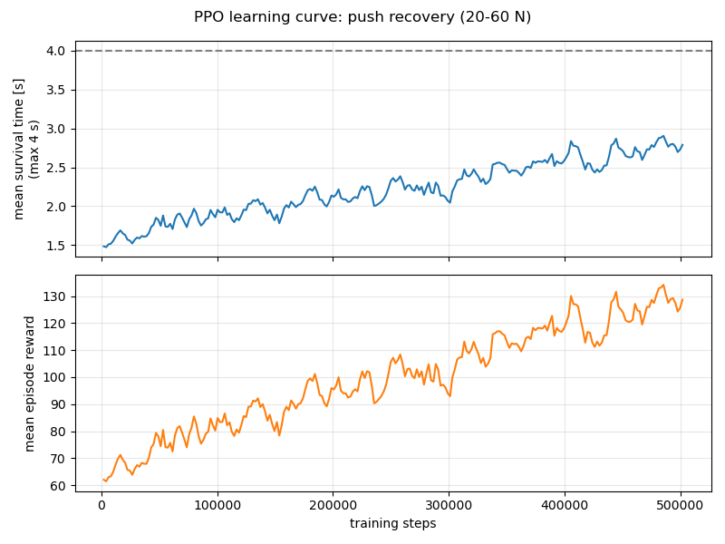

# 07. 강화학습 첫 예제 — "밀려도 넘어지지 않기"

> 이 문서의 명령·출력·수치는 2026-10-08 이 PC(AMD Ryzen 5 4600H 6코어 12스레드, GTX 1650)에서 실제로 실행한 결과입니다.
> 자동 테스트: `tests/test_learning.py`

## 0. 한눈에 보기

| 하고 싶은 것 | 명령 | 걸리는 시간 |
|---|---|---|
| 학습 패키지 설치 (처음 한 번) | `bash scripts/setup_learning.sh` | 수 분 (CPU판 PyTorch 약 200 MB) |
| **학습 없이 바로 결과 보기** | `python learning/evaluate_balance.py --pretrained --view --push 40` | 바로 |
| 직접 학습 | `python learning/train_balance.py` | CPU로 약 4분 |
| 학습 결과 비교표 | `python learning/evaluate_balance.py` | 약 10초 |
| 학습 과정 그래프 (다른 터미널) | `tensorboard --logdir output/learning` → http://localhost:6006 | 실시간 |
| 학습 결과를 화면으로 | `python learning/evaluate_balance.py --view --push 40` | 바로 |
| 같은 상황에서 학습 전(PD만)은? | `python learning/evaluate_balance.py --view --push 40 --baseline` | 바로 |

## 1. 무엇을 학습하나

t06에서 본 것처럼, 관절 PD 제어만으로는 몸통을 **20 N**으로 0.1초 밀면 버티지만 **30 N부터는 넘어집니다.**
이 예제에서는 로봇이 스스로 "밀렸을 때 관절을 어떻게 움직이면 안 넘어지는지"를 **시행착오로 배웁니다.**

결과 (같은 조건으로 세기마다 6번: 앞/뒤 × 미는 시각 3가지):

| 밀기 세기 | PD만 (학습 전) | 학습한 정책 (50만 스텝, CPU 3분 45초) |
|---|---|---|
| 20 N | 6/6 버팀 | 6/6 버팀 |
| 30 N | **0/6** | **6/6** |
| 40 N | **0/6** | **5/6** |
| 50 N | 0/6 | 4/6 |
| 60 N | 0/6 | 0/6 |



학습 곡선: 위는 에피소드(4초)마다 평균 몇 초를 버텼는지, 아래는 평균 보상입니다. 50만 스텝에서도 아직 오르는 중이라 더 오래 학습하면 더 좋아질 여지가 있습니다 (§7 과제).
평균이 4초까지 가지 않는 이유: 학습할 때 20~60 N을 무작위로 섞어 미는데, 60 N 근처는 이 로봇의 몸으로는 거의 버틸 수 없기 때문입니다.

## 2. 강화학습 기본 개념 (이 예제 기준)

```
        ┌────────── 관측 (28개 숫자: 기울기, 각속도, 관절 각도 …) ──────────┐
        │                                                                     ▼
  ┌───────────┐                                                       ┌──────────────┐
  │ 환경       │ ◀── 행동 (6개 숫자: 관절 목표 각도를 얼마나 바꿀지) ── │ 정책 (신경망) │
  │ (MuJoCo +  │                                                       │  28 → 128 →   │
  │  밀기)     │ ── 보상 (잘 버티면 +, 기울면 −) ──▶ 학습 알고리즘 ──▶ │  128 → 6      │
  └───────────┘                         (PPO: 보상이 커지게 신경망을 고침) └──────────────┘
```

| 용어 | 뜻 | 이 예제에서 |
|---|---|---|
| **환경** (environment) | 행동을 받아 결과를 돌려주는 세계 | `BipedBalanceEnv`: MuJoCo 시뮬레이션 + 밀기 |
| **관측** (observation) | 정책이 보는 정보 | 몸통 기울기·각속도·속도·높이, 관절 각도·속도, 직전 행동 (28개) |
| **행동** (action) | 정책이 고르는 것 | 관절 6개의 목표 각도 보정값 (−1 ~ 1 → ±0.3 rad) |
| **보상** (reward) | 잘했는지 점수 | 매 0.02초마다: 살아 있으면 +1, 기울면 감점, 행동이 떨리면 감점 |
| **에피소드** | 한 번의 시도 | 최대 4초. 넘어지면 바로 끝 (그 뒤 보상을 못 받으니 손해) |
| **정책** (policy) | 관측 → 행동 규칙 | 작은 신경망 (은닉층 128, 128) |
| **PPO** | 학습 알고리즘 | 경험을 모아 "보상이 컸던 행동은 더 하고, 작았던 행동은 덜 하게" 신경망을 조금씩 고치기를 반복 |
| **스텝** | 행동 한 번 | 0.02초. 50만 스텝 = 시뮬레이션 속 약 2.8시간 분량의 경험 |

## 3. 과제 설계 (코드: `biped_sim/envs/balance.py`)

| 항목 | 값 | 이유 |
|---|---|---|
| 제어 주기 | 50 Hz (정책) / 500 Hz (물리, PD) | 정책은 느리게 목표만 정하고, 빠른 토크 계산은 PD가 담당 (실제 로봇 구조와 같음) |
| 행동의 의미 | 목표 = home 자세 + 0.3 rad × 행동 | **행동 0 = 학습 전 PD 제어와 똑같음.** 학습은 기본 동작을 '고쳐 나가는' 것이라 처음부터 크게 망가지지 않음 |
| 밀기 | 20~60 N, 0.1초, 앞 또는 뒤, 0.5~1.5초 사이 무작위 시각 | 매번 다른 상황 → 특정 상황만 외우지 않음 |
| 시작 자세 | home 자세 ± 0.02 rad 무작위 | 같은 이유 |
| 넘어짐 | 몸통 기울기 > 0.6 rad 또는 높이 < 0.40 m | |
| 보상 | +1 − 2×기울기² − 0.05×(행동 변화)² | 오래 버틸수록, 똑바로 설수록, 부드럽게 움직일수록 좋음 |
| 신경망 | 28 → 128 → 128 → 6 (tanh), 처음 탐색 잡음 표준편차 0.37 | 작은 망으로 충분 |
| PPO 설정 | 환경 8개 병렬, 롤아웃 256스텝×8, 미니배치 512, 10에폭, 학습률 3e-4 | Stable-Baselines3 기본값 근처 |

## 4. 실행

### 설치 (처음 한 번)

```bash
cd ~/Giga && source scripts/activate.sh
bash scripts/setup_learning.sh          # CPU판 PyTorch (이 예제는 CPU가 더 빠름, §6). GPU판은 --gpu
```

✅ 확인: 마지막에 `torch 2.8.0+... | gymnasium 1.4.0 | stable-baselines3 2.9.0`, `numpy 1.26.4 | setuptools 59.6.0`

> 버전을 고정한 이유: 최신 PyTorch(2.9 이상)는 setuptools 77 이상을 설치하는데, 이것이 ROS2 Humble의 패키지 빌드를 깨뜨릴 수 있습니다.
> PyTorch 2.8.0은 setuptools를 건드리지 않아서 ROS2와 함께 쓸 수 있습니다. numpy도 ROS2 때문에 1.x로 유지합니다 ([01 §5](01_environment.md)).

### 학습 없이 바로 결과 보기

저장소에 미리 학습된 모델(`learning/pretrained/balance_ppo.zip`, 위 표의 결과)이 들어 있습니다.

```bash
python learning/evaluate_balance.py --pretrained --view --push 40              # 학습한 정책: 버팀
python learning/evaluate_balance.py --view --push 40 --baseline                # PD만: 넘어짐
```

MuJoCo 창에서 1초쯤에 몸통이 앞/뒤로(번갈아) 밀립니다. 터미널에 매번 결과가 나옵니다 (실측):

```
[학습한 정책] 40.0 N으로 0.1초 밀기를 앞/뒤 번갈아 반복합니다. 종료: 창 닫기 또는 Ctrl+C
  #1: 앞으로 40.0 N → 버팀 ✅  (t = 4.00 s)

[PD만 (학습 전)] 40.0 N으로 0.1초 밀기를 앞/뒤 번갈아 반복합니다. 종료: 창 닫기 또는 Ctrl+C
  #1: 앞으로 40.0 N → 넘어짐 ❌  (t = 1.58 s)
  #2: 뒤로 40.0 N → 넘어짐 ❌  (t = 1.50 s)
```

### 직접 학습

```bash
python learning/train_balance.py                   # 50만 스텝 (CPU 약 4분)
python learning/train_balance.py --steps 20000     # 동작 확인만 (약 15초, 학습 효과는 거의 없음)
```

학습 중 출력 (실측, 일부):

```
  스텝    25,000 / 500,000 | 평균 버틴 시간 1.58 s / 4.00 s | 평균 보상   66.3 | 경과    11 s
  스텝   250,000 / 500,000 | 평균 버틴 시간 2.35 s / 4.00 s | 평균 보상  106.7 | 경과   113 s
  스텝   500,000 / 500,000 | 평균 버틴 시간 2.75 s / 4.00 s | 평균 보상  126.8 | 경과   224 s
```

`평균 버틴 시간`과 `평균 보상`이 올라가면 학습이 되고 있는 것입니다. 끝나면 학습 전/후 비교표가 자동으로 나옵니다.

결과는 `output/learning/<YYMMDD_HHMMSS>_balance/` (예: `261008_032517_balance`)에 저장됩니다 (`model.zip`, `progress.csv`, `learning_curve.png`).
가장 최근 모델은 `output/learning/balance_latest.zip`에도 복사되어, `evaluate_balance.py`가 옵션 없이 이것을 씁니다.
같은 시드(`--seed 0`)와 같은 장치면 결과가 똑같이 재현됩니다 (CPU에서 두 번 실행해 같은 표를 확인).

### 학습 과정을 TensorBoard로 실시간 보기

학습을 시작한 뒤 **다른 터미널**에서:

```bash
cd ~/Giga && source scripts/activate.sh
tensorboard --logdir output/learning
```

웹 브라우저에서 **http://localhost:6006** 을 엽니다 (원격 접속 중이면 그 PC의 브라우저에서).
학습이 진행되는 동안 그래프가 자동으로 갱신됩니다 (오른쪽 위 새로고침 버튼 또는 설정에서 자동 새로고침).
여러 번 학습했다면 실행마다 다른 색 선으로 겹쳐 그려져 비교할 수 있습니다 (왼쪽 Runs에서 골라 보기).

| 그래프 (태그) | 뜻 | 좋아지는 방향 |
|---|---|---|
| `reward_terms/alive` | 에피소드 동안 받은 "살아 있음" 보상 합 (= 버틴 제어 스텝 수) | ↑ |
| `reward_terms/tilt` | 기울기 감점 합 | 0에 가까워짐 (↑) |
| `reward_terms/action_rate` | 행동 떨림 감점 합 | 0에 가까워짐 (↑) |
| `episode/survival_time_s` | 평균 버틴 시간 [s] (최대 4) | ↑ |
| `episode/fell` | 넘어진 에피소드 비율 | ↓ |
| `eval/survive_30N`, `40N`, `50N` | 5만 스텝마다 고정 조건(앞/뒤)으로 시험해 버틴 비율 | ↑ |
| `rollout/ep_rew_mean` | 평균 총보상 (위 보상 항목들의 합) | ↑ |
| `train/std` | 정책의 탐색 잡음 크기 | 학습이 진행되면 보통 ↓ |
| `train/approx_kl`, `train/clip_fraction` | 한 번 업데이트에서 정책이 얼마나 바뀌었나 | 너무 크면(예: KL > 0.05) 학습률을 낮출 것 |
| `train/explained_variance` | 가치 함수가 보상을 얼마나 잘 예측하나 | 1에 가까울수록 좋음 |

**보상 항목별 그래프를 보는 이유**: 총보상만 보면 "왜" 좋아졌는지 모릅니다. 예를 들어 `alive`는 오르는데 `tilt` 감점이 같이 커지면
"기울어진 채로 버티는 법"을 배우고 있다는 뜻입니다. 보상 가중치(`biped_sim/envs/balance.py`의 `REWARD_WEIGHTS`)를 바꿀 때
이 그래프로 의도한 대로 바뀌는지 확인하세요 (§7 과제 3).

## 5. 결과 해석

- **학습한 정책은 실제로 무엇을 하나?** 40 N으로 밀었을 때를 기록해 비교했습니다 (실측):

  | | 결과 | 몸통 최대 기울기 | 몸통 이동 | 밀린 후 1.5초 중 한쪽 발이 뜬 시간 |
  |---|---|---|---|---|
  | 학습한 정책, 앞으로 밀기 | 버팀 | 10.9° | +0.05 m | 22 % |
  | 학습한 정책, 뒤로 밀기 | 버팀 | 8.4° | **−0.39 m** | **43 %** (양발이 함께 뜬 시간 5 %) |
  | PD만, 앞으로 밀기 | 넘어짐 | 35.9° | +0.36 m | 3 % |
  | PD만, 뒤로 밀기 | 넘어짐 | 36.4° | −0.36 m | 0 % |

  PD만 쓰면 관절이 "home 자세로 돌아가려고만" 해서 거의 움직이지 않고(최대 약 3°) 몸 전체가 한 덩어리로 넘어갑니다.
  학습한 정책은 밀리는 순간 좌우 다리를 **다르게** 움직이고(고관절·발목 10° 안팎), **발을 들어 옮기며** 균형을 되찾습니다.
  특히 뒤로 밀리면 발을 딛으며 약 40 cm 물러납니다. 아무도 "발을 내딛어라"라고 알려 주지 않았는데, 넘어지지 않으려다 스스로 찾아낸 동작입니다.
  `--view --push 40`으로 직접 보세요.
- **60 N을 못 버티는 이유**: 더 크게, 더 빨리 발을 옮겨야 하는데 50만 스텝으로는 거기까지 배우지 못했습니다 (§7 과제 1, 5).
  또 hip roll이 없어 옆으로 체중을 옮길 수 없어 한 발로 서는 동작에 한계가 있습니다 ([04 §6](04_simple_biped_spec.md)).
- **정책이 '안 넘어지는 법'을 배운 것이지 '똑바로 서는 법'을 정확히 배운 것은 아닙니다**: 보상에 기울기 감점이 있지만 생존(+1)이 가장 크기 때문입니다.
  보상을 바꾸면 행동이 달라집니다 (§7).

## 6. CPU vs GPU — 실측

"GPU가 무조건 빠르지 않나?"에 대한 이 PC(Ryzen 5 4600H, GTX 1650)의 측정 결과입니다.
측정할 때는 GPU를 쓰는 다른 프로그램(MuJoCo·RViz 창, GPU 학습)을 모두 끄고, 같은 설정으로 한 번씩 돌렸습니다.

**① 전체 학습 시간 (같은 설정, 50만 스텝)**

| 장치 | 시간 | 속도 | 학습 결과 (20/30/40/50/60 N, 각 6번 중 버틴 횟수) |
|---|---|---|---|
| **CPU** | **228 초** | 2,191 스텝/s | 6 / 6 / 5 / 4 / 0 |
| GPU (GTX 1650) | 284 초 | 1,761 스텝/s | 6 / 6 / 6 / 0 / 0 |

→ 이 예제는 **CPU가 약 1.25배 빠릅니다.** GPU를 써도 빨라지지 않습니다.
학습 결과는 장치보다 실행마다의 우연(난수)에 따라 조금씩 다릅니다.

> 주의: 처음에는 "CPU가 3배 빠르다(GPU 674초)"로 잘못 측정했습니다. 그때 MuJoCo 화면 창 하나가 켜져 있었는데,
> 그 창이 GPU를 96 %까지 쓰고 있었습니다. **GPU 속도를 잴 때는 `nvidia-smi`로 다른 프로그램이 GPU를 쓰는지 먼저 확인하세요.**
> (지금은 이 저장소의 MuJoCo 창이 GPU를 거의 쓰지 않게 고쳐 두었습니다 — docs/08 §0)

**② 왜? 신경망 계산만 따로 재 보면** (PyTorch 2.8, 학습 스크립트와 같은 CPU 스레드 1개, 미리 20번 돌린 뒤 측정)

| 작업 | CPU | GPU | 빠른 쪽 |
|---|---|---|---|
| 행동 계산 (환경 8개분, 매 스텝마다) | 0.055 ms | 0.12 ms | CPU 2.2배 |
| 학습 1회 — 작은 망(64), 묶음 64 | 0.88 ms | 1.4 ms | CPU 1.6배 |
| 학습 1회 — 중간 망(256), 묶음 2048 | 20 ms | 1.6 ms | GPU 13배 |
| 학습 1회 — 큰 망(1024), 묶음 2048 | 205 ms | 8.7 ms | GPU 24배 |

- 강화학습 시간의 대부분은 "시뮬레이션하면서 매 순간 행동 고르기"입니다. 이건 아주 작은 계산이라,
  데이터를 GPU로 보냈다 받는 시간(약 0.1 ms)이 계산 자체보다 큽니다. 시뮬레이션(MuJoCo)도 CPU에서 돕니다.
  그래서 신경망 학습 부분이 GPU에서 빨라져도 전체로는 이득이 없습니다.
- GPU가 빛나는 경우: **신경망이 크고 한 번에 많이 계산할 때** (위 표 아래 두 줄, 카메라 영상 입력 등), 그리고
  **시뮬레이션 자체를 GPU에서 수천 개 동시에 돌릴 때** (MuJoCo MJX, Isaac Gym 류).
  보행 학습은 이 방법으로 CPU보다 약 13배 빠릅니다 → **[docs/08 GPU 보행 학습](08_gpu_walking.md)**
- GPU로 해 보려면: `python learning/train_balance.py --device cuda`

## 7. 해 볼 것 (과제)

각 과제 뒤에 `python learning/evaluate_balance.py`로 표를 비교하세요.

1. **더 오래**: `--steps 1000000`. 50 N, 60 N 결과가 어떻게 바뀌나요? 학습 곡선은 언제 평평해지나요?
2. **신경망 크기**: `train_balance.py`의 `net_arch=[128, 128]`을 `[64, 64]`, `[256, 256]`으로. 속도와 결과는?
3. **보상 바꾸기**: `balance.py`의 `REWARD_WEIGHTS`에서 `"tilt"`를 −20(10배)으로 키우면? 0으로 하면?
   TensorBoard의 `reward_terms/` 그래프와 화면 속 자세를 비교해 보세요.
4. **행동 크기**: `ACTION_SCALE = 0.3`을 0.1, 0.6으로. 너무 작거나 크면 무슨 일이 생기나요?
5. **더 세게 밀며 학습**: `python learning/train_balance.py --push-range 40 80`. 발 딛기가 더 커지나요? 60 N도 버티게 되나요?
   반대로 20 N 근처의 약한 밀기에 대한 결과는 나빠지지 않나요? (쉬운 상황을 덜 연습하게 됨)
6. **시드 바꾸기**: `--seed 1, 2, 3`. 결과가 얼마나 달라지나요? (강화학습은 운의 영향이 큽니다 — 여러 번 돌려 비교하는 습관)

## 8. 한계와 다음 단계

| 한계 | 실제 로봇으로 갈 때 문제 | 다음 단계 |
|---|---|---|
| 관측에 몸통 속도·높이(시뮬레이션 정답값)를 씀 | 실제 로봇은 IMU·관절 센서만 있음 | 관측을 IMU + 관절로 제한하거나, 상태 추정기 추가 |
| 센서 노이즈·지연·모터 한계 모델 없음 | 시뮬레이션에서만 잘 되는 정책이 됨 (sim-to-real gap) | 노이즈·지연·질량을 무작위로 바꾸며 학습 (domain randomization), Phase 4 |
| 앞/뒤로만 밀기, hip roll 없음 | 옆으로 밀리면 대응 못 함 | 12-DoF 모델 (Phase 4) |
| 서 있기만 함 | — | 보행 학습 (Phase 8), GPU 병렬 시뮬레이션(MJX) 검토 |
| 학습한 정책을 ROS2에서 안 씀 | — | `demo_controller` 자리에 "정책 노드"를 넣어 ROS2로 실행 (같은 토픽 인터페이스) |

## 9. 관련 파일

| 파일 | 역할 |
|---|---|
| `biped_sim/envs/balance.py` | 학습 환경 (관측·행동·보상·밀기) + 평가 함수 |
| `learning/train_balance.py` | PPO 학습 (`--steps`, `--envs`, `--device`, `--seed`, `--push-range`, `--output-dir`), 진행 출력, 학습 곡선, 학습 전/후 비교표 |
| `learning/evaluate_balance.py` | 비교표, MuJoCo 화면 재생 (`--view`, `--baseline`, `--pretrained`) |
| `learning/pretrained/balance_ppo.zip` | 미리 학습된 모델 (위 결과표의 모델) |
| `requirements-learning.txt`, `scripts/setup_learning.sh` | 학습 패키지 (선택 설치) |
| `tests/test_learning.py` | 환경 규격, 기준선, 미리 학습된 모델 성능, 학습 스크립트 동작 |
