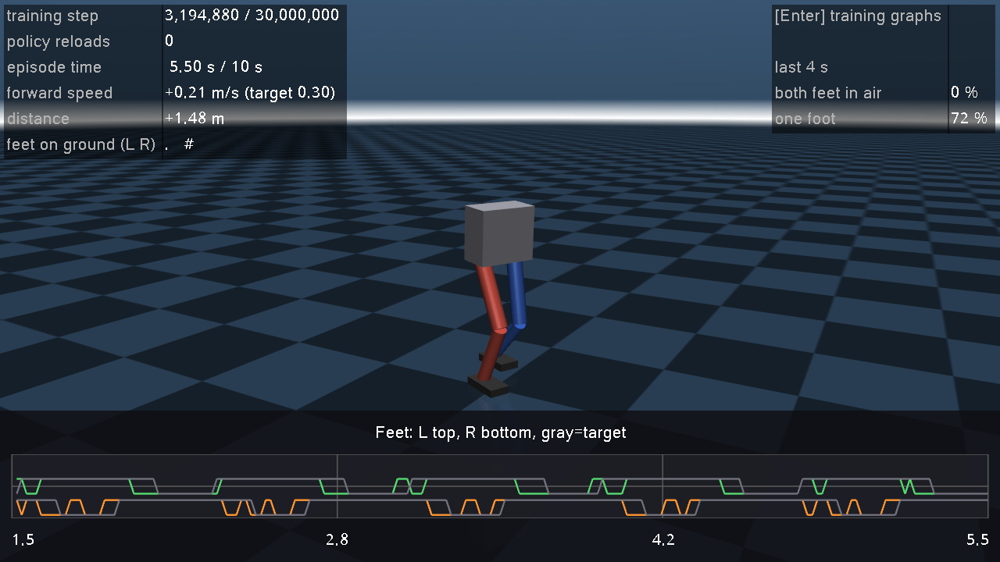
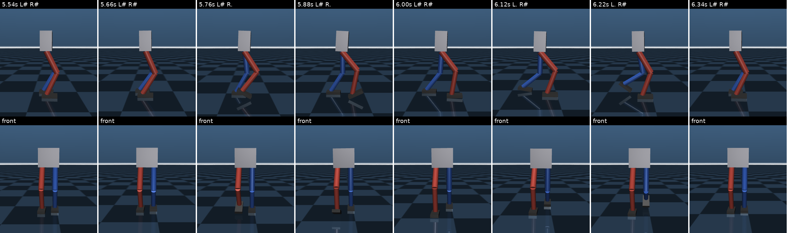
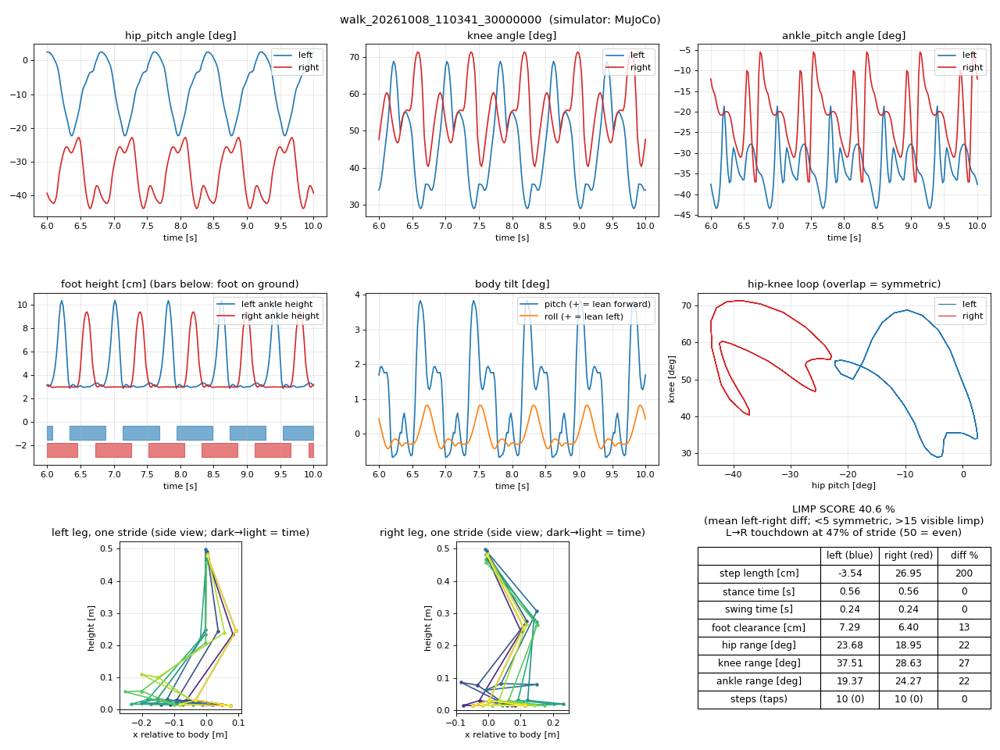
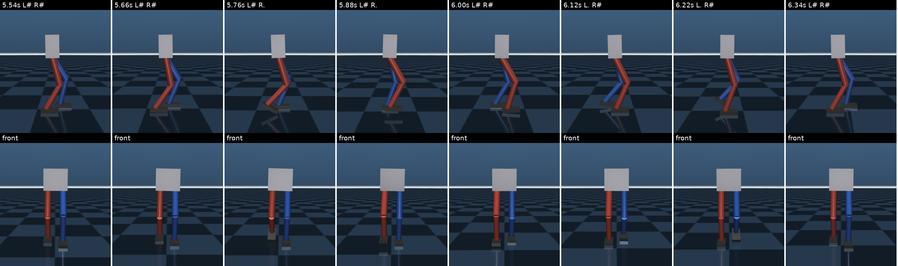
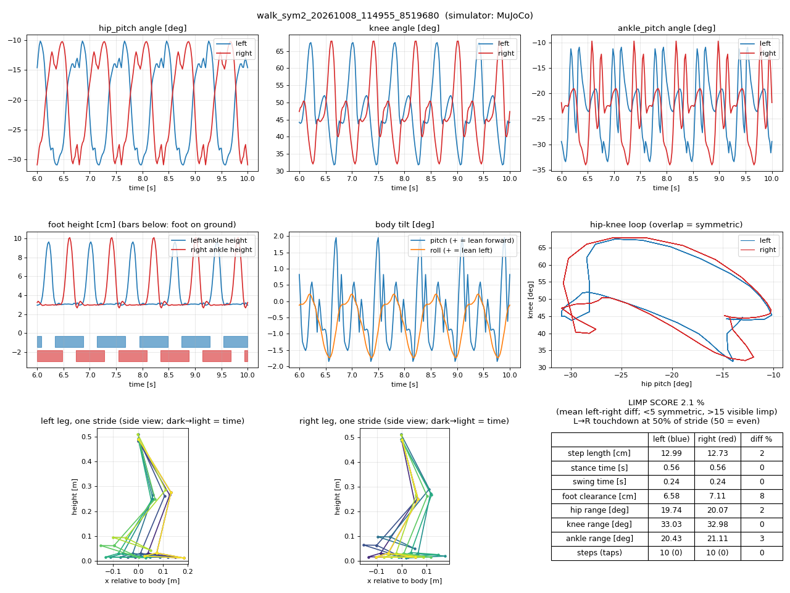

# 08. GPU 보행 학습 — MuJoCo MJX + Brax PPO

> 이 문서의 명령·출력·수치는 2026-10-08 이 PC(AMD Ryzen 5 4600H, GTX 1650 4 GB, NVIDIA 드라이버 535)에서 실제로 실행한 결과입니다.

## 0. 한눈에 보기

```bash
# 처음 한 번: GPU 학습 전용 환경 설치 (약 3 GB, ROS2 환경과 분리)
bash scripts/setup_gpu_learning.sh

# GPU 학습 + 학습 화면 (ROS를 켜지 않은 새 터미널 권장)
source scripts/activate_gpu.sh
python learning/train_walk_gpu.py --watch         # 3,000만 스텝, 약 20분. MuJoCo 창이 함께 열림

# (선택) TensorBoard로 더 자세한 그래프 — 다른 터미널
source scripts/activate.sh
tensorboard --logdir output/learning              # → 웹 브라우저에서 http://localhost:6006

# 끝난 뒤: 걸음 보기·분석 (source scripts/activate_gpu.sh 후)
python learning/play_walk.py --view               # MuJoCo 화면 (Enter로 학습 그래프도 볼 수 있음)
python learning/analyze_gait.py --run output/learning/walk_<날짜_시각>   # 영상·연속 사진·그래프·절뚝임 점수 (§6)

# 걸음 다듬기: 가장 좋은 정책에서 보상을 바꿔 이어서 학습 (§6)
python learning/train_walk_gpu.py --init-from <정책.pkl> --reward symmetry=-2 --steps 10000000 --watch

# GPU 학습 없이 다듬어 둔 걸음 바로 보기
python learning/play_walk.py --view --params learning/pretrained/walk_policy.pkl
```

### 학습 화면 (`--watch` = `play_walk.py --live`)

MuJoCo 창 하나에서 **학습 그래프**와 **지금까지 배운 정책으로 걷는 로봇**을 함께 봅니다. **Enter 키**로 두 화면을 오갑니다.

| 화면 | 보이는 것 |
|---|---|
| **학습 현황** (처음 화면) | 왼쪽: 에피소드 보상 / 앞으로 속도(회색 = 목표). 오른쪽: 보상 항목(큰 것 6개) / **걸음 방식 변화**(두 발 공중·한 발·양발 %). 가운데 위: 발 접촉, 그 아래: 걷는 로봇. 맨 위 줄: 학습 스텝, 버틴 시간 |
| **로봇 보기** | 로봇을 크게. 아래에 발 접촉 그래프, 왼쪽 위에 학습 스텝·속도·이동 거리, 오른쪽 위에 최근 4초 걸음 비율 |


*학습 현황 (320만 스텝, 약 6분). 오른쪽 아래 그래프에서 두 발 공중(빨강)이 60 %에서 0 %로 줄고 한 발 지지(초록)가 늘어납니다. 뛰던 로봇이 걷기를 배우는 과정입니다.*



*로봇 보기 (Enter). 아래 발 접촉 그래프에서 위쪽 파랑 = 왼발, 아래쪽 빨강 = 오른발 (로봇 다리 색과 같음), 높으면 딛고 있음. 회색 = `gait_phase` 보상이 원하는 박자.*

**발 접촉 그래프가 보행 방식을 보여 줍니다.** 좌우 선이 번갈아 높으면 걷기이고, 두 선이 함께 낮은 구간이 많으면 두 발이 다 떠 있는 뛰기입니다.
회색 선(목표 박자)과 얼마나 겹치는지가 `gait_phase` 보상입니다.

동작 방식:
- 학습은 약 100만 스텝(약 40초)마다 평가하고 그때까지의 정책을 저장합니다 (`<실행 폴더>/params.pkl`, `output/learning/walk_latest.pkl`).
  화면은 파일이 바뀌면 다음 에피소드부터 새 정책으로 바꿔 걷습니다. 첫 정책이 나오기 전(컴파일 3~4분)에는 행동 0, 즉 PD로 제자리에 서 있습니다.
- 그래프는 TensorBoard와 같은 기록 파일(`events.out.tfevents.*`)을 직접 읽어 그립니다 (`learning/live_dashboard.py`).
  MuJoCo 화면 글꼴이 한글을 지원하지 않아 화면 글자는 영어입니다.
- 화면은 학습과 **별도 프로세스**이고, 정책 계산과 물리는 **CPU**에서 해서 학습 중인 GPU와 겹치지 않습니다.
  창을 닫아도 학습은 계속되고, 학습이 끝나도 창은 남아 마지막 정책으로 계속 걷습니다. 화면의 터미널 출력은 `<실행 폴더>/watch.log`에 쌓입니다.
- 학습 없이 화면만 따로 켤 수도 있습니다: `python learning/play_walk.py --live` (가장 최근 학습을 따라감).
- 화면은 모니터 주기(약 60 Hz)로만 다시 그리도록 해 두었습니다 (`__GL_SYNC_TO_VBLANK=1`, `biped_sim.passive_viewer`).
  이게 없으면 MuJoCo 화면 하나가 GTX 1650을 49~96 % 차지해 학습이 크게 느려졌습니다 (실측). 켠 뒤에는 측정되지 않을 만큼 작고,
  학습 속도도 100만 스텝당 37초 → 37~41초로 거의 그대로였습니다.
- 설정 패널은 숨겨져 있습니다 (Tab / Shift+Tab으로 켜기). 마우스로 시점을 돌리거나 Ctrl+오른쪽 드래그로 로봇을 밀어 볼 수 있습니다.

## 1. 왜 GPU인가 — 무엇이 다른가

| | CPU 학습 (docs/07, 밀기 버티기) | **GPU 학습 (이 문서, 보행)** |
|---|---|---|
| 시뮬레이터 | MuJoCo (C, CPU) | **MuJoCo MJX** (JAX로 다시 쓴 MuJoCo, GPU) |
| 병렬 방식 | 환경 8개를 CPU 프로세스 8개로 | **환경 1024개를 GPU 프로그램 하나로** |
| 학습 라이브러리 | Stable-Baselines3 (PyTorch) | **Brax PPO** (JAX) — 시뮬레이션·신경망·학습이 전부 GPU 안에서 |
| 속도 (실측) | 약 2,200 제어스텝/s | **약 28,000~31,000 제어스텝/s (약 13배)** |
| 첫 실행 준비 | 바로 시작 | GPU 코드 컴파일(JIT)에 약 3~4분 |

CPU 학습은 매 스텝 파이썬이 개입해 시뮬레이션(CPU) ↔ 신경망을 오가므로 느립니다.
MJX + Brax는 **시뮬레이션 1024개, 신경망 계산, PPO 업데이트를 하나의 GPU 프로그램으로 컴파일**해 GPU 밖으로 나오지 않습니다.
보행처럼 수천만 스텝이 필요한 학습에서는 이 차이가 결정적입니다 (CPU로는 3,000만 스텝에 약 4시간, GPU로는 약 20분).

GTX 1650 같은 노트북 GPU에서는 1024개에서 이미 GPU가 꽉 차서, 그 이상 늘려도 빨라지지 않았습니다 (`--envs`).

## 2. 환경을 둘로 나눈 이유

| 가상환경 | 용도 | 켜는 법 |
|---|---|---|
| `.venv` | MuJoCo 튜토리얼, ROS2, CPU 학습(PyTorch), TensorBoard 보기 | `source scripts/activate.sh` |
| `.venv-mjx` | GPU 학습 (JAX, MJX, Brax) | `source scripts/activate_gpu.sh` |

JAX/Brax는 약 65개 패키지를 끌어오고, PyTorch와 같은 NVIDIA 라이브러리를 다른 버전으로 요구합니다.
한 환경에 섞으면 ROS2 쪽이 깨질 위험이 커서 분리했습니다. 두 환경이 주고받는 것은 **학습 결과 파일**(`output/learning/`)뿐입니다.
한 터미널에서 둘을 섞지 마세요 (`activate_gpu.sh`는 ROS가 켜진 터미널이면 경고하고 ROS 경로를 비웁니다).

## 3. 과제 설계 (코드: `biped_sim/envs/walk_mjx.py`)

| 항목 | 내용 |
|---|---|
| 목표 | 앞(+x)으로 0.3 m/s로 걷기, 에피소드 최대 10초 |
| 행동 (6) | 관절 목표 = home 자세 + 0.5 rad × 행동 → **관절 PD가 토크 계산** (CPU 환경·ROS2 sim_node와 같은 구조) |
| 관측 (31) | 중력 방향(3), 각속도(3), 몸통 속도(3), 높이 오차(1), 관절 각도·속도(12), 직전 행동(6), 목표 속도(1), 걸음 박자 sin/cos(2) |
| 제어 주기 | 50 Hz (물리 250 Hz, 0.004 s × 5스텝) |
| 넘어짐 | 기울기 > 0.6 rad 또는 몸통 높이 < 0.35 m |

### 보상 항목 (`REWARD_WEIGHTS`)

| 항목 | 가중치 | 계산 | 의도 |
|---|---|---|---|
| `forward_velocity` | +2.0 | exp(−(vx − 0.3)² / 0.05) | 목표 속도로 앞으로 |
| `lateral_velocity` | −1.0 | vy² | 옆으로 미끄러지지 않기 |
| `yaw_rate` | −0.5 | (회전 속도)² | 제자리에서 돌지 않기 |
| `upright` | −2.0 | 기울기² | 똑바로 |
| `height` | −10.0 | (높이 − 0.588)² | 너무 웅크리지 않기 |
| `feet_air_time` | +2.0 | 착지할 때 (공중 시간 − 0.2 s) | 발을 충분히 들어 딛기 |
| `action_rate` | −0.02 | \|Δ행동\|² | 떨림 방지 |
| `torque` | −0.0002 | \|토크\|² | 에너지 절약 |
| `alive` | +0.5 | 1 | 넘어지지 않기 |
| `flight` | −1.0 | 두 발 모두 공중이면 1 | 뛰지 말고 걷기 (§5.1에서 추가하게 된 이유) |
| `gait_phase` | +1.0 | 걸음 박자(0.8 s)의 앞 절반은 왼발만, 뒤 절반은 오른발만, 전환 구간은 양발로 딛으면 1 | 좌우 번갈아 걷기 |
| `heading` | 0 (꺼짐) | (방향 각도)² | 처음 방향 유지 — §6 |
| `symmetry` | 0 (꺼짐) | Σ(왼다리 관절 각도 − 반 박자 전 오른다리 관절 각도)² + 반대 [rad²] | 두 다리가 같은 동작을 반 박자 어긋나게 (절뚝임 방지) — §6 |
| `step_length` | 0 (꺼짐) | 한 걸음 착지 때 (반대 발보다 앞에 놓은 거리 / 목표 보폭 0.12 m), 최대 1. 0.1초 이상 공중에 있던 착지만 | 두 발 모두 앞으로 내딛기 — §6 |

가중치는 코드를 고치지 않고 학습 명령에서 바꿀 수 있습니다:

```bash
python learning/train_walk_gpu.py --reward heading=-1 --name walk_heading            # 방향 유지 보상 켜기
python learning/train_walk_gpu.py --reward gait_phase=0 --reward flight=0 --name walk_v1   # §5.1 재현 (뛰는 걸음)
```

가중치가 0인 항목은 보상 그래프(`eval/episode_reward/<항목>`)에서도 0으로 나옵니다.
보상과 상관없이 실제 걸음이 어떤지는 `walk/gait_*_pct`, `walk/abs_heading_deg` 그래프로 봅니다 (§4).

### GPU(MJX)를 위한 단순화

| 단순화 | 이유 | 영향 |
|---|---|---|
| 충돌은 발바닥(box) ↔ 바닥만 | MJX는 원기둥-상자 충돌을 지원하지 않음 (실측: `NotImplementedError`). 다리·몸통이 바닥에 닿을 정도면 이미 넘어진 것 | 다리끼리 부딪혀도 통과함 |
| 물리 0.004 s, 접촉 풀이 반복 4회 | MJX 권장값. 반복 4회로 한 스텝이 1.4~1.8배 빨라지고(실측), 시간 간격 2배로 같은 시간에 필요한 스텝이 절반 | 재생 시에도 같은 설정을 씀 (play_walk.py). 정책이 일반 MuJoCo에서도 비슷하게 걷는지는 §5에서 확인 |

**같은 정책이 일반 MuJoCo(ROS2 sim_node와 같은 시뮬레이터)에서도 비슷하게 걷는지** `play_walk.py`가 기본으로 확인합니다 (§5 결과).
관측 계산이 GPU 환경과 일치하는지는 `tests/test_walk_mjx.py`가 확인합니다.

## 4. 학습 중 화면 출력과 TensorBoard

학습 출력 (실측, 기본 설정 일부):

```
처음 1~3분은 GPU용 코드 컴파일(JIT) 시간이라 출력이 없습니다.
  스텝           0 / 30,000,000 | 평균 보상   -2.38 | 버틴 시간  1.03 s / 10 s | 앞으로 속도 +0.06 m/s | 두 발 공중  62% | 경과   112 s
  스텝   1,064,960 / 30,000,000 | 평균 보상    1.20 | 버틴 시간  1.10 s / 10 s | 앞으로 속도 +0.25 m/s | 두 발 공중  37% | 경과   249 s
  스텝   2,129,920 / 30,000,000 | 평균 보상   21.21 | 버틴 시간  9.79 s / 10 s | 앞으로 속도 +0.27 m/s | 두 발 공중  17% | 경과   292 s
  스텝   3,194,880 / 30,000,000 | 평균 보상   27.71 | 버틴 시간 10.00 s / 10 s | 앞으로 속도 +0.27 m/s | 두 발 공중   4% | 경과   342 s
  스텝   5,324,800 / 30,000,000 | 평균 보상   32.24 | 버틴 시간 10.00 s / 10 s | 앞으로 속도 +0.30 m/s | 두 발 공중   0% | 경과   431 s
```

`두 발 공중`은 평가 에피소드에서 두 발이 모두 땅에서 떨어져 있던 시간 비율입니다. 0 %에 가까우면 뛰지 않고 걷는 것입니다.
같은 설정·같은 `--seed`로 다시 학습하면 같은 숫자가 나옵니다 (실측: 이 출력과 §5.2 v2 학습의 평균 보상이 소수점까지 같음).

TensorBoard (`tensorboard --logdir output/learning` → http://localhost:6006):

| 그래프 (태그) | 뜻 |
|---|---|
| `eval/episode_reward` | 평가 에피소드(128개)의 평균 총보상 |
| `eval/episode_reward/<항목>` | **보상 항목별** 에피소드 합계 (위 표의 항목마다 그래프 하나) — 어떤 행동이 늘고 줄었는지 |
| `walk/forward_speed_mps` | 평균 앞으로 속도 [m/s] (목표 0.3) |
| `walk/episode_seconds` | 평균 버틴 시간 [s] (최대 10) |
| `walk/gait_flight_pct`, `walk/gait_single_pct`, `walk/gait_double_pct` | **걸음 방식** — 두 발 공중 / 한 발 / 양발로 딛은 시간 비율 [%]. 뛰면 flight가, 걸으면 single이 큼 |
| `walk/gait_phase_match_pct` | 걸음 박자와 일치한 정도 [%] |
| `walk/abs_heading_deg` | 처음 방향에서 돌아간 평균 각도 [°] |
| `training/sps` | 초당 학습 스텝 (속도) |
| `training/policy_loss`, `v_loss`, `kl_mean`, `entropy_loss` | PPO 내부 값 |
| `episode/...` | 학습용 환경들의 에피소드 통계 (평가와 비슷하지만 탐색 잡음이 섞임) |

CPU 학습(docs/07)과 같은 `output/learning` 폴더에 쌓이므로 TensorBoard 하나로 모두 볼 수 있습니다.
실행마다 폴더 이름(`walk_…`, `walk_v2_…`, `balance_…`)이 달라 왼쪽 Runs에서 골라 비교합니다.

## 5. 결과 (이 PC 실측)

### 5.1 걸음 박자 보상 없이 (v1): `--reward gait_phase=0 --reward flight=0`

처음에는 `flight`, `gait_phase` 없이 (둘 다 0) 학습했습니다.

3,000만 스텝에 **1,291초(약 21분)** 걸렸습니다.
처음 약 3.5분은 컴파일 시간이고, 그 뒤로는 100만 스텝당 약 36초입니다.
Brax는 평가 구간 단위로 반올림하므로 실제로는 3,195만 스텝까지 돕니다.

| 스텝 | 평균 보상 | 버틴 시간 | 앞으로 속도 | 경과 |
|---|---|---|---|---|
| 0 | −2.16 | 1.02 s | +0.06 m/s | 96 s |
| 106만 | 1.26 | 1.23 s | +0.25 m/s | 219 s |
| 213만 | 18.89 | 9.76 s | +0.28 m/s | 257 s |
| 426만 | 23.35 | **10.00 s** | **+0.30 m/s** | 334 s |
| 2,023만 | 24.74 | 10.00 s | +0.30 m/s | 882 s |
| 3,195만 | 24.85 | 10.00 s | +0.30 m/s | 1,290 s |

**약 200만 스텝(4분)에 넘어지지 않는 법을, 400만 스텝에 목표 속도를 배웁니다.** 그 뒤로는 보상이 거의 오르지 않습니다.
하지만 숫자가 멈췄다고 걸음이 그대로인 건 아닙니다. `play_walk.py`로 10초씩 분석해 보면 다음과 같습니다.

| 시점 | 앞으로 | 옆으로 | 방향 | 양발 / 한 발 / **둘 다 공중** | 딛은 횟수 왼발 / 오른발 |
|---|---|---|---|---|---|
| 426만 스텝 | +2.70 m | −1.40 m | −55° | 2 % / 63 % / 35 % | 57 / 59 |
| 약 2,000만 스텝 | +3.00 m | +0.04 m | +4° | 14 % / 19 % / 66 % | 26 / 39 |
| 최종 (일반 MuJoCo) | +3.02 m | −0.14 m | −4° | 11 % / 19 % / **70 %** | **19 / 37** |
| 최종 (MJX) | +3.01 m | +0.01 m | 0° | 13 % / 19 % / 69 % | 19 / 37 |

- **곧게 걷는 법은 늦게 배웁니다.** 426만 스텝에는 10초에 55° 돌며 옆으로 1.4 m 흘렀습니다.
  2,000만 스텝 이후에는 거의 직진합니다.
- 그런데 **시간의 70 %가 두 발 모두 공중**입니다. 걷기보다 깡충깡충 뛰기에 가깝고, 오른발이 왼발보다 2배 자주 딛습니다.
  `feet_air_time` 보상은 "발을 오래 들었다 딛으면 +"라서, 두 발을 다 띄우는 뛰기가 이 보상을 쉽게 받는 방법이었습니다.
  **강화학습은 보상이 시킨 것만 합니다.** "걷기"를 원하면 걷기가 무엇인지 보상으로 알려 줘야 합니다 (→ 5.2).
- **일반 MuJoCo와 MJX의 결과가 거의 같습니다** (앞으로 3.02 m 대 3.01 m, 발 접촉 비율·횟수 동일).
  GPU에서 배운 정책이 ROS2 sim_node가 쓰는 시뮬레이터에서도 그대로 걷는다는 뜻입니다.
  옆으로 흐름·방향의 작은 차이는 두 시뮬레이터의 미세한 수치 차이가 10초 동안 쌓인 것입니다.

### 5.2 걸음 박자 보상 추가 (v2 = 현재 기본값): `python learning/train_walk_gpu.py`

`gait_phase` +1.0(박자대로 좌우 번갈아 딛기)과 `flight` −1.0(두 발 모두 공중이면 벌점)을 더했습니다. 학습 시간은 1,288초로 v1과 같습니다.

| 스텝 | 평균 보상 | 버틴 시간 | `gait_phase` 합 (최대 10) | `flight` 합 (= −공중에 뜬 초) |
|---|---|---|---|---|
| 0 | −2.38 | 1.03 s | 0.41 | −0.64 |
| 213만 | 21.21 | 9.79 s | 5.84 | −1.65 |
| 426만 | 30.65 | 10.00 s | 8.18 | −0.09 |
| 639만 | 33.08 | 10.00 s | 9.32 | −0.01 |
| 3,195만 | 34.44 | 10.00 s | **9.73** | **0.00** |

(보상 식이 달라서 v1과 v2의 '평균 보상' 숫자끼리는 비교하지 않습니다.)

최종 정책의 10초 걸음 분석:

| | 앞으로 | 옆으로 | 방향 | 양발 / 한 발 / **둘 다 공중** | 딛은 횟수 왼발 / 오른발 |
|---|---|---|---|---|---|
| v1 최종 (일반 MuJoCo) | +3.02 m | −0.14 m | −4° | 11 % / 19 % / 70 % | 19 / 37 |
| **v2 최종 (일반 MuJoCo)** | +3.00 m | −0.17 m | −3° | 40 % / **60 %** / **0 %** | **12 / 13** |
| v2 최종 (MJX) | +2.99 m | −0.26 m | −5° | 40 % / 60 % / 0 % | 12 / 13 |

- **뛰기가 걷기로 바뀌었습니다.** 두 발이 동시에 뜨는 순간이 없어지고, 좌우가 12회·13회로 번갈아 딛습니다.
  10초 동안 박자(0.8 s)가 12.5번 돌므로 박자에 정확히 맞춰 걷는 것입니다.
- 속도(0.30 m/s)와 직진성은 v1과 같습니다. 새 보상이 다른 목표를 망치지 않았습니다.
- 600만 스텝(약 5분)이면 박자를 거의 다 배웁니다 (`gait_phase` 9.3 / 10). 학습 화면의 발 접촉 그래프에서 이 변화를 직접 볼 수 있습니다.
- 일반 MuJoCo와 MJX의 걸음이 같아서, ROS2 sim_node에서도 같은 걸음을 기대할 수 있습니다.
- 하지만 **영상으로 보면 절뚝입니다.** 오른다리는 늘 앞, 왼다리는 늘 뒤에 있습니다. 위 숫자들로는 보이지 않던 문제입니다 → §6에서 진단하고 고칩니다.

**배운 점: 보상을 바꾸면 걸음이 바뀝니다.** "넘어지지 말고 0.3 m/s로 가라"만으로는 뛰는 걸음이 나왔고,
"좌우를 이 박자로 번갈아 딛어라"를 더하자 걷는 걸음이 나왔습니다. 직접 해 볼 것:
- `--speed 0.5`: 더 빠르게 걸으라고 하면 걸음 방식이 어떻게 바뀌는지
- 박자 `GAIT_PERIOD`(walk_mjx.py)를 0.6이나 1.0으로 바꾸면 보폭이 어떻게 바뀌는지

## 6. 걸음 다듬기 — 보고, 진단하고, 보상을 바꿔 이어서 학습

5.2의 걸음은 넘어지지 않고, 목표 속도로, 두 발이 번갈아 딛습니다. 그런데 **영상으로 보면 절뚝입니다.**
속도·버틴 시간·발 접촉 비율 같은 숫자 몇 개로는 걸음의 질을 알 수 없습니다. 이 절은 다음을 반복하는 방법입니다.

```
  학습 ──▶ 가장 좋은 정책 고르기 ──▶ 영상·사진·그래프로 진단 ──▶ 원인에 맞게 보상 추가·조정
   ▲      (analyze_gait.py --run)      (analyze_gait.py)                         │
   └──────────── 그 정책에서 이어서 학습 (train_walk_gpu.py --init-from) ◀────────┘
```

처음부터 다시 학습하지 않고 **지금까지 가장 좋은 정책에서 이어서** 학습하면, 이미 배운 것(넘어지지 않기, 속도, 박자)은 유지한 채
바꾼 보상만 새로 배웁니다. 이번 예에서는 1,000만 스텝(약 12분)이면 충분했습니다 (처음부터는 3,000만 스텝, 약 22분).

### 6.1 걸음 보기: `analyze_gait.py`

```bash
source scripts/activate_gpu.sh
python learning/analyze_gait.py --params output/learning/walk_<날짜_시각>/params.pkl   # 정책 하나
python learning/analyze_gait.py --run output/learning/walk_<날짜_시각>                 # 학습 중 저장된 정책을 모두 비교
```

| 결과 (`output/gait/<실행>_<스텝>/`) | 내용 |
|---|---|
| `walk.mp4`, `walk_slow.mp4` | 옆·앞에서 본 영상 (실시간, 4배 느리게) |
| `filmstrip.png` | 걸음 한 주기(0.8 s)의 옆·앞 모습 8장. 영상을 한 장으로 봄 |
| `gait.png` | 관절 각도 좌우 비교, 발 높이·접촉, 몸통 기울기, 고관절-무릎 궤적 고리, 다리 막대 그림, 좌우 비교표 |
| `gait.json` + 터미널 | 좌우 걸음 길이·디딤/공중 시간·발 높이·관절 범위, **절뚝임 점수**, 발 튕김 횟수 |

- **절뚝임 점수** = 좌우 차이(대칭 지수 = |왼쪽 − 오른쪽| / 평균 × 100)의 평균 [%].
  대략 5 % 미만이면 대칭, 15 % 이상이면 눈에 띄게 절뚝입니다 (사람 보행 분석의 경험적 기준, 참고용).
- **`--run`**: 학습은 평가마다 정책을 `<실행 폴더>/checkpoints/step_<스텝>.pkl`로 저장합니다. 이것들을 모두 10초씩 걸려
  표로 비교하고, 조건(10초 버팀, 목표 속도 ±0.05 m/s, 두 발 공중 < 5 %, 발 튕김 ≤ 2회)을 만족하는 것 중
  절뚝임 점수가 가장 낮은 것을 골라 영상까지 분석합니다. **학습 마지막 정책이 항상 가장 좋은 것은 아닙니다** (6.3의 표).
- 연속 사진과 그래프는 한 장의 그림이라, 영상을 직접 재생할 수 없는 AI 도우미(Claude 등)도 이것을 보고 걸음을 진단할 수 있습니다.
  이 절의 진단도 그렇게 했습니다.

### 6.2 진단: 절뚝이는 걸음 (5.2의 결과)



*위: 옆(로봇이 오른쪽으로 걸음), 아래: 앞. 파랑 = 왼다리, 빨강 = 오른다리. 빨간 오른다리는 늘 몸 앞에 비스듬히 있고,
파란 왼다리는 몸 아래·뒤에만 머물다 뒤로 차올립니다 (6.12~6.22 s).*



| | 왼쪽 | 오른쪽 | 좌우 차이 |
|---|---|---|---|
| 걸음 길이 (착지할 때 반대 발보다 앞에 놓은 거리) | **−3.5 cm** | **27.0 cm** | 200 % |
| 디딤 / 공중 시간 | 0.56 / 0.24 s | 0.56 / 0.24 s | 0 % |
| 고관절 각도 범위 | −22° ~ +3° | −44° ~ −23° | 겹치지 않음 |
| **절뚝임 점수** | | | **40.6 %** |

- **오른다리는 늘 앞, 왼다리는 늘 뒤에 있습니다.** 왼발은 오른발보다 앞으로 나가지 못하고 뒤에 따라붙기만 합니다.
  고관절 각도 범위가 아예 겹치지 않고, 고관절-무릎 고리(가운데 오른쪽 그래프)가 좌우로 따로 떨어져 있습니다.
- 박자(디딤·공중 시간)는 좌우가 똑같습니다. `gait_phase` 보상은 **언제** 딛는지만 보기 때문입니다.
- **원인: 보상에 "두 다리가 같은 동작을 해야 한다"는 것이 없습니다.** 몸통 속도와 발 딛는 박자만 맞으면 이렇게 비대칭인 걸음도 만점입니다.

### 6.3 1차: 대칭 보상을 넣고 이어서 학습

두 보상을 새로 만들었습니다 (`walk_mjx.py`, 기본은 꺼짐).
- `symmetry` (−2): 지금 왼다리 관절 각도와 **반 박자(0.4 s) 전 오른다리** 관절 각도의 차이² (그리고 반대). 걷기는 두 다리가 같은 동작을 반 박자 어긋나게 하는 것이므로, 이 차이가 0이면 대칭입니다.
- `step_length` (+5): 착지할 때 반대 발보다 앞에 놓은 거리 / 목표 보폭(0.12 m = 속도 × 반 박자), 최대 1점. 목표보다 길게 디뎌도 점수가 같아서, 한쪽 다리만 길게 딛는 걸음으로는 점수를 더 받을 수 없습니다.

```bash
python learning/train_walk_gpu.py --init-from output/learning/walk_<5.2 실행>/params.pkl \
    --reward symmetry=-2 --reward step_length=5 --steps 10000000 --evals 11 --name walk_sym --watch
```

학습 출력의 `좌우 다리 차이`(반 박자 어긋나게 비교한 관절 각도 차이)는 18.5° → 9.5°(100만 스텝) → 4.1°로 줄었습니다.
`analyze_gait.py --run`으로 체크포인트를 비교한 결과입니다:

| 학습 스텝 | 방향 | 발 튕김 | 다리 차이 | 절뚝임 |
|---|---|---|---|---|
| 0 (= 5.2의 정책) | −3° | 0 | 19.5° | 40.6 % |
| 106만 | −9° | 0 | 9.5° | 26.3 % |
| 426만 | −13° | 1 | 3.6° | 8.8 % |
| 532만 | −15° | **12** | 3.1° | 7.0 % |
| 1,065만 | **−18°** | **24** | 3.2° | 4.1 % |

절뚝임은 고쳐졌지만(걸음 길이 왼쪽 12.3 / 오른쪽 11.6 cm), 두 가지 새 문제가 생겼습니다.
- **발 튕김 (보상 꼼수):** 발이 착지한 뒤 살짝(1.5 cm 미만) 떴다가 다시 닿습니다. `step_length`를 **착지할 때마다** 줬더니,
  한 걸음에 두 번 착지해 보상을 두 번 받는 법을 배운 것입니다. 530만 스텝쯤부터 생겨 점점 늘었습니다.
  **강화학습은 우리가 의도한 것이 아니라 보상 식이 실제로 계산하는 것을 최대화합니다.**
- **방향이 돌아감:** 10초에 −18°, 옆으로 −0.61 m. 방향 유지 보상(`heading`)이 꺼져 있었습니다.

### 6.4 2차: 꼼수를 막고 방향 유지 보상을 더해 이어서 학습

- `step_length`는 **0.1초 이상 공중에 있다가** 착지한 경우만 한 걸음으로 칩니다 (`MIN_STEP_AIR`).
- `heading` −3: 처음 방향에서 돌아간 각도²에 벌점.
- 1차의 정책에서 이어서 학습합니다.

```bash
python learning/train_walk_gpu.py --init-from output/learning/walk_sym_<...>/checkpoints/step_00010649600.pkl \
    --reward symmetry=-2 --reward step_length=5 --reward heading=-3 --steps 10000000 --evals 11 --name walk_sym2 --watch
```

| 학습 스텝 | 방향 | 발 튕김 | 다리 차이 | 절뚝임 |
|---|---|---|---|---|
| 0 (= 1차의 정책) | −18° | 24 | 3.2° | 4.1 % |
| 106만 | −9° | 11 | 3.6° | 5.1 % |
| 319만 | −2° | 1 | 2.2° | 2.4 % |
| **852만 (선택됨)** | **−1°** | **0** | **1.7°** | **2.1 %** |
| 1,065만 | −2° | 0 | 1.4° | 2.8 % |



*빨간 오른다리(5.76~5.88 s)와 파란 왼다리(6.12~6.22 s)가 번갈아 몸 앞으로 나갑니다.*



*좌우 고관절 각도 범위가 같아지고(−31° ~ −10°), 고관절-무릎 고리가 거의 겹칩니다. 발 접촉 막대에 튕김이 없습니다.*

### 6.5 정리

| | 5.2 (절뚝임) | 6.3 1차 | **6.4 2차 (최종)** |
|---|---|---|---|
| 걸음 길이 왼쪽 / 오른쪽 | −3.5 / 27.0 cm | 12.3 / 11.6 cm | **13.0 / 12.7 cm** |
| 좌우 다리 차이 | 19.5° | 3.2° | **1.7°** |
| **절뚝임 점수** | 40.6 % | 4.1 % | **2.1 %** |
| 발 튕김 (8초) | 0 | 24 | **0** |
| 방향 / 옆으로 흐름 (10초) | −3° / −0.17 m | −18° / −0.61 m | **−1° / −0.02 m** |
| 속도, 두 발 공중 | 0.30 m/s, 0 % | 0.31 m/s, 0 % | 0.30 m/s, 0 % |
| 학습 시간 | 22분 (처음부터) | +12분 | +14분 |

최종 정책은 `learning/pretrained/walk_policy.pkl`에 넣어 두었습니다. GPU 학습 없이 바로 볼 수 있습니다:

```bash
python learning/play_walk.py --view --params learning/pretrained/walk_policy.pkl
python learning/analyze_gait.py --params learning/pretrained/walk_policy.pkl
```

배운 점:
- **숫자 몇 개로는 걸음의 질을 모릅니다.** 영상·연속 사진과 좌우를 나란히 놓은 그래프로 봐야 합니다.
- **원인을 찾아 그것만 보상으로 알려 주면 됩니다.** 절뚝임의 원인은 "두 다리가 같은 동작"이라는 기준이 없던 것이었습니다.
- **새 보상은 꼼수를 낳을 수 있습니다.** 새 보상을 넣은 뒤에는 반드시 다시 보고, 꼼수를 막는 조건을 더합니다.
- **이어서 학습하면 빠릅니다.** 이미 배운 것은 유지되고, 바뀐 부분만 배웁니다.
- 보상 식이 바뀌면 '평균 보상' 숫자는 이전 학습과 비교할 수 없습니다. 비교는 `analyze_gait.py`의 걸음 수치로 합니다.

직접 해 볼 것:
- 이 보상들(`symmetry`, `step_length`, `heading`)을 켜고 **처음부터** 학습하면 절뚝이지 않는 걸음이 바로 나오는지
- `--speed 0.5`로 이어서 학습해 더 빠른 걸음으로 다듬기 (목표 보폭은 속도에 맞춰 자동으로 바뀜)

## 7. 문제 해결

| 증상 | 원인 / 해결 |
|---|---|
| 학습 시작 후 몇 분간 출력 없음 | 정상. GPU 코드 컴파일(JIT). 이 PC는 드라이버(CUDA 12.2)가 JAX의 컴파일러(12.9)보다 오래돼 병렬 컴파일이 꺼져 더 오래 걸림 |
| 학습 화면의 로봇이 처음 몇 분간 서 있기만 함 | 정상. 첫 정책이 저장될 때까지(컴파일 3~4분) 행동 0으로 서 있음 |
| Enter를 눌러도 화면이 안 바뀜 | MuJoCo 창을 한 번 클릭해 키 입력이 창으로 가게 한 뒤 다시. 그래프는 0.1초마다 갱신 |
| 이어서 학습했는데 처음 평가부터 점수가 다름 | 정상. 보상을 바꿨으므로 같은 걸음이라도 점수가 다름. 처음 평가의 버틴 시간·속도가 이전과 같으면 제대로 이어진 것 |
| `analyze_gait.py --run`: 체크포인트가 없습니다 | 체크포인트 저장 기능 이전에 학습한 실행. `--params`로 `params.pkl`을 하나씩 분석 |
| 학습 화면 창이 안 열림 (`--watch`) | `<실행 폴더>/watch.log`에 오류가 있음. 화면이 없는 서버라면 `--watch` 없이 학습 |
| `Failed to import warp` (설치 확인 중) | MJX의 선택 백엔드(NVIDIA Warp)가 없다는 안내. 무시 (학습·재생 스크립트에서는 숨김) |
| 학습이 이상하게 느림 | **다른 프로그램이 GPU를 쓰고 있는지** `nvidia-smi` 확인. 화면 주기 제한이 없는 3D 창은 GTX 1650을 96 %까지 씀 (실측). 이 저장소의 MuJoCo 창은 `__GL_SYNC_TO_VBLANK=1`로 제한해 두었지만, RViz 등 다른 3D 창은 학습 중에 닫을 것 |
| `RESOURCE_EXHAUSTED` / 메모리 부족 | `--envs 512`로 줄이거나, `XLA_PYTHON_CLIENT_MEM_FRACTION` 낮추기 (activate_gpu.sh 기본 0.7) |
| `NotImplementedError: ... collisions not implemented` | MJX가 지원하지 않는 충돌 조합. 새 로봇 모델에서는 발 외 충돌을 끄거나 capsule/box로 바꿀 것 |

## 8. 관련 파일

| 파일 | 역할 |
|---|---|
| `biped_sim/envs/walk_mjx.py` | GPU 보행 환경 (관측·행동·보상·넘어짐), 학습용 모델 생성 |
| `learning/train_walk_gpu.py` | Brax PPO 학습, TensorBoard 기록, 평가마다 정책 저장(`checkpoints/`) (`--steps`, `--envs`, `--speed`, `--reward`, `--name`, `--watch`, `--init-from`) |
| `learning/play_walk.py` | 학습 화면(`--live`), 재생(`--view`), 화면 없이 걸음 요약, 일반 MuJoCo(기본) 또는 MJX(`--backend mjx`) |
| `learning/walk_tools.py` | 공용 도구: 정책 불러오기, 일반 MuJoCo/MJX 재생기, 한 에피소드 기록, 걸음 수치(절뚝임 점수) |
| `learning/live_dashboard.py` | MuJoCo 창 안의 학습 그래프·발 접촉 그래프, TensorBoard 기록 파일 읽기, Enter 전환 |
| `learning/analyze_gait.py` | 걸음 분석: 영상, 연속 사진, 관절 그래프, 좌우 대칭 수치(절뚝임 점수), 체크포인트 비교(`--run`) |
| `requirements-gpu.txt`, `scripts/setup_gpu_learning.sh`, `scripts/activate_gpu.sh` | GPU 학습 환경 |
| `tests/test_walk_mjx.py` | 환경 동작, 일반 MuJoCo 재생기와 관측 일치 (GPU 환경에서만 실행) |
