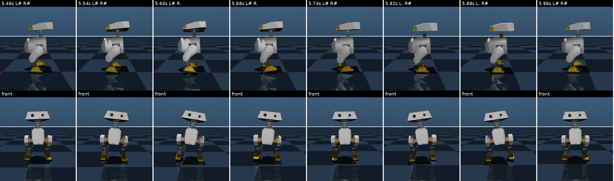
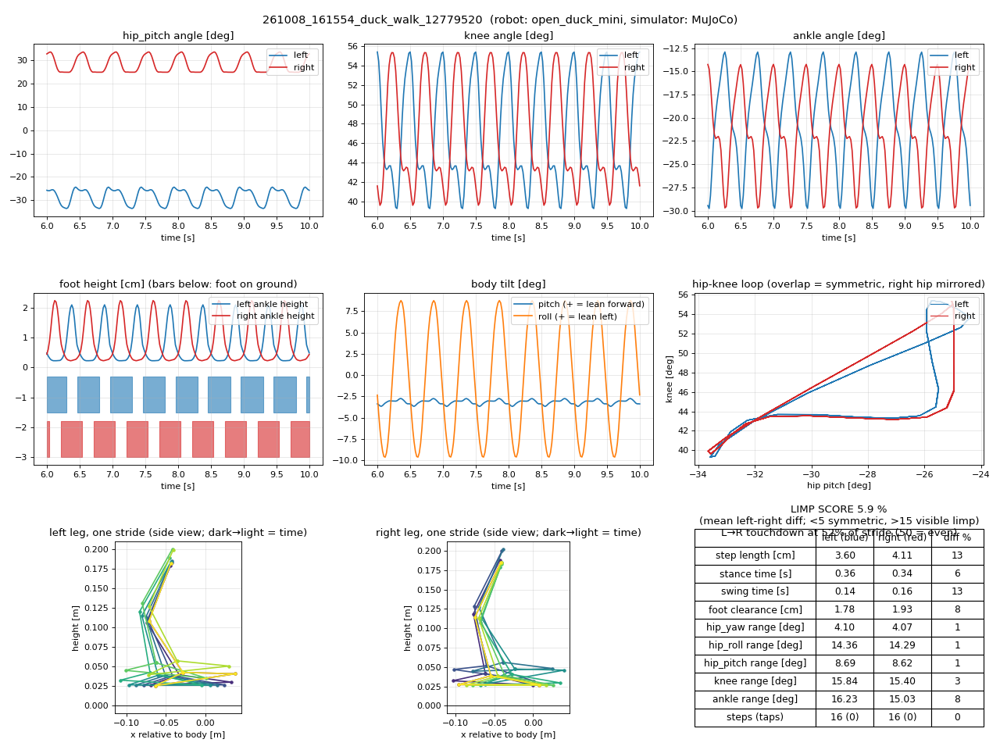
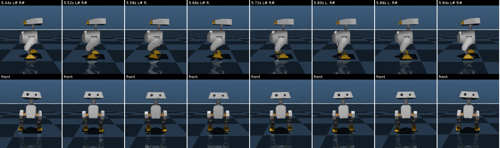
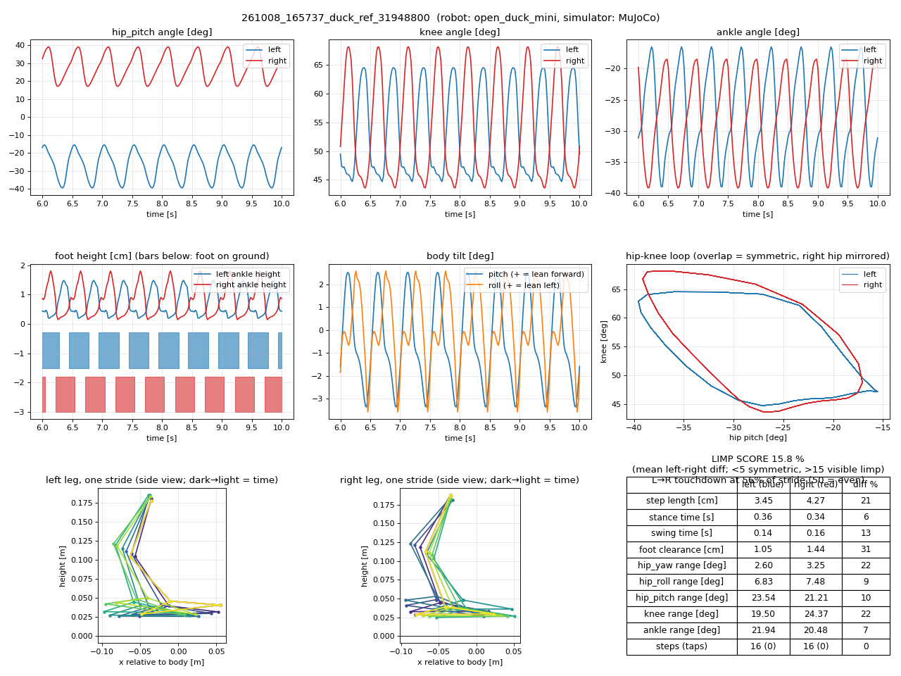
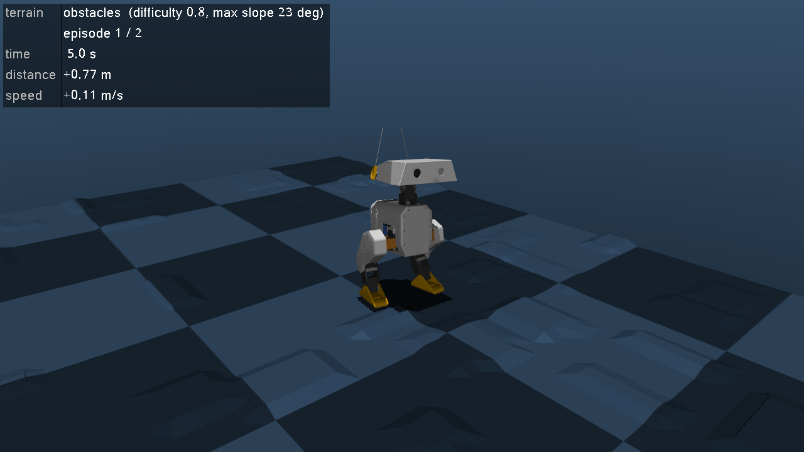
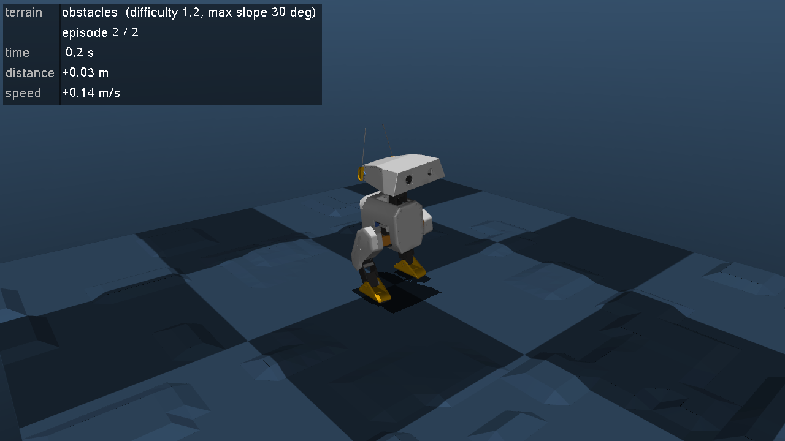
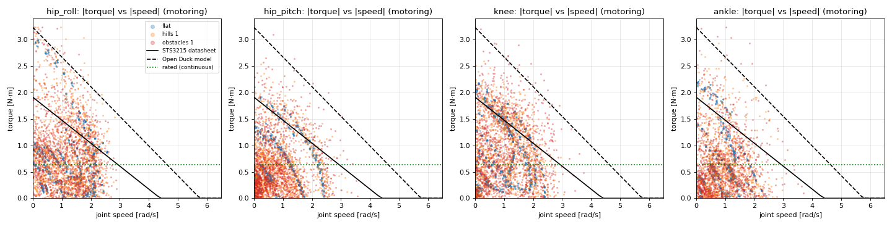

# 09. 오픈소스 로봇 불러오기 — Open Duck Mini v2 (오리 모양 2족 로봇)

> 이 문서의 결과는 2026-10-08 이 PC에서 Open Duck Mini 저장소 커밋 `b23317a`(v2 브랜치)로 실제로 확인한 것입니다.

인터넷에서 받은 로봇 URDF는 **그대로 시뮬레이션에 넣으면 거의 항상 문제가 있습니다.**
이 문서는 실제 오픈소스 로봇 하나를 받아 문제를 하나씩 찾고, 받은 파일은 고치지 않은 채 불러올 때 보완하는 과정입니다.
다른 로봇을 가져올 때도 §2의 점검표를 그대로 쓰면 됩니다.

## 0. 한눈에 보기

```bash
source scripts/activate.sh
bash scripts/get_open_duck.sh                         # 처음 한 번: URDF + 메시 45개 + 라이선스 (약 19 MB)
python tutorials/t07_open_duck.py --headless          # 문제 확인 → 보완 → 좌우 부호 → 서 있기 검증
python tutorials/t07_open_duck.py                     # 뷰어: PD로 서 있는 오리 (Ctrl+오른쪽 드래그로 밀어 보기)
python -m pytest tests/test_open_duck.py              # 자동 점검 (파일이 없으면 건너뜀)
```


## 1. Open Duck Mini v2

디즈니의 BD-X 드로이드를 작게 본뜬 팬 프로젝트입니다 ([저장소](https://github.com/apirrone/Open_Duck_Mini)).

| 항목 | 값 |
|---|---|
| 크기 / 질량 | 다리를 폈을 때 약 42 cm / 2.06 kg (URDF 합계) — simple_biped(8.2 kg)의 4분의 1 |
| 관절 16개 | 다리 5개 × 2 (고관절 yaw·roll·pitch, 무릎, 발목) + 목·머리 4개 + 안테나 2개 |
| 모터 | Feetech STS3215 서보 (위치 제어형), 부품값 약 $400 목표 |
| 학습 방식 | MuJoCo MJX + Brax PPO (이 저장소의 docs/08과 같은 방식) + 참고 동작을 따라 하는 모방 보상 |
| 파일 | `mini_bdx/robots/open_duck_mini_v2/` 에 `robot.urdf`, MuJoCo용 `robot.xml`·`robot_motors.xml`, STL 45개 |

## 2. 오픈소스 URDF를 받을 때 점검표

| # | 점검 | 왜 | Open Duck에서 실제로 | 이 저장소의 대응 |
|---|---|---|---|---|
| 1 | **라이선스** | 받아 쓰고 고치고 배포해도 되는지 | 주 저장소 Apache-2.0 ✅. 학습 코드 저장소(Open_Duck_Playground)는 라이선스 없음 → 읽고 배우기만, 코드 복사 금지. 외형은 디즈니 캐릭터 → 상업적 사용은 따로 확인 | 파일을 저장소에 넣지 않고 내려받기 스크립트로. LICENSE를 함께 받음 |
| 2 | **버전 고정** | 원본이 바뀌면 결과가 달라짐 | 활발히 바뀌는 저장소 | 커밋 `b23317a`로 고정 (`scripts/get_open_duck.sh`) |
| 3 | **메시 경로** | `package://`는 ROS 전용 표기 | `package:///이름.stl` → MuJoCo가 `package:/이름.stl`을 열다 실패 | `mesh_dir` 옵션 (meshdir + strippath, docs/03 §3) |
| 4 | **몸통 고정·모터 없음** | URDF에는 시뮬레이션 요소가 없음 | 그대로 열면 nq=16(관절만), 모터 0개 | 빌더가 freejoint·모터·IMU·바닥 추가 (t04와 같음) |
| 5 | **관절 순서** | 코드가 순서를 가정하면 틀림 | URDF에 발목 → 무릎 → 고관절 순(아래부터)으로 적혀 있음 | 이름으로만 다룸 (`RobotInterface`) |
| 6 | **관절 축과 좌우 부호** | 대칭 동작·보상의 기준 | 모든 축이 `0 0 1`(관절마다 좌표계를 돌려 둠). **hip_pitch만 좌우 부호가 반대**, knee·ankle은 같음 | FK로 직접 확인 (t07 §3, 테스트) |
| 7 | **관절 범위** | 자세·보행 방식을 정함 | hip_pitch: 앞 +0.52 / 뒤 −1.22 rad로 비대칭 | 무릎을 새처럼 뒤로 굽히는 자세 (§4) |
| 8 | **모터 사양** | 토크 한계·제어 방식이 다르면 정책이 실물에서 안 됨 | 모든 관절 `effort=1`, `velocity=20` — CAD 내보내기 기본값 | 토크 한계 3.23 N·m로 덮어씀 (`effort_limits`) |
| 9 | **질량·관성** | CAD 값과 실물이 다름 | 3D 프린팅 부품은 채움 비율에 따라 무게가 달라 제작자가 슬라이서 값으로 고침 | 실물이 있으면 저울로 잰 총 질량과 비교할 것 |
| 10 | **충돌 형상** | 계산 속도와 가짜 접촉 | 충돌 형상 131개가 전부 CAD 메시, 꼭짓점 18만 6천 개. 처음 자세에서 부품끼리 겹친 가짜 접촉 154개 (빌더의 부모-자식 제외 후에도 26개) | 발만 충돌 (`collision_bodies`) → 가짜 접촉 0개 |
| 11 | **시각용 형상** | 충돌을 끈 형상이 사라질 수 있음 | MuJoCo는 URDF를 읽을 때 충돌하지 않는 형상을 버림(`discardvisual` 기본값) → 발만 보이는 로봇 | 빌더가 항상 `discardvisual=False` |
| 12 | **바닥에 놓기** | 시작부터 떨어지거나 박힘 | 메시를 경계구로 근사하면 발이 5 cm 떠서 시작해 떨어짐 | 메시는 꼭짓점으로 가장 낮은 점을 정확히 계산 → 1 mm 위 |
| 13 | **시뮬레이션과 실물 차이** | 학습한 정책이 실물에서 동작하려면 | 제작자 메모: "시뮬레이션의 모터가 실물과 다르게 움직이면 정책이 동작하지 않는다". 서보 특성을 측정 도구(BAM)로 따로 잼 | 걷기 학습 전에 서보 모델을 맞춰야 함 (§6) |

## 3. biped_sim에서 한 일 — 받은 파일은 그대로

받은 파일은 한 글자도 고치지 않았습니다. 필요한 보완은 모두 `biped_sim/robot_configs.py`의 `OPEN_DUCK_MINI.sim_defaults`에 있고,
`build_robot_model(cfg.urdf, cfg.sim_config(...))`로 불러올 때 적용됩니다.

| `sim_defaults` | 값 | 근거 |
|---|---|---|
| `mesh_dir` | `models/third_party/open_duck_mini_v2` | 메시 경로가 `package:///` (점검 3) |
| `effort_limits` | 3.23 N·m (모든 관절) | URDF 값 1은 임시값. Open Duck 프로젝트가 측정한 STS3215(7.4 V) 값 |
| `joint_armature`, `joint_frictionloss`, `joint_damping` | 0.027, 0.083, 0 | 서보 감속기 관성·마찰. Open Duck 저장소의 `robot_motors.xml` (토크 모터 모델) 값 |
| `collision_bodies` | `foot_assembly`, `foot_assembly_2` | 발만 충돌 (점검 10) |
| `kp` / `kd` | 9.5 / 0.5 | kp는 Open Duck `robot.xml`의 위치 서보 값. 서보 내부의 위치 PD를 "토크 모터 + 바깥 PD"로 흉내 냄 |

빌더(`biped_sim/builder.py`)에 새로 생긴 옵션(`SimConfig`): `mesh_dir`, `effort_limits`, `joint_damping`, `joint_frictionloss`,
`collision_bodies`. 그리고 이 로봇을 불러오다 발견한 두 가지 문제(점검 11·12)를 빌더에서 고쳐 모든 로봇에 적용했습니다.

## 4. 서 있는 자세 찾기

모든 관절이 0이면 다리를 거의 편 자세라 균형 잡기 어렵습니다. 무릎을 굽힌 자세를 직접 찾습니다.

**① 부호 규칙 확인 (t07 §3).** 매단 상태에서 관절 하나만 +0.3 rad 돌려 발이 어디로 가는지 봅니다.

| 관절 | 왼발 이동 | 오른발 이동 | 좌우 부호 |
|---|---|---|---|
| hip_pitch | +5.7 cm (앞) | −5.7 cm (뒤) | **반대** |
| knee | +3.4 cm | +3.4 cm | 같음 |
| ankle | +1.1 cm | +1.1 cm | 같음 |

**② 발바닥 수평 + 발이 엉덩이 아래.** 세 관절이 모두 같은 축(pitch)이므로 발바닥이 수평이려면 세 각도의 합이 0이어야 합니다
(오른쪽 hip은 부호를 뒤집어서). 이 조건에서 무릎 각도마다 발이 엉덩이 아래에 오는 hip 각도를 풀면 `hip = ankle = −knee/2`입니다.
무릎을 앞으로(−) 굽힐 수도, 뒤로(+) 굽힐 수도 있는데, hip_pitch의 앞쪽 범위가 0.52 rad밖에 안 돼서
무릎을 앞으로 굽히면(hip +0.4) 다리를 앞으로 내밀 여유가 0.12 rad밖에 남지 않습니다.
→ **무릎을 새처럼 뒤로 0.8 rad 굽히는 자세**를 골랐습니다 (BD-X 다리 모양과도 같음).

| | hip_pitch | knee | ankle |
|---|---|---|---|
| 왼쪽 | −0.4 | +0.8 | −0.4 |
| 오른쪽 | **+0.4** | +0.8 | −0.4 |

## 5. 결과: 관절 PD로 서 있기

`python tutorials/t07_open_duck.py --headless` (5초):

```
t=5.0s 몸통 높이 0.178 m, 기울기 4.2°, 발 하중 10.27 + 9.96 N = 무게(20.22 N)의 1.000배, 최대 토크 0.42 / 3.23 N·m
→ 서 있음 ✅
```

- 두 발 하중의 합이 무게와 정확히 같습니다 (t06과 같은 힘의 평형 검증).
- 서 있는 데는 서보 한계의 13 %(0.42 N·m)만 씁니다.

PD 게인을 바꿔 보면 (5초 뒤, 같은 home 자세에서 시작):

| kp / kd | 몸통 높이 | 기울기 | 최대 토크 |
|---|---|---|---|
| 5.0 / 0.5 | 0.171 m | 11.5° | 0.52 N·m |
| **9.5 / 0.5 (기본)** | 0.178 m | 4.2° | 0.42 N·m |
| 9.5 / 1.0 | 0.179 m | 4.0° | 0.41 N·m |
| 13.4 / 0.5 | 0.180 m | 2.8° | 0.40 N·m |

게인이 약하면 무게에 눌려 더 기웁니다. 기본 게인에서도 몸통이 앞으로 4.2° 기우는데(pitch +), 무게중심이 처음부터
발 중심보다 0.8 cm 앞에 있기 때문입니다. 머리가 0.54 kg(전체의 26 %)이고 몸통 원점보다 3.4 cm 앞에 있습니다 (실측).
실제 로봇에서도 이 기울기가 비슷한지 비교해 보면 질량 분포가 맞는지 확인할 수 있습니다.

## 6. 오리 걷기 학습 (GPU, docs/08과 같은 방식)

```bash
source scripts/activate_gpu.sh
python learning/train_walk_gpu.py --robot open_duck_mini                                  # 1차: 보상만으로
python learning/train_walk_gpu.py --robot open_duck_mini --reward reference=3 --name duck_ref   # 2차: 참고 동작 모방
python learning/analyze_gait.py --run output/learning/<YYMMDD_HHMMSS>_duck_walk           # 진단
```

### 6.1 보행 학습을 로봇마다 쓸 수 있게 (`walk_mjx.WalkSpec`)

| 항목 | simple_biped | Open Duck Mini | 이유 |
|---|---|---|---|
| 정책이 움직이는 관절 | 6 | 다리 10 (머리·안테나 6개는 PD로 home 유지) | 걷기에 필요한 관절만 |
| 관측 / 행동 크기 | 31 / 6 | 43 / 10 | 13 + 3 × 관절 수 |
| 발 충돌 | 상자 | CAD 메시 → **감싸는 상자** (`SimConfig.collision_boxes`, 10.4 × 4.7 × 5.3 cm) | GPU 속도, 접촉 안정 |
| 접촉 판정 | 발목 높이 < 3.5 cm | 발바닥 기준점(`left_foot`) 높이 < 1 cm | 로봇 크기 |
| 목표 속도 / 걸음 박자 | 0.3 m/s / 0.8 s | 0.15 m/s / 0.5 s | 다리 길이가 약 0.3배 → 속도·박자 ∝ √길이 |
| 좌우 부호표 (symmetry 보상) | 모두 +1 | hip yaw·roll·pitch −1, knee·ankle +1 | **FK로 자동 계산** (`mirror_table`): 왼쪽 관절을 돌려 움직인 발을 좌우로 뒤집은 것과 오른쪽을 비교 |

같은 보상 가중치(docs/08의 기본값)를 그대로 썼습니다. 목표 보폭, 발 공중 시간 기준, 속도 보상의 폭은 박자·속도에 비례해 자동으로 바뀝니다.

**학습 속도 주의:** 처음에는 100만 스텝에 5.5분이 걸렸습니다. 학습 화면(`--watch`) 창이 오리의 CAD 메시 131개(꼭짓점 18만 개)를
같은 GPU로 1초에 60번 그렸기 때문입니다. 창 없이 하면 100만 스텝에 71초(4.6배 빠름)였습니다.
GPU 물리 자체는 simple_biped와 비슷합니다(1024개 동시에 초당 약 2만 6천 스텝). → 학습 화면에서는 그림자·바닥 반사를 끄도록 바꿨습니다
(한 장 그리는 시간 8.6 → 2.1 ms). 그 뒤 울퉁불퉁한 지형 학습에서 창을 띄우면 약 2.1배 느립니다 (평가 간격 107 → 225 s, §9.4).

### 6.2 1차: 보상만으로 — 뒤뚱거리는 걸음

3,000만 스텝, 2,407초(40분). 320만 스텝에 10초를 버티고, 640만 스텝부터 목표 속도로 걷습니다.
`analyze_gait.py --run`이 고른 가장 좋은 정책(1,278만 스텝):



| 항목 | 값 | 판단 |
|---|---|---|
| 속도 / 방향 / 옆으로 흐름 | 0.15 m/s / 0° / +0.13 m | ✅ |
| 발 접촉 | 양발 40 %, 한 발 60 %, 두 발 공중 0 %, 걸음 16 / 16회 (박자 0.5 s와 일치) | ✅ |
| 좌우 대칭 | 다리 차이 1.0°, 고관절-무릎 고리 겹침 | ✅ |
| 보폭 | 3.6 / 4.1 cm | 목표(속도 × 디딤 시간 = 3.75 cm)와 같음 |
| **몸통 좌우 흔들림** | **±9° (범위 18.4°)**, 고관절 roll을 14° 사용 | ❌ 뒤뚱거림 |
| 발끝 방향 | 고관절 yaw 평균 왼쪽 +6°, 오른쪽 −5° (발끝이 벌어짐) | △ |
| 발 들기 | 1.8~1.9 cm | △ 낮은 편 |



*몸통 기울기(가운데) 그래프에서 roll(주황)이 걸음마다 ±9° 흔들립니다. 앞에서 본 연속 사진에서도 몸통이 좌우로 기웁니다.*

**진단:** 보상은 "목표 속도로, 박자대로, 좌우 같은 동작으로"만 요구하고 **다리를 어떻게 움직일지는 말하지 않습니다.**
그래서 정책이 몸통을 옆으로 크게 흔들어 디딤 발 위로 체중을 옮기는 방법을 찾았습니다. 걷기는 하지만 BD-X처럼 보이지 않고,
몸통이 크게 흔들리면 실물에서는 넘어지기 쉽습니다.

### 6.3 2차: 다른 방식 — 참고 동작 모방 (`reference` 보상)

디즈니 BD-X 논문과 Open Duck 프로젝트가 쓰는 방식입니다. 걸음 박자에 맞춘 **참고 관절 각도**를 만들고, 그에 가까울수록 보상합니다.

- 참고 동작 (`WalkSpec.reference_gait`, `BipedWalkMjxEnv.reference_pose`): 디딤 동안 발을 앞에서 뒤로 밀고, 흔듦 동안 무릎을 굽혀 들어 앞으로.
  고관절 roll·yaw는 0 (몸통을 흔들지 않음). 관절 계수는 §4에서 서 있는 자세를 찾을 때의 관계 그대로:
  hip + knee + ankle = 0이면 발바닥 수평, hip = ankle = −knee/2면 발이 엉덩이 아래.
- FK로 확인한 참고 동작: 디딤 발이 바닥 높이 그대로 3.7 cm 뒤로 (0.15 m/s × 0.25 s와 일치), 흔드는 발은 2.2 cm 들림,
  발바닥은 늘 수평, 좌우가 반 박자씩 번갈아. 모든 관절이 범위 안.
- 보상 = exp(−Σ(관절 − 참고)² / (관절 수 × 0.15²)), 가중치 3. 나머지 보상은 1차와 같음. 비교를 위해 처음부터 3,000만 스텝.

**결과** (3,000만 스텝, 2,402초): 320만 스텝에 버티기, 640만 스텝에 목표 속도. 마지막 정책(3,195만 스텝):





*몸통 roll(주황)이 ±2.5° 안으로 줄었고(1차는 ±9°), 고관절 pitch가 20° 넘게 앞뒤로 움직여 다리를 실제로 내딛습니다.*

### 6.4 두 방식 비교 (각각 마지막 정책, 3,195만 스텝)

| | 1차: 보상만 | 2차: 참고 동작 모방 |
|---|---|---|
| 속도 / 버티기 / 두 발 공중 | 0.15 m/s / 10 s / 0 % | 0.15 m/s / 10 s / 0 % |
| **몸통 좌우 흔들림 (roll 범위)** | 15.2° | **6.2°** |
| 고관절 roll 사용 범위 | 11.4° | **7°** |
| **고관절 pitch 범위 (다리 앞뒤 흔듦)** | 9.5° | **21~24°** |
| 고관절 yaw 평균 (발끝 방향) | ±5° (벌어짐) | **0°** |
| 몸통 앞뒤 흔들림 (pitch 범위) | **1.0°** | 6.0° |
| 옆으로 흐름 (10초) | **+0.09 m** | +0.34 m |
| 발 들기 (왼 / 오른) | 1.8 / 1.8 cm | 1.1 / 1.4 cm |
| 좌우 다리 차이 / 절뚝임 점수 | **0.8° / 8.5 %** | 2.1° / 15.8 % |
| 왼발→오른발 착지 (50 %가 고름) | 48 % | 56 % |

- **참고 동작을 주면 "어떻게 걷는지"가 바뀝니다.** 몸통을 흔들어 체중을 옮기던 뒤뚱 걸음이, 다리를 앞뒤로 내딛는 걸음으로 바뀌었습니다.
  발끝 벌어짐도 사라졌습니다. 둘 다 참고 동작에 고관절 roll·yaw = 0이 들어 있기 때문입니다.
- **대신 좌우 대칭과 직진은 1차가 더 좋습니다.** 참고 동작은 정확히 대칭이지만, 실제로는 오른쪽 무릎이 조금 더 높이 들리고(68° 대 64°),
  착지 간격이 56 %로 어긋나며, 옆으로 0.34 m 흐릅니다. 몸통 roll 없이 한 발로 서려면 균형이 더 어렵고,
  그 보정을 정책이 좌우 다르게 배운 것으로 보입니다.
- **발 들기는 참고 동작(2.2 cm)보다 낮습니다** (1.1~1.4 cm). 모방 보상은 관절 각도 전체를 비교하므로, 들기 같은 작은 차이는 덜 중요하게 취급됩니다.
- `analyze_gait.py --run`은 절뚝임 점수로만 고르므로 2차에서 640만 스텝(절뚝임 13.9 %, 몸통 흔들림 13.1°)을 골랐습니다.
  몸통 흔들림은 마지막 정책이 훨씬 작습니다. **고르는 기준(무엇을 '좋은 걸음'으로 볼지)도 설계의 일부입니다.**

**다음에 해 볼 것:**
- 2차 정책에서 이어서(`--init-from`) symmetry 가중치를 키워 좌우를 맞추고, heading으로 옆 흐름 줄이기
- 참고 동작의 들기(lift)를 키우거나, 발 높이를 직접 보상하는 항목 추가
- 참고 동작에 작은 고관절 roll(체중 옮기기)을 넣어 1차와 2차의 중간 찾기
- 실제 로봇에 쓰려면: 서보 지연·백래시를 모델에 넣고, 질량·마찰을 학습마다 조금씩 바꾸기(도메인 무작위화)

## 7. 울퉁불퉁한 지형 — 언덕, 불규칙한 경사로, 장애물

평지에서 배운 걸음(§6.2, 1차 1,278만 스텝)을 지형 위에 올려 보고, 지형에서 더 학습시킵니다.

```bash
source scripts/activate_gpu.sh
python learning/terrain_trial.py --params <정책.pkl>                            # MuJoCo 화면: 지형마다 새 지형으로 반복
python learning/terrain_trial.py --params <정책.pkl> --headless --episodes 10   # 화면 없이 통계
python learning/train_walk_gpu.py --robot open_duck_mini --terrain rough --init-from <평지 정책.pkl> --steps 20000000
```

### 7.1 지형 만들기 (`biped_sim/terrain.py`)

MuJoCo 높이맵(heightfield): 일정한 간격(4 cm)의 격자마다 땅 높이 하나. 오리 크기(다리 약 0.17 m, 발 들기 약 2 cm)에 맞춘 지형:

| 종류 | 만드는 법 | 험한 정도 0 → 1 |
|---|---|---|
| `hills` (산악 언덕) | 무작위 잡음을 파장 약 1 m로 부드럽게 | 높이 ±1 → ±3 cm, 최대 경사 4 → 12° |
| `slopes` (불규칙한 경사로) | 0.4 m 칸마다 높이를 무작위로 정하고 평면으로 이음 → 칸마다 기울기가 다름 | 최대 경사 2.5 → 9° |
| `obstacles` (장애물) | 한 변 6~24 cm의 납작한 상자를 1 m²당 4~10개 | 높이 0.5 → 2 cm |
| `mixed` | 언덕 → 경사로 → 장애물을 x 방향으로 이어 붙임 | |

- 출발 자리(지름 0.7 m)는 평평하게 두어 매번 같은 조건에서 출발합니다.
- 화면 실험에서는 **에피소드마다 지형을 새로 만들어**(같은 종류, 다른 배치) 같은 모델에 바꿔 끼웁니다 (`Terrain.apply`, `viewer.update_hfield`).
- 몸통 높이와 발 접촉은 **그 자리 땅을 기준으로** 잽니다 (관측, 보상, 넘어짐 판정 모두). 평지에서는 전과 같은 값입니다.
- ⚠ MuJoCo는 모델을 만들 때 높이맵 데이터를 "가장 낮은 값 0, 가장 높은 값 1"로 다시 늘입니다.
  처음에 다른 비율로 넣었더니 언덕이 2배로 높아졌습니다 → [최저, 최고] → [0, 1]로 넣고 높이 범위·위치를 함께 정함.
  MuJoCo 광선(`mj_ray`)으로 잰 실제 표면과 0.3 mm 안으로 같은지 `tests/test_terrain.py`가 확인합니다.

### 7.2 실험 1: 평지에서 배운 걸음을 지형 위로

`terrain_trial.py --headless --episodes 10` (지형 종류마다 새 지형 10개, 10초 버티면 성공):

| 지형 | 험한 정도 0.5 | 험한 정도 1.0 |
|---|---|---|
| flat | 10 / 10 | — |
| hills | 8 / 10 | 4 / 10 |
| slopes | 8 / 10 | 3 / 10 |
| obstacles | 7 / 10 | 2 / 10 |
| mixed | 8 / 10 | 2 / 10 |



*`terrain_trial.py` 화면: 장애물 지형(험한 정도 0.8). 왼쪽 위에 지형 종류·에피소드·시간·거리·속도.*

MuJoCo 화면으로 본 실험(험한 정도 0.8, 종류마다 2번)에서는 평지만 2 / 2, 나머지는 모두 넘어졌습니다.
평지에서는 한 번도 넘어지지 않던 걸음이 지형이 험해질수록 무너집니다. 이 정책은 지형을 본 적이 없고, 발밑을 보는 센서도 없습니다
(관측은 몸통 자세·속도와 관절뿐).

### 7.3 지형에서 학습하기

- 학습 지형 (`make_training_terrain`): 12 × 12 m에 약 1.5 m 구역마다 언덕·경사로·장애물·평지 중 하나가 주로 나오고,
  험한 정도도 0.4~1.2로 곳마다 다릅니다 (시험보다 조금 더 험하게 연습). 에피소드마다 무작위 위치에서 출발합니다 (`spawn_area`).
  처음엔 네 지형을 평균으로 섞었더니 서로 상쇄돼 절반 넘게 거의 평지가 되어, 구역마다 한 종류가 주도하게 바꿨습니다.
- 속도: 높이맵 위에서는 발 상자가 주변 격자 칸들과 충돌 검사를 해서 GPU 물리가 느려집니다
  (4 cm 격자: 초당 3,850 스텝, 평지의 5분의 1). 학습 지형은 8 cm 격자로 해서 2배 빠르게 (7,800 스텝/s).
  시험은 4 cm 격자 → 학습 때 못 본 더 촘촘한 지형에서 시험하는 셈.
- 평지 정책(1차 1,278만 스텝)에서 이어서 2,000만 스텝.

**결과** (2,000만 스텝, 3,385초 ≈ 56분): 학습 지형 위 평균 버틴 시간이 처음(= 평지 정책) 8.3초 → 100만 스텝 9.6초 → 320만 스텝부터 10초.

### 7.4 실험 2: 지형에서 배운 걸음 — 같은 시험

`terrain_trial.py --headless --episodes 10` (시험 지형은 4 cm 격자, 학습 때 쓰지 않은 새 지형):

| 지형 (10번 중 10초 버팀) | 평지 정책 0.5 | **지형 정책 0.5** | 평지 정책 1.0 | **지형 정책 1.0** | 평지 정책 1.5 | **지형 정책 1.5** | 평지 정책 2.0 | **지형 정책 2.0** |
|---|---|---|---|---|---|---|---|---|
| flat | 10 | **10** | — | **10** | — | — | — | — |
| hills | 8 | **10** | 4 | **10** | 2 | **8** | 1 | **6** |
| slopes | 8 | **10** | 3 | **10** | 2 | **10** | 2 | **7** |
| obstacles | 7 | **10** | 2 | **10** | 2 | **5** | 0 | **1** |
| mixed | 8 | **10** | 2 | **10** | 2 | **9** | 0 | **8** |

(험한 정도 1.5·2.0은 학습(최대 1.2)보다 험한 한계 시험. 2.0의 장애물은 높이 최대 3.5 cm로 발 들기 약 2 cm보다 높음)

MuJoCo 화면 실험 (험한 정도 1.2, 같은 지형 = 시드 7, 종류마다 2번): **지형 정책 9 / 10** (장애물 1번만 9.7초에 넘어짐),
평지 정책 2 / 10 (평지만).



*험한 정도 1.2의 장애물 지형을 걷는 지형 정책.*

- **지형에서 연습하면 지형에서 걷습니다.** 발밑을 보는 센서 없이도 (몸통 자세·속도·관절만 보고) 험한 정도 1.0의 모든 지형을
  10번 모두 통과합니다. 넘어지려는 기울기를 느끼고 다음 걸음으로 바로잡는 법을 배운 것입니다.
- 학습 때보다 험한 지형(1.5, 2.0)에서도 평지 정책보다 훨씬 잘 버팁니다. 가장 어려운 것은 **장애물**입니다:
  발을 들어 올리는 높이보다 높은 턱은 보지 않고서는 넘기 어렵습니다 → 다음 단계는 발밑 높이 정보(높이 지도)를 관측에 넣는 것.
- 평지 걸음도 거의 그대로입니다 (평지 0.16 m/s, 10초 버팀). 발 들기 1.8 → 2.1 cm, 발끝 벌어짐 ±5° → 0°로 오히려 나아졌고,
  몸통 좌우 흔들림(16°)은 그대로입니다.

## 8. 동역학적으로 어디까지 가능한가 — 계산으로 예상하고 시뮬레이션과 비교

학습 결과만 보면 "됐다 / 안 됐다"만 알 수 있습니다. 그 전에 **로봇의 질량·치수·모터 사양만으로 한계를 계산**해 두면,
실패했을 때 그것이 물리적으로 불가능해서인지, 정책이 아직 못 배워서인지 구별할 수 있습니다.
여기서는 계산(손으로도 할 수 있는 식)으로 예상한 뒤, 학습한 정책이 실제로 쓰는 토크·속도·마찰을 재서 비교합니다.

```bash
source scripts/activate_gpu.sh
python learning/feasibility.py --params output/learning/<지형 정책>/checkpoints/<마지막>.pkl
#  → 계산 5가지 + 평지·언덕·장애물(험한 정도 1.0)에서 10초씩 측정, output/feasibility/<실행>/torque_speed.png, report.json
```

아래 숫자는 지형 정책(§7.3, 2,130만 스텝)의 결과입니다. 평지 정책도 거의 같습니다.

### 8.1 재료: 로봇과 서보

| 로봇 (home 자세) | 값 |
|---|---|
| 질량 / 무게중심 높이 | 2.06 kg / 22.3 cm |
| 다리 길이 (고관절 축 ~ 발바닥) | 18.4 cm (무릎을 펴면 19.6, 끝까지 접으면 15.0) |
| 발 (충돌 상자) / 두 발 간격 | 10.4 × 4.7 cm / 18.1 cm |

| 서보 모델 | 최대 토크 | 속도가 빠르면 | 정격(계속 내도 되는) 토크 |
|---|---|---|---|
| STS3215 7.4 V 데이터시트 (Open Duck v2 부품 목록의 서보, 14개) | 정지 1.91 N·m (19.5 kg·cm) | 무부하 4.4~5.5 rad/s에서 0으로 직선 감소 | 0.49~0.64 N·m |
| Open Duck 팀의 측정 모델 (Playground) | 3.23 N·m | 관절 damping 0.56 N·m·s/rad → 약 5.8 rad/s에서 0 | — |
| **이 시뮬레이션** | 3.23 N·m | **줄지 않음** (damping 0) | — |

⚠ 이 시뮬레이션은 Open Duck 저장소의 `robot_motors.xml`(damping 0)을 따랐기 때문에 **빨리 움직여도 최대 토크를 그대로 냅니다.**
실제 모터는 빨리 돌수록 역기전력 때문에 토크가 줄어듭니다. Open Duck 팀이 같은 서보(7.4 V STS3215)를 Rhoban의 BAM으로 측정해
학습에 쓰는 모델(Playground)은 관절 damping 0.56으로 이것을 흉내 냅니다. 그 모델의 최대 토크 3.23 N·m는 데이터시트 정지 토크(1.91)보다
커서, 어느 쪽이 실물에 가까운지는 측정 조건(전압 등)을 확인해야 합니다. 그래서 아래에서는 두 모델을 모두 기준으로 씁니다.

### 8.2 계산 1: 한 발로 설 때 필요한 토크

발이 땅에 붙어 있으면, 관절은 **자기보다 몸통 쪽에 있는 질량 전체**를 들고 있어야 합니다.

$$\tau_j = \hat{a}_j \cdot \big( (\mathbf{c}_{몸통쪽} - \mathbf{p}_j) \times m_{몸통쪽}\,\mathbf{g} \big)$$

($\hat a_j$: 관절 축, $\mathbf p_j$: 관절 위치, $m_{몸통쪽} = $ 전체 질량 − 관절부터 발까지의 질량)

| 관절 | 한 발 정적 토크 | 데이터시트 정지 토크 대비 | 정격 대비 |
|---|---|---|---|
| hip_roll | 0.90 N·m | 47 % | **141 %** |
| knee | 0.74 N·m | 39 % | **116 %** |
| hip_pitch | 0.18 N·m | 10 % | 29 % |
| ankle | 0.16 N·m | 8 % | 25 % |
| hip_yaw | 0 (축이 연직 → 중력 토크 없음) | 0 % | 0 % |

무게중심이 두 발 가운데 그대로인 가장 나쁜 경우입니다. **버틸 수는 있지만(정지 토크의 절반 이하), hip_roll과 knee는
가만히 한 발로 서 있기만 해도 정격을 넘습니다** — 오래 걸으면 서보가 뜨거워질 수 있는 영역입니다.

### 8.3 계산 2: 발을 얼마나 들 수 있나 — 턱 높이

세 가지 한계가 있고, 가장 낮은 것이 실제 한계입니다.

| 한계 | 계산 | 발을 올릴 수 있는 높이 |
|---|---|---|
| 관절 범위 | 무릎을 0 ~ 1.57 rad로 (hip = ankle = −무릎/2로 발바닥 수평) | 흔드는 발만 접으면 3.4 cm, 디딤 다리를 끝까지 펴면 4.6 cm |
| 학습 환경의 행동 범위 | 관절마다 home ± `action_scale`(0.3 rad), 4관절을 다 써서 (FK 격자 탐색) | 3.1 cm |
| **서보 속도 × 흔듦 시간** | 시간 T 동안 최고 속도 ω로 갔다 오면 (사인 모양) 각도 폭 ≤ ωT/π | **T = 0.15 s(지금): 0.21 rad → 1.8 cm** / T = 0.25 s: 0.35 rad → 4.0 cm |

(끝까지 접은 자세로 한 발을 버티는 무릎 토크는 1.17 N·m로 정지 토크 이내 → 토크는 한계가 아님)

지금 정책의 발 들기는 **2.1 cm** — 지금 걸음 박자(흔듦 0.15 s)에서 서보 속도로 낼 수 있는 높이와 거의 같습니다.
§7.4에서 **장애물이 가장 어려웠던 이유가 여기서 나옵니다**: 장애물 높이는 험한 정도 1.0 / 1.5 / 2.0에서 최대 2.0 / 2.75 / 3.5 cm이고
(성공 10 / 5 / 1번), 2.75 cm 이상은 **박자를 늦춰(흔듦 0.25 s 이상) 다리를 더 접어야만** 넘을 수 있습니다.
발밑을 보지 못하는 정책은 언제 늦춰야 할지도 모릅니다.

### 8.4 계산 3: 경사 — 미끄러짐과 넘어짐

- **미끄러짐**: 경사 θ에서 발이 버티려면 마찰력 ≥ 경사 방향 중력 → $\tan\theta \le \mu$. MuJoCo 기본 μ = 1 → **45°**.
- **자세를 그대로 두고 통째로 기울면 넘어짐**: 무게중심의 연직선이 발바닥 밖으로 나가는 각도 = atan(발끝까지 거리 / 무게중심 높이)
  → 오르막 12°, 내리막 14°, 옆 27°.
- **발목으로 몸을 똑바로 세우면** 51°, **경사 쪽으로 몸을 숙이면** 넘어짐 한계가 없음 → 결국 **미끄러짐(45°)이 한계**.

| 시험 지형의 가장 가파른 곳 (시드 10개 평균) | 험한 정도 1.0 | 1.5 | 2.0 |
|---|---|---|---|
| hills | 11° | 15° | 18° |
| slopes | 10° | 13° | 17° |
| 지형 정책 성공 (10번 중, hills · slopes) | 10 · 10 | 8 · 10 | 6 · 7 |

자세를 그대로 두면 12~14°에서 넘어지는데 17~18° 지형을 절반 넘게 통과합니다 = 정책이 몸을 숙여 무게중심을 옮기고 있습니다.
**물리 한계(45°)까지는 여유가 많으니, 경사에서의 실패는 물리가 아니라 정책(학습)의 한계**입니다.
단, μ = 1은 시뮬레이션 기본값입니다. 실물의 3D 프린팅 발은 바닥에 따라 더 미끄러울 수 있습니다 (μ = 0.5이면 27°).

### 8.5 계산 4: 얼마나 빨리 걸을 수 있나

- **프루드 수** $Fr = v^2/(gL)$: 다리 길이가 다른 동물의 걸음을 비교하는 무차원 수. 사람·동물은 Fr ≈ 0.5 근처에서 걷기를 뛰기로 바꿉니다.
  L = 18.4 cm → **0.95 m/s**. 지금 0.15 m/s는 Fr = 0.012 (아주 느린 걸음).
- **서보 속도**: 디딤 동안 다리가 연직에서 ±A만큼 쓸고 (A = v·T_디딤 / 2L), 흔듦 동안 사인 모양으로 되돌아오면
  고관절 최대 각속도 = $\frac{v}{L}\cdot\frac{\pi}{2}\cdot\frac{\beta}{1-\beta}$ (β = 디딤 비율). 지금(β = 0.70)은 3.0 rad/s가 필요합니다
  (측정 최대 2.4~2.5 rad/s — 단순한 모델이라 같은 크기만 맞으면 됩니다). 이것이 무부하 속도 4.4~5.5 rad/s를 넘지 않으려면:

| 디딤 비율 β | 0.70 (지금) | 0.60 | 0.50 |
|---|---|---|---|
| 서보 속도로 낼 수 있는 최고 걸음 속도 | 0.22~0.28 m/s | 0.34~0.43 m/s | 0.51~0.64 m/s |

**속도의 한계는 걷기 물리(0.95 m/s)가 아니라 서보 속도**입니다 (실제로는 부하가 걸리면 더 느려짐).
더 빨리 걸으려면 디딤 비율을 줄여 다리를 앞으로 가져올 시간을 늘려야 합니다.

### 8.6 계산 5: 좌우 흔들림 — 뒤뚱거림은 꼭 필요한가

한 발로 서 있는 동안 몸은 디딤 발 위의 **선형 역진자**(LIPM)처럼 움직입니다: $\ddot y = \omega^2 (y - p)$, $\omega = \sqrt{g/z_c}$.
두 발 사이 가운데에서 출발해 시간 T 뒤 가운데로 돌아오는 대칭 궤적이면, 무게중심이 디딤 발 쪽으로 가장 많이 가는 양은

$$\Delta y = \frac{w}{2}\left(1 - \frac{1}{\cosh(\omega T/2)}\right)$$

ω = 6.6 rad/s (시정수 151 ms), 두 발 간격 w = 18.1 cm, T = 0.15 s(한 발 지지) ~ 0.25 s(반 주기) → **1.0 ~ 2.4 cm**.

측정 (걸음 한 주기 이동평균을 빼서 옆으로 천천히 흘러가는 것은 제외): **지형 정책 ±0.9 cm, 평지 정책 ±1.0 cm** — 계산의 최솟값과 같습니다.
무게중심은 물리적으로 꼭 필요한 만큼만 옮기고 있습니다. 그런데 **몸통 roll은 ±8°**로, 무게중심 ±1 cm에 필요한 기울기
(atan(1 / 22.3) ≈ 2.6°)의 약 3배입니다. 나머지는 '스타일'이고, 일부는 발을 드는 데 쓰는 것으로 보입니다 (roll과 흔드는 발 높이의
상관 0.65 → 발 높이 변화의 약 40 %가 roll과 함께 움직임). §8.3대로 지금 박자에서는 다리를 접어 올리는 높이가 빠듯합니다.

### 8.7 측정: 학습한 걸음이 실제로 쓰는 토크·속도·마찰

물리 스텝(4 ms)마다 기록, 출발 1초 제외, 좌우 다리 범위. "한계 밖" = 그 순간 속도에서 서보가 낼 수 없는 토크를 쓴 시간 비율.
전압으로 구동하는 DC 모터의 토크 범위는 $[-\tau_s - k\omega,\ \tau_s - k\omega]$ ($k = \tau_s/\omega_{무부하}$)이므로,
토크와 속도 방향이 같으면(모터가 일을 할 때) 빠를수록 한계가 줄고, 반대(브레이크)면 오히려 늘어납니다.

| 관절 | RMS 토크 평지 / 장애물 1.0 | (계산 1) | 정격 초과 시간 | 한계 밖: 데이터시트 평지 / 장애물 | 한계 밖: Open Duck 모델 |
|---|---|---|---|---|---|
| hip_roll | 1.04~1.06 / 1.11~1.13 N·m | 0.90 | 51~61 % | 13~17 % / 14~16 % | 0~1 % |
| knee | 0.95~1.04 / 1.07~1.12 | 0.74 | 53~61 % | 8~16 % / 15~17 % | 0~1 % |
| ankle | 0.93~0.94 / 0.87~0.90 | 0.16 | 37~42 % | 4~8 % / 6~7 % | 0~0.4 % |
| hip_pitch | 0.74~0.76 / 0.80~0.85 | 0.18 | 31~41 % | 4~7 % / 7 % | 0~0.4 % |
| hip_yaw | 0.43~0.46 / 0.49~0.50 | 0 | 15~20 % | 0 % / 0~0.2 % | 0 % |



*모터가 일을 하는 순간의 (속도, 토크). 실선 = 데이터시트 한계, 점선 = Open Duck 측정 모델, 초록 점선 = 정격.*

- hip_roll·knee의 RMS 토크(약 1.0 N·m)는 계산 1(0.90, 0.74)과 비슷합니다 → **토크의 대부분은 몸무게를 버티는 데** 씁니다.
  발목은 계산(0.16)보다 훨씬 많이(0.9) 씁니다 → 발목은 균형 잡기(발바닥 위 압력 중심 옮기기)에 바쁩니다.
- **데이터시트 기준이면 hip_roll·knee는 걷는 시간의 8~17 % 동안 서보가 낼 수 없는 토크**를 씁니다. 정격 초과도 절반 이상입니다.
  Open Duck 측정 모델 기준이면 거의 다 한계 안(0~1 %)입니다. 즉 이 걸음이 실물에서 되느냐는 **서보가 실제로 어느 쪽에 가까운지에** 달렸고,
  데이터시트가 맞다면 이 걸음 그대로는 어렵거나 금방 뜨거워집니다.
- **마찰**: 평지에서 발이 쓰는 마찰(수평력 / 수직력)은 중앙값 0.36이지만 상위 10 %는 0.94, 접촉의 10 %는 미끄러지고 있습니다
  (발을 비비거나 끄는 순간). μ = 1이라서 되는 걸음이고, 더 미끄러운 바닥에서는 달라집니다.

### 8.8 정리: 무엇이 한계인가

| 항목 | 계산한 한계 | 지금 정책 | 막는 것 |
|---|---|---|---|
| 한 발 버티기 | hip_roll 0.90 N·m (정지 토크 1.91의 47 %) | RMS 1.0 N·m | 토크는 되지만 **정격 초과 → 발열** |
| 턱 높이 | 지금 박자 1.8 cm, 박자 늦추면 4.0 cm, 관절 끝 4.6 cm | 발 들기 2.1 cm, 2.75 cm 장애물 5 / 10 | **걸음 박자 × 서보 속도** |
| 경사 | 미끄러짐 45° (자세 그대로면 12~14°) | 18° 지형 6 / 10 | **정책** (물리 여유 큼) |
| 속도 | 서보 0.22~0.64 m/s (디딤 비율에 따라), 걷기 물리 0.95 m/s | 0.15 m/s | **서보 속도** |
| 좌우 흔들림 | 무게중심 1.0~2.4 cm | 무게중심 ±0.9 cm, roll ±8° | 무게중심은 최소, roll은 필요한 것의 약 3배 (스타일) |

실물로 가려면 다음 순서가 좋습니다:
1. **시뮬레이션 서보를 실물에 가깝게**: 관절 damping 0.56(Open Duck 측정 모델) 또는 토크 1.91 N·m + 속도에 따른 감소(데이터시트)로 바꿔 다시 학습
   → §9에서 실측 모델로 해 봄.
2. 토크 보상(`torque`)을 키워 RMS 토크를 정격 가까이로.
3. 바닥 마찰을 무작위로(예: 0.4~1.0) 바꿔 가며 학습 → 미끄러운 바닥 대비 (§9).
4. 장애물: 발 들기 높이 보상 + 발밑 높이 지도 관측, 또는 흔듦 시간을 늘린 박자.

출처: [Open Duck Mini v2 부품 목록](https://docs.google.com/spreadsheets/d/1gq4iWWHEJVgAA_eemkTEsshXqrYlFxXAPwO515KpCJc) ("Feetech 7.4v STS 3215" 14개),
[Feetech STS3215 (제조사)](https://www.feetechrc.com/74v-19-kgcm-plastic-case-metal-tooth-magnetic-code-double-axis-ttl-series-steering-gear.html),
[Seeed STS3215 사양](https://www.seeedstudio.com/STS3215-19kg-cm-7-4V-Serial-Servo-p-6338.html),
[OpenELAB STS3215 C001](https://openelab.io/products/feetech-sts3215-c001-servo),
[Open_Duck_Playground `open_duck_mini_v2.xml`](https://github.com/apirrone/Open_Duck_Playground) (class `sts3215`: kp 13.37, forcerange ±3.23, damping 0.56)

## 9. 실물에 가까운 서보 + 미끄러운 바닥으로 다시 학습

§8의 결론대로 두 가지를 바꿔 지형 정책(§7.3)에서 이어서 학습했습니다.

| 바꾼 것 | 옵션 | 내용 |
|---|---|---|
| 서보 모델 | `--servo open_duck` | Open Duck 팀의 실측 모델 (`walk_mjx.SERVO_MODELS`): 위치 kp 13.37, kd 0, 토크 ±3.23 N·m, **관절 damping 0.56** (빨리 돌수록 토크 감소), frictionloss 0.068. 기본값 `ideal`은 지금까지의 모델 |
| 바닥 마찰 | `--friction 0.4 1.0` | 1024개 환경마다 마찰 계수를 0.4~1.0에서 무작위로 (Brax 자동 리셋이 첫 상태로 되돌리므로 환경마다 학습 내내 같은 값) |

```bash
python learning/train_walk_gpu.py --robot open_duck_mini --servo open_duck --friction 0.4 1.0 --terrain rough \
    --init-from output/learning/261008_181514_duck_rough/checkpoints/step_00021299200.pkl \
    --steps 20000000 --name duck_servo_friction                 # GTX 1650에서 60분
python learning/terrain_trial.py --params <정책.pkl> --friction 0.5 --difficulty 2.0 --headless --episodes 10
python learning/terrain_trial.py --params <예전 정책.pkl> --servo open_duck   # 예전 정책을 새 서보 모델로 시험
python learning/feasibility.py --params <예전 정책.pkl> --servo open_duck
```

서보 모델은 학습 설정(`config.json`의 `servo`)에 저장되므로, 재생·분석·지형 실험은 알아서 학습 때와 같은 모델을 씁니다.

### 9.1 먼저 확인: 예전 정책을 새 서보 모델에 넣으면

예전 지형 정책(ideal 서보로 학습)을 실측 서보 모델 + 마찰 0.5에서 걸려도 험한 정도 1.0의 모든 지형에서 10번 모두 버텼습니다.
학습 첫 평가도 10초 버팀, 0.16 m/s. **이 정책은 서보 모델·마찰이 바뀌어도 걸음이 무너지지 않을 만큼 이미 튼튼했습니다.**
그래서 차이는 더 험한 조건(1.5, 2.0)에서 봅니다.

### 9.2 결과: 같은 조건(실측 서보 모델, 같은 지형 시드)에서 10번 중 10초 버팀

| 험한 정도 / 마찰 | hills | slopes | obstacles | mixed | 합계 (평지 제외, 40번 중) |
|---|---|---|---|---|---|
| 1.5 / 1.0 | 8 → **9** | 10 → 10 | 7 → 7 | 10 → 10 | 35 → **36** |
| 1.5 / 0.5 | 9 → 9 | 10 → 10 | 4 → **6** | 10 → 10 | 33 → **35** |
| 2.0 / 1.0 | 6 → **8** | 9 → 8 | 1 → 0 | 8 → **9** | 24 → **25** |
| 2.0 / 0.5 | 7 → 6 | 7 → **10** | 2 → 0 | 9 → 9 | 25 → 25 |

(왼쪽 = 예전 지형 정책, 오른쪽 = 새로 학습한 정책. 평지는 모두 10 / 10)

| 평지에서 걸음 (feasibility.py) | 예전 정책, ideal 서보 | 예전 정책, 실측 서보 | 새 정책, 실측 서보 |
|---|---|---|---|
| RMS 토크 hip_roll / knee / ankle [N·m] | 1.05 / 1.0 / 0.94 | 1.16 / 1.26 / 1.0 | 1.12 / 1.25 / 1.03 |
| 데이터시트 한계 밖 hip_roll / knee | 13~17 % / 8~16 % | 10~19 % / 22~26 % | 9~15 % / 18~26 % |
| 발 들기 | 2.1 cm | 2.3 cm | **1.7 cm** |
| 무게중심 좌우 / 몸통 roll 범위 | ±0.9 cm / 16° | ±0.9 cm / 16° | ±1.2 cm / 18° |
| 쓰는 마찰 중앙값 / 미끄러지는 접촉 | 0.36 / 10 % | 0.44 / 8 % | 0.45 / 9 % |

### 9.3 해석

- **성공 횟수는 조금 늘었지만(160번 중 117 → 121) 큰 차이는 아닙니다.** 칸마다 10번뿐이라 ±1~2는 우연일 수 있습니다.
  가장 뚜렷한 것은 **미끄러운 바닥의 장애물(1.5 / 0.5: 4 → 6)과 경사로(2.0 / 0.5: 7 → 10)** — 마찰 무작위 학습의 효과로 보입니다.
- **3.5 cm 장애물(2.0)은 오히려 0번**이 됐습니다. 새 정책은 발 들기가 1.7 cm로 줄었는데, 이것은 §8.3의 계산
  "흔듦 0.14 s 동안 서보 속도로 올릴 수 있는 높이 1.7 cm"와 **정확히 같습니다.** 실측 서보 모델은 빨리 움직이면 토크가 줄어서,
  정책이 서보 속도 한계 안의 걸음으로 바뀐 것으로 보입니다 (예전 정책을 같은 서보 모델에 넣기만 했을 때는 2.3 cm). 이 박자로는 3.5 cm 턱을 넘을 수 없습니다 → 흔듦 시간을 늘리는 수밖에 없습니다.
- **토크는 줄지 않았습니다.** 실측 서보 모델에서는 같은 걸음에도 모터 토크가 더 큽니다 (역기전력 damping이 브레이크 토크로 더해짐:
  RMS 1.0 → 1.2 N·m). 다시 학습해도 그대로인 이유는 보상의 `torque` 가중치(−2e-4)가 너무 작아서입니다:
  Σ토크² ≈ 10이면 초당 −0.002점으로, 살아 있기(+0.5)의 0.4 %밖에 안 됩니다. **데이터시트가 맞다면 knee는 걷는 시간의 18~26 % 동안
  서보가 못 내는 토크를 쓰므로, 실물로 가려면 토크 보상을 키워야 합니다.**

다음 단계 후보: (1) 토크 보상을 키워 토크 줄이기 (→ §9.4), (2) 오리의 걸음 박자(`gait_period` 0.5 s)를 늘려 흔듦 시간 확보 → 높은 턱,
(3) 발밑 높이 지도 관측.

### 9.4 토크 줄이기 (`--reward torque=-0.01`)

§9.3대로 토크 감점이 너무 작았습니다: 에피소드마다 −0.035점, 전체 보상(약 36점)의 0.1 %. 가중치를 50배(−2e-4 → −0.01)로 올려
전체의 약 5 %(−1.75점)가 되게 하고, §9의 정책에서 이어서 2,000만 스텝을 학습했습니다 (실측 서보 + 마찰 무작위 + 지형, `--watch`로 창을 띄워서 2시간).

```bash
python learning/train_walk_gpu.py --robot open_duck_mini --servo open_duck --friction 0.4 1.0 --terrain rough \
    --init-from output/learning/261008_221156_duck_servo_friction/checkpoints/step_00022118400.pkl \
    --reward torque=-0.01 --steps 20000000 --name duck_torque --watch
```

학습 중 토크 감점은 −1.75 → −1.20점 (Σ토크² 31 % 감소), 속도 보상은 19.5 → 19.4점으로 거의 그대로였습니다.

| 평지에서 걸음 (feasibility.py, 실측 서보) | §9 정책 | **토크 줄인 정책** |
|---|---|---|
| RMS 토크 hip_roll / knee / ankle [N·m] | 1.12 / 1.25 / 1.03 | **0.91 / 0.94 / 0.84** |
| 데이터시트 한계 밖 hip_roll / knee / ankle | 9~15 % / 18~26 % / 2~4 % | **6~9 % / 1~8 % / 0 %** |
| 언덕 1.0에서 데이터시트 한계 밖 hip_roll / knee | 14~20 % / 17~23 % | **10 % / 5~8 %** |
| 정격(0.64 N·m) 초과 시간 hip_roll / knee | 49~54 % / 64~65 % | 50~53 % / 49~53 % |
| 발 들기 / 속도 | 1.7 cm / 0.155 m/s | **1.4 cm** / 0.147 m/s |

| 10번 중 10초 버팀 (실측 서보) | 1.5 / 1.0 | 1.5 / 0.5 | 2.0 / 1.0 | 2.0 / 0.5 |
|---|---|---|---|---|
| 장애물 제외 (hills·slopes·mixed, 30번 중) | 29 → 29 | 29 → 30 | 25 → 24 | 25 → 26 |
| obstacles | 7 → **3** | 6 → **1** | 0 → 3 | 0 → 0 |

- **목표는 이뤘습니다.** 무릎이 데이터시트 한계를 넘는 시간이 18~26 % → 1~8 %로 줄었고, 언덕·경사로 성적은 그대로입니다.
- **대가는 장애물입니다.** 발을 높이 드는 데도 토크가 들기 때문에 발 들기가 1.7 → 1.4 cm로 낮아졌고, 2.75 cm 장애물(1.5)에서 크게 나빠졌습니다.
  토크와 발 들기는 서로 맞바꾸는 관계입니다 → 장애물까지 원하면 발 들기를 따로 보상하거나 걸음 박자를 늘려야 합니다 (§8.3).
- **더 줄이려면 자세를 바꿔야 합니다.** knee RMS 0.94 N·m는 지금 자세(무릎 0.8 rad)에서 한 발로 버티는 정적 토크 0.74 N·m(§8.2)에 가깝습니다.
  정격 0.64 N·m 아래로 가려면 무릎을 0.6 rad 이하로 덜 굽혀 몸통을 약 5 mm 높여야 합니다 (`knee_sweep`: 무릎 0.61 rad → 0.62 N·m).
  학습이 아니라 home 자세·기준 높이(`nominal_height`) 설계의 문제입니다.

### 9.5 서 있는 자세 바꾸기 (`--home-knee 0.6`)

§9.4의 knee 토크는 home 자세(무릎 0.8 rad)의 정적 토크 0.74 N·m에 가까웠습니다. §8.3의 `knee_sweep`대로 무릎을 0.6 rad로 덜 굽히면
정적 토크가 0.61 N·m로 정격(0.64) 아래가 됩니다 (몸통 기준 높이 0.180 → 0.185 m, 자동 계산). `--home-knee`는 학습 설정에 저장되므로
재생·분석도 같은 자세를 쓰고, 로봇 설정(`OPEN_DUCK_MINI`)은 그대로라 예전 정책도 그대로 재생됩니다.
§9.4 정책을 새 자세에 넣기만 해도 10초 버팀·0.148 m/s였으므로 거기서 이어서 2,211만 스텝 (창을 띄워 2시간).

```bash
python learning/train_walk_gpu.py --robot open_duck_mini --servo open_duck --friction 0.4 1.0 --terrain rough \
    --home-knee 0.6 --reward torque=-0.01 --steps 20000000 --name duck_knee06 --watch \
    --init-from output/learning/261008_232319_duck_torque/checkpoints/step_00022118400.pkl
```

| 평지에서 걸음 (실측 서보) | §9.4 (무릎 0.8) | **무릎 0.6** |
|---|---|---|
| 걸을 때 평균 무릎 각도 | 49° (0.85 rad) | **38° (0.66 rad)** |
| 정적 토크 knee (계산 1) | 0.74 N·m | **0.61 N·m** |
| RMS 토크 hip_roll / knee / ankle | 0.91 / 0.94 / 0.84 | 0.94 / **0.89** / **0.79** |
| 데이터시트 한계 밖 hip_roll / knee | 6~9 % / 1~8 % | 5~8 % / 3~5 % |
| 발 들기 / 절뚝임 점수 | 1.4 cm / 13.2 % | 1.3 cm / 11.5 % |

지형 시험(같은 조건)은 거의 그대로입니다: 장애물 제외 120번 중 109 → 108, 장애물 40번 중 7 → 6.

- **자세는 바뀌었습니다** (걸을 때 무릎 0.85 → 0.66 rad). 그런데 무릎 RMS 토크는 5 %만 줄었습니다 (정적 계산은 18 % 감소).
  몸무게를 버티는 정적 토크보다 **움직임(다리 흔들기·밀어내기·균형 잡기)에 드는 동적 토크**의 몫이 이제 더 크다는 뜻입니다.
- **hip_roll은 무릎 자세와 상관이 없습니다.** 오리에는 발목 roll 관절이 없어서 옆으로 기울어지는 힘을 hip_roll 혼자 버팁니다.
  토크 팔 = 고관절 축(y = 3.5 cm)과 몸통 쪽 무게중심(y = −1.9 cm, 반대쪽 다리 포함) 사이 5.4 cm → 0.90 N·m.
  **무게중심을 디딤 발 쪽으로 옮길수록 줄어듭니다**: 1.2 cm(지금 걸음) → 0.70, 2.4 cm(§8.6 LIPM 상한) → 0.50 N·m (정격 아래).
  §8.6에서 '스타일'이라고 본 좌우 흔들림이, 무게중심 이동만큼은 hip_roll 부담을 덜어 주는 데 필요한 것입니다.

### 9.6 무게중심을 디딤 쪽으로 (`--reward com_over_stance=1.0`)

§9.5의 계산대로라면 한 발로 설 때 무게중심을 디딤 쪽 hip_roll 축으로 2.4 cm 옮기면 hip_roll 정적 토크가 0.90 → 0.50 N·m가 됩니다.
그래서 그 이동 거리에 점수를 주는 보상 `com_over_stance`를 만들었습니다 (몸통 방향 기준 옆 거리, 2.4 cm에서 만점, 기본 0 = 꺼짐).
§9.5 정책은 한 발 지지 동안 평균 0.44 cm만 옮기고 있었습니다. 나머지는 §9.5와 같은 조건으로 이어서 2,211만 스텝 (창을 띄워 1시간 47분).

```bash
python learning/train_walk_gpu.py --robot open_duck_mini --servo open_duck --friction 0.4 1.0 --terrain rough \
    --home-knee 0.6 --reward torque=-0.01 --reward com_over_stance=1.0 --steps 20000000 --name duck_com_shift --watch \
    --init-from output/learning/261009_013514_duck_knee06/checkpoints/step_00022118400.pkl
```

학습 중 무게중심 이동(TensorBoard `walk/com_shift_cm`)은 0.44 → 1.03 cm로 꾸준히 늘었지만(아직 오르는 중), 기울기 감점(`upright`)도
−0.24 → −0.48로 두 배가 됐습니다. 토크 감점은 −1.18 → −1.11 (6 % 감소).

| 평지에서 걸음 (실측 서보) | §9.5 (무릎 0.6) | **무게중심 이동** |
|---|---|---|
| 한 발 지지 때 무게중심 이동 | 0.4 cm | **1.0 cm** |
| RMS 토크 hip_roll / hip_pitch / knee / ankle | 0.94 / 0.76 / 0.89 / 0.79 | 0.97 / **0.55** / 0.87 / 0.78 |
| 데이터시트 한계 밖 hip_roll / knee | 5~8 % / 3~5 % | **10~12 %** / 4~5 % |
| 몸통 roll 범위 / 앞으로 숙임 / 발끝 벌림(hip_yaw) | 17° / +2.5° / ±9° | 21° / +5.0° / ±13° |
| 발 들기 / 절뚝임 점수 | 1.3 cm / 11.5 % | 1.1 cm / 11.4 % |

| 10번 중 10초 버팀 (실측 서보) | 1.5 / 1.0 | 1.5 / 0.5 | 2.0 / 1.0 | 2.0 / 0.5 | 합계 |
|---|---|---|---|---|---|
| hills·slopes·mixed (30번 중) | 28 → 28 | 29 → 30 | 24 → 24 | 27 → 24 | 108 → 106 |
| obstacles | 1 → **4** | 3 → **8** | 1 → **4** | 1 → **2** | **6 → 18** |

- **예상은 빗나갔습니다: hip_roll 토크는 줄지 않았습니다** (RMS 0.94 → 0.97, 한계 밖 시간은 오히려 증가).
  오리는 발목 roll이 없고 발바닥이 평평하게 땅에 붙어 있어서, 디딤 다리의 고관절은 발 위에서 옆으로 거의 움직이지 못합니다.
  그래서 무게중심을 옆으로 옮기는 방법은 사실상 **몸통을 hip_roll 축으로 기울이는 것**뿐이고 (roll 17 → 21°, 발끝을 더 벌려 9 → 13°,
  다리 앞뒤 관절로 조금이라도 옆으로 움직이려는 것으로 보임), 몸통을 좌우로 흔드는 데 드는 동적 토크가 정적으로 아낀 만큼을 다시 씁니다.
  → **hip_roll 부담은 이 로봇 구조(발목 roll 없음)의 한계**에 가깝습니다. 줄이려면 더 센 서보(예: 12 V STS3215, 30 kg·cm)를 hip_roll에 쓰는 등
  하드웨어 쪽 선택이 필요합니다.
- **대신 보행은 좋아졌습니다: 장애물 6 → 18번** (특히 미끄러운 1.5: 3 → 8). 발 들기는 오히려 낮아졌으므로(1.1 cm), 발이 턱에 걸려도
  무게중심이 디딤 발 위에 있어 한 발로 버티며 회복하기 쉬워진 것으로 보입니다 (추정). hip_pitch 토크도 28 % 줄었습니다.

### 9.7 발 들기 보상 (`--reward foot_clearance=5`) — 버림

착지할 때마다 그 흔듦 동안 발을 가장 높이 든 높이 / 3 cm(최대 1)를 주는 보상. §9.6 정책(챔피언)에서 이어서 2,211만 스텝.
여기부터는 자율 학습(docs/10)으로 진행했고, 학습 뒤 자동 평가(`evaluate_walk.py`)의 보고서로 판단했습니다.

| | §9.6 (챔피언) | 발 들기 보상 |
|---|---|---|
| 보행 점수 (지형 160번) | 77.5 | 73.1 — **불합격** (절뚝임 34 %, 고친 측정으로 15.8 %) |
| 장애물 (40번) | 18 | 11 (우연 범위 안) |
| 발 들기 / 흔듦 시간 | 1.1 cm / 0.15 s | **2.1 cm** / 0.17~0.20 s |
| 걸음 길이 왼 / 오른 (고친 측정), 방향 | 3.7 / 3.9 cm, −3° | 3.7 / 3.8 cm, **−20°** |
| hip_roll 데이터시트 한계 밖 | 10~12 % | 17~24 % |

- 발은 높이 들었고, 그러려고 흔듦 시간을 스스로 늘렸습니다 — §8.3의 계산(높이 들려면 흔듦이 길어야 함) 그대로입니다.
- 하지만 걸으면서 오른쪽으로 계속 돌았습니다 (10초에 −20°). 장애물·지형 성적도 좋아지지 않아 이 변경은 버렸습니다.
- ⚠ **측정 오류 정정**: 걸음 길이 6.9 / 0.7 cm는 실제 절뚝임이 아니었습니다. 걸음 길이를 world x 방향으로 쟀기 때문에, 몸이 ψ만큼
  돌아 있으면 두 발 간격(18 cm) × sin ψ(−20°면 약 6 cm)가 한쪽 걸음엔 더해지고 다른 쪽엔 빠졌습니다 (도는 길의 안팎 차이는
  반지름 4 m에서 4 %뿐). 몸통 방향으로 재도록 고친 뒤(`walk_tools.gait_metrics`)에는 3.7 / 3.8 cm, 절뚝임 점수 15.8 %입니다
  (다리 동작이 작은 hip_yaw의 좌우 비율 차이가 큼). 방향이 −20° 틀어지는 것 자체는 실제 문제라 판단은 그대로입니다.
- 다음: 발 높이를 보상으로 강제하는 대신 **걸음 박자 자체를 늘려**(0.5 → 0.6 s) 흔듦 시간을 주는 방법 (docs/10 아이디어 B).

### 9.8 걸음 박자 늘리기 (`--gait-period 0.6`) — 보행은 같고 토크는 줄어듦

발 높이를 보상으로 강제하는 대신 걸음 박자를 0.5 → 0.6 s로 늘려 흔듦 시간을 줌. 챔피언(§9.6)에서 이어서 2,211만 스텝.

| | §9.6 (챔피언) | 박자 0.6 s |
|---|---|---|
| 보행 점수 / 장애물 | 77.5 / 18 | 76.2 / 19 (우연 범위 안) |
| RMS 토크 hip_roll / knee / hip_pitch | 0.97 / 0.87 / 0.55 | **0.85 / 0.78 / 0.47** |
| 데이터시트 한계 밖 (다리 평균) | 3.0 % | 2.8 % |
| 발 들기 / 절뚝임 (고친 측정) | 1.1 cm / 10.1 % | 1.3 cm / 12.5 % |

- 보행 점수로는 챔피언과 같아서(차이가 우연 범위) 챔피언은 그대로입니다.
- 대신 **hip_roll 토크가 12 % 줄었습니다**. §9.6에서 무게중심 이동으로도 줄지 않던 관절입니다. 박자가 느려 몸통을 좌우로 흔드는 횟수가
  줄었기 때문으로 보입니다 (추정). 실물 서보 쪽으로는 이득이라, 보행을 높이는 다른 변경과 합칠 후보로 남깁니다 (docs/10 아이디어 H).

### 9.9 더 험한 지형에서 연습 (`--terrain-difficulty 0.8 2.0`) — 새 챔피언

학습 지형의 험한 정도를 0.4~1.2 → 0.8~2.0으로. 시험(1.5, 2.0)이 지금까지 학습 지형보다 험했습니다. 챔피언(§9.6)에서 이어서 2,211만 스텝.

| 10번 중 10초 버팀 (평지 제외 40번) | 1.5 / 1.0 | 1.5 / 0.5 | 2.0 / 1.0 | 2.0 / 0.5 | 보행 점수 |
|---|---|---|---|---|---|
| §9.6 | 32 | 38 | 28 | 26 | 77.5 |
| **험한 지형 연습** | **36** | **39** | **31** | **33** | **86.9** |

- **우연보다 큰 차이로 좋아졌습니다** (160번 중 124 → 139). 언덕·경사로·섞인 코스는 거의 다 통과하고, 장애물은 18 → 23 / 40.
  시험만큼 험한 곳을 연습하는 것이 지금까지 바꾼 것 중 효과가 가장 컸습니다.
- 대가: hip_roll 데이터시트 한계 밖 시간 10~12 → 14~15 %, 평지에서 방향 틀어짐 −3 → −10° (10초).
  → 다음은 hip_roll 토크를 줄였던 걸음 박자 0.6 s(§9.8)를 이 정책에 더해 봄.

## 10. 관련 파일

| 파일 | 역할 |
|---|---|
| `scripts/get_open_duck.sh` | 고정 커밋에서 URDF·메시·LICENSE 내려받기 → `models/third_party/open_duck_mini_v2/` (git 제외) |
| `models/third_party/README.md` | 외부 로봇 파일의 출처·라이선스 |
| `biped_sim/robot_configs.py` | `OPEN_DUCK_MINI`: home 자세, 게인, `sim_defaults` (근거 주석 포함) |
| `biped_sim/builder.py` | `SimConfig`의 `mesh_dir`, `effort_limits`, `collision_bodies` 등 |
| `biped_sim/utils.py` | `lowest_collision_z`: 메시의 가장 낮은 점 정확히 |
| `tutorials/t07_open_duck.py` | 문제 확인 → 보완 → 좌우 부호 → 서 있기 |
| `tests/test_open_duck.py` | 빌더 보완, 바닥 1 mm 위 시작, 좌우 부호, 서 있기 |
| `biped_sim/envs/walk_mjx.py` | `WalkSpec`·`SPECS`(로봇별 보행 과제), `mirror_table`(좌우 부호 자동), 참고 동작(`reference_pose`) |
| `biped_sim/terrain.py`, `learning/terrain_trial.py`, `tests/test_terrain.py` | 지형 만들기·바꿔 끼우기, 지형 실험(화면/통계), 지형 높이 검증 |
| `tests/test_walk_mjx.py::test_open_duck_walk_env` | 오리 보행 환경: 관측 크기, 좌우 부호표, 서 있기, 일반 MuJoCo와 관측 일치 |
| `learning/feasibility.py`, `tests/test_walk_mjx.py::test_feasibility_estimates_for_open_duck` | 동역학 한계 계산(토크·턱·경사·속도·흔들림)과 정책 측정 비교 (§8) |
| `biped_sim/envs/walk_mjx.py` `SERVO_MODELS`·`with_servo`, `friction_range` / `tests/test_walk_mjx.py::test_open_duck_servo_model_and_random_friction` | 서보 모델(ideal / open_duck 실측)과 바닥 마찰 무작위 (§9) |
| `walk_mjx.with_home_knee` (`--home-knee`) / `tests/test_walk_mjx.py::test_open_duck_home_knee_posture` | 서 있는 자세(무릎 각도) 바꾸기, 기준 높이 자동 (§9.5) |
| `walk_mjx` `com_over_stance` 보상·`COM_SHIFT_TARGET`·`WalkSpec.hip_roll_joints`, TensorBoard `walk/com_shift_cm` | 한 발 지지 때 무게중심을 디딤 쪽 고관절로 (§9.6) |

출처: [Open_Duck_Mini](https://github.com/apirrone/Open_Duck_Mini) (Apache-2.0),
[sim2real 메모](https://github.com/apirrone/Open_Duck_Mini/blob/v2/docs/sim2real.md),
[Open_Duck_Playground](https://github.com/apirrone/Open_Duck_Playground) (참고만, 라이선스 없음)
